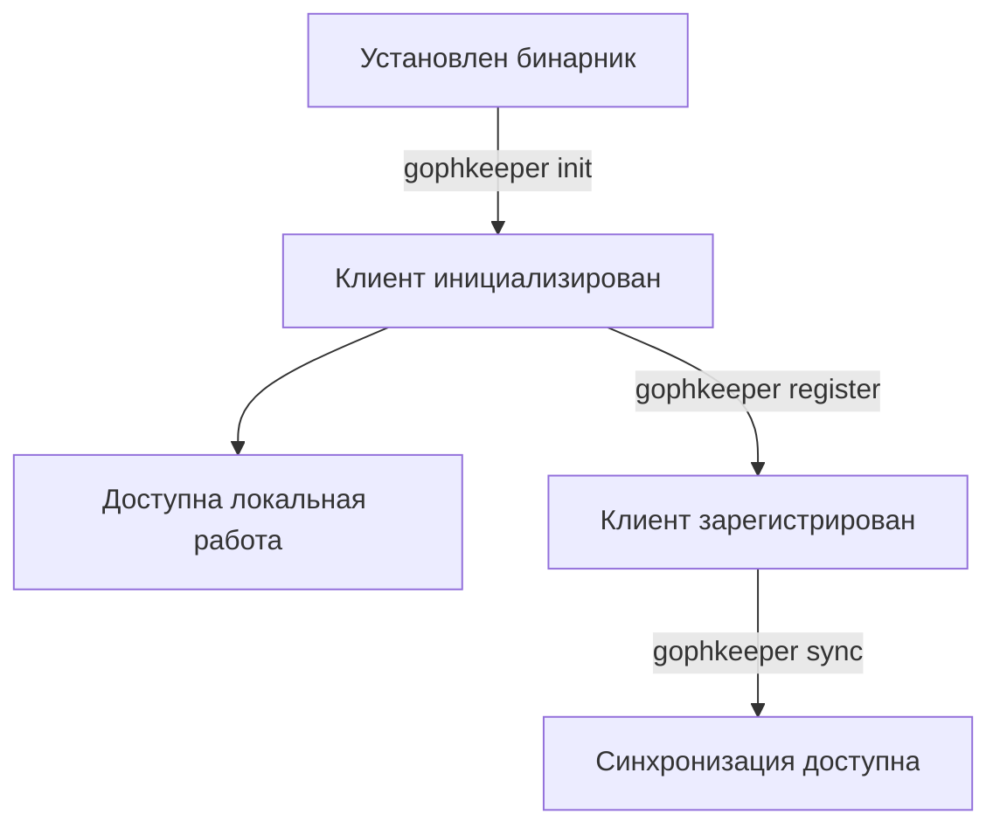
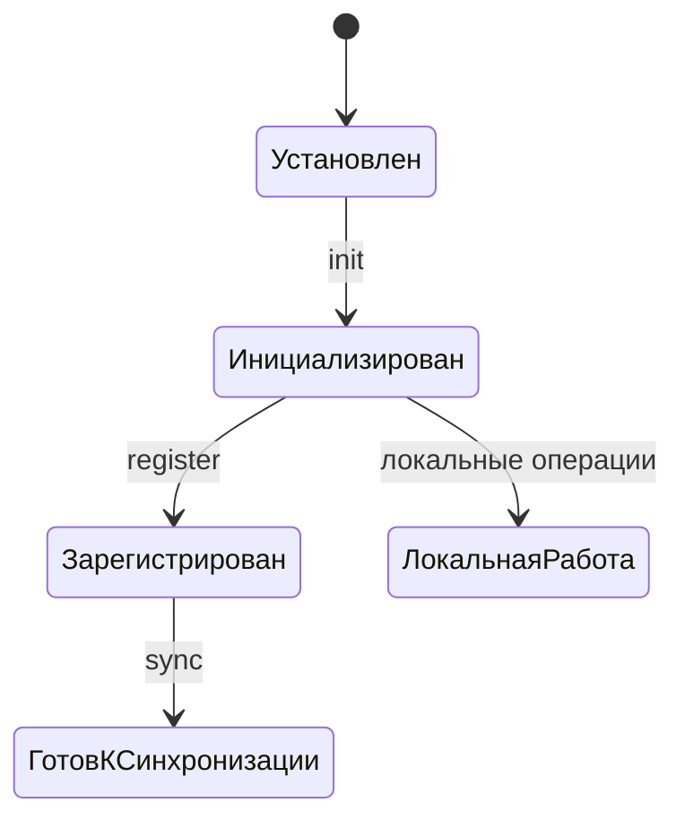
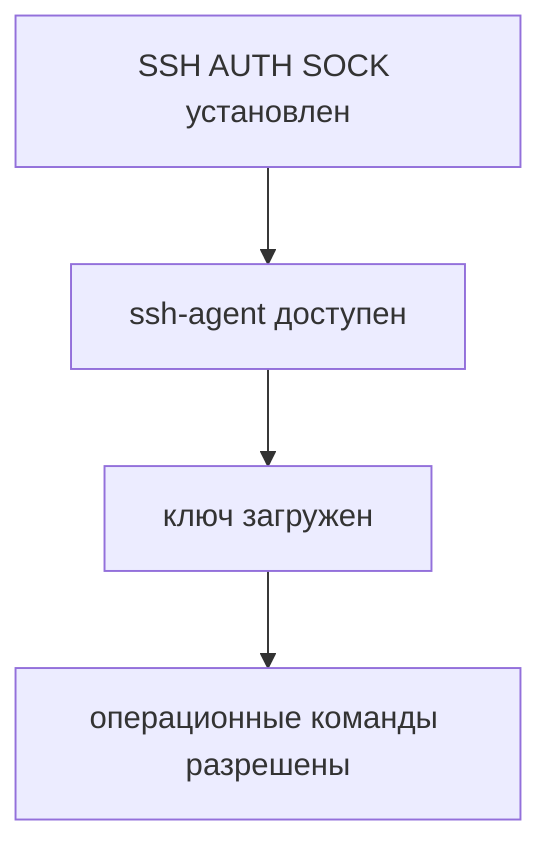
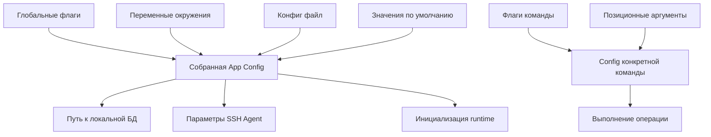
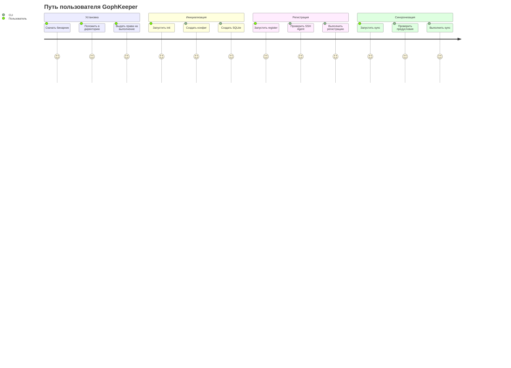

# Жизненный цикл клиента GophKeeper и модель команд

## Обзор

`gophkeeper` — это **stateful CLI-клиент** с явным жизненным циклом и строгим разделением между:

- **постоянной конфигурацией приложения**
- **эфемерными параметрами конкретной команды**
- **runtime-предусловиями выполнения**
- **локальным состоянием клиента**
- **состоянием удалённой регистрации и синхронизации**

Клиент нельзя рассматривать как безынерционный набор команд. Он проходит через последовательные этапы:

1. установка бинарника
2. локальная инициализация
3. локальная работа без синхронизации
4. регистрация на сервере
5. синхронизация

---

## Инженерные принципы

### 1. Stateful CLI
`gophkeeper` хранит локальное состояние в SQLite и может хранить сведения о привязке к удалённому серверу синхронизации.

### 2. Архитектура, ориентированная на жизненный цикл
Клиент должен проходить через явные этапы:
- install
- init
- register
- sync

### 3. Выполнение команд через проверку предусловий
Операционные команды выполняются только если соблюдены их runtime- и state-предусловия.

### 4. Разделение постоянных и одноразовых входных данных
- **Глобальная конфигурация приложения** может приходить из:
  - глобальных CLI-флагов
  - переменных окружения
  - конфиг-файла
  - значений по умолчанию
- **Параметры конкретного вызова команды** должны передаваться явно в момент запуска.

Это предотвращает утечку одноразовых параметров операций в постоянную конфигурацию.

---

## Общий жизненный цикл



---

## Модель runtime-зависимостей

Большинство команд зависит от живой сессии SSH Agent.

### Правило
Все команды, кроме чисто информационных, требуют:

- `SSH_AUTH_SOCK`
- доступного `ssh-agent`
- загруженного ключа, пригодного для использования

### Информационные команды
Обычно **не требуют** SSH Agent:
- `help`
- `completion`
- `version`

### Операционные команды
**Требуют** SSH Agent:
- `init`
- `register`
- `sync`
- `create`
- любые команды, читающие или изменяющие защищённое локальное состояние

---

## Классификация команд

### Информационные команды
Не изменяют состояние и не требуют runtime-предусловий.

Примеры:
- `help`
- `version`
- `completion`

### Bootstrap-команды
Создают локальную среду клиента.

Примеры:
- `init`

### Команды идентификации и привязки
Привязывают локальную идентичность клиента к удалённому серверу синхронизации.

Примеры:
- `register`

### Операционные команды
Читают или изменяют состояние клиента и могут взаимодействовать с сервером.

Примеры:
- `create`
- `sync`

---

## Модель состояний

### Состояние 0: Бинарник установлен
Бинарник:
- скачан
- лежит в файловой системе
- имеет право на выполнение

Но:
- конфиг-файл может отсутствовать
- SQLite БД может отсутствовать
- привязка к серверу отсутствует

### Состояние 1: Клиент инициализирован
После `gophkeeper init`:
- конфиг-файл существует
- локальная SQLite БД существует
- схема БД создана и/или применены миграции
- клиент готов к локальной работе

Но:
- клиент может ещё не быть зарегистрирован
- синхронизация может быть ещё недоступна

### Состояние 2: Доступен SSH Agent
В runtime-окружении доступны:
- `SSH_AUTH_SOCK`
- живой `ssh-agent`
- загруженный SSH-ключ

### Состояние 3: Клиент зарегистрирован
Клиент:
- прошёл регистрацию на сервере синхронизации
- сохранил метаданные привязки локально
- известен серверу по своей публичной ключевой идентичности

### Состояние 4: Клиент готов к синхронизации
Клиент:
- инициализирован
- имеет доступ к SSH Agent
- зарегистрирован
- может выполнять `sync`

---

## Диаграмма переходов состояний



### Наложение runtime-предусловия



---

## Пример пользовательского сценария

### Установка
1. скачать `gophkeeper`
2. положить бинарник в нужную директорию
3. выдать права на выполнение

### Инициализация
Если нет локального конфига и локальной БД:

```sh
gophkeeper init --config=/path/to/config.yaml --storage=/path/to/sqlite.db
```

Поведение:
- создаёт конфиг-файл по указанному пути
- создаёт SQLite БД по указанному пути
- инициализирует или мигрирует схему
- может подсказать, какие переменные окружения удобно выставить

Если пользователь запускает:

```sh
gophkeeper init
```

Поведение:
- использует пути по умолчанию
- создаёт конфиг и БД в дефолтных местах
- инициализирует локальную среду
- не обязан советовать экспорт переменных окружения, если используются стандартные пути

### Локальная работа
После `init` клиент может работать с локальным storage.

### Попытка синхронизации до регистрации
Если пользователь запускает:

```sh
gophkeeper sync
```

и клиент ещё не зарегистрирован, ожидаемое поведение:
- определить, что локальная инициализация уже есть
- определить, что удалённая регистрация отсутствует
- вернуть понятную и прикладную ошибку с рекомендацией выполнить `register`

### Регистрация
Пользователь выполняет:

```sh
gophkeeper register --server=HOST:PORT --login=USER --cert=/path/to/key.pub
```

Поведение:
- проверяет доступность SSH Agent
- проверяет, что публичный ключ соответствует ключу, загруженному в agent
- выполняет регистрацию на удалённом сервере
- сохраняет сведения о привязке в локальную SQLite БД
- после этого делает синхронизацию возможной

---

## Политика конфигурации

## Постоянная конфигурация приложения
Постоянная конфигурация приложения описывает среду выполнения CLI.

Примеры:
- путь к конфиг-файлу
- путь к SQLite БД
- путь к SSH socket
- будущие настройки логирования
- возможные настройки сервера по умолчанию

### Поддерживаемые источники
В порядке приоритета:

1. глобальные CLI-флаги
2. переменные окружения
3. конфиг-файл
4. встроенные значения по умолчанию

### Примеры
- `--config=/path/to/config.yaml`
- `--sqlite-path=/path/to/client.db`
- `SSH_AUTH_SOCK=/tmp/agent.sock`

---

## Эфемерные параметры команды
Параметры команды описывают, **что пользователь хочет сделать прямо сейчас**.

Примеры:
- `register --login=alice`
- `register --cert=/path/to/key.pub`
- `create --key=email`
- `create --value=secret`

Эти значения:
- контекстны
- одноразовы
- часто чувствительны
- не должны по умолчанию жить в постоянной конфигурации

### Правило проектирования
Параметры конкретной операции должны передаваться только через:
- флаги команды
- позиционные аргументы

Они **не должны** считываться из:
- переменных окружения
- конфиг-файла

---

## Почему это разделение важно

### Хорошее использование config/env
Они описывают стабильную инфраструктуру и среду выполнения:

- где лежит БД
- где лежит конфиг
- где находится сокет SSH Agent

### Плохое использование config/env
Они не должны описывать одноразовый пользовательский intent:

- логин для текущей регистрации
- путь к публичному ключу для текущего запуска
- секрет, создаваемый прямо сейчас

---

## Диаграмма потока конфигурации



---

## Предусловия по командам

| Команда  | Нужен SSH Agent | Нужен init | Нужна регистрация | Примечание |
|----------|------------------|-------------|-------------------|------------|
| help     | нет              | нет         | нет               | информационная |
| version  | нет              | нет         | нет               | информационная |
| init     | да               | нет         | нет               | создаёт локальное состояние |
| register | да               | да          | нет               | создаёт удалённую привязку |
| sync     | да               | да          | да                | требует полный lifecycle |
| create   | да               | да          | нет или зависит   | локальная операция по умолчанию |

---

## Семантика команд

## `init`
### Ответственность
Bootstrap локального состояния клиента.

### Входные данные
- необязательный путь к конфигу
- необязательный путь к storage

### Эффекты
- создаёт конфиг-файл, если его нет
- создаёт локальную SQLite БД, если её нет
- применяет схему и миграции
- подготавливает клиент к локальной работе

### Постусловия
- клиент находится в состоянии `Инициализирован`

### Примечание
`init` — это команда, которая создаёт базовую локальную среду приложения.

---

## `register`
### Ответственность
Привязать уже инициализированный локальный клиент к удалённому серверу синхронизации.

### Входные данные
- флаги команды:
  - `--login`
  - `--cert`
  - `--server`

### Предусловия
- клиент инициализирован
- SSH Agent доступен
- нужный ключ загружен в `ssh-agent`

### Эффекты
- выполняет протокол регистрации
- сохраняет сведения о привязке локально
- переводит клиента в состояние `Зарегистрирован`

---

## `sync`
### Ответственность
Синхронизировать локальное состояние с удалённым storage.

### Предусловия
- клиент инициализирован
- SSH Agent доступен
- клиент уже зарегистрирован

### Поведение при ошибке
Если регистрация отсутствует, команда должна возвращать прикладную и понятную ошибку.

Пример:
```text
Клиент не зарегистрирован ни на одном сервере синхронизации.
Пожалуйста, выполните:

  gophkeeper register --server=HOST:PORT --login=USER --cert=/path/to/key.pub
```

---

## SSH Agent как обязательная runtime-зависимость

## Обоснование
`gophkeeper` использует операции, основанные на SSH Agent, как основной локальный механизм доверия и идентичности.

Поэтому живой SSH Agent является обязательной runtime-зависимостью для всех операционных команд.

### Необходимые условия
- `SSH_AUTH_SOCK` должен быть установлен
- сокет должен быть доступен
- agent должен отвечать
- нужный ключ должен быть загружен, если это требуется командой

---

## Ожидаемое поведение ошибок

Ошибки должны быть:

- детерминированными
- прикладными
- понятными предметно
- помогающими пользователю восстановиться

### Пример: отсутствует SSH Agent
Плохо:
```text
ssh auth sock is not set
```

Хорошо:
```text
SSH Agent недоступен: переменная SSH AUTH SOCK не установлена.

GophKeeper требует работающий ssh-agent для всех операционных команд.

Быстрый старт:
  1. Сгенерируйте пару ключей ED25519:
     ssh-keygen -t ed25519 -f ~/.ssh/gophkeeper_ed25519

  2. Запустите ssh-agent:
     eval "$(ssh-agent -s)"

  3. Загрузите приватный ключ:
     ssh-add ~/.ssh/gophkeeper_ed25519

  4. Повторите команду.
```

Это пример **guided recovery messaging**.

---

## Рекомендуемый UX для инициализации

### Явная инициализация
```sh
gophkeeper init --config=/path/to/config.yaml --storage=/path/to/sqlite.db
```

Ожидаемое поведение:
- создать конфиг-файл
- создать storage БД
- инициализировать схему
- вывести итоговые пути
- если использованы нестандартные пути, подсказать, какие переменные окружения можно экспортировать для удобства

### Инициализация по умолчанию
```sh
gophkeeper init
```

Ожидаемое поведение:
- использовать XDG-совместимые пути по умолчанию
- создать конфиг и БД в этих местах
- инициализировать схему
- не навязывать экспорт переменных окружения, если используются стандартные пути

---

## Диаграмма пользовательского жизненного пути



---

## Архитектурное резюме

`gophkeeper` должен быть реализован как:

- **stateful CLI**
- **приложение, ориентированное на жизненный цикл**
- **система команд с проверкой предусловий**
- **клиент с жёсткой дисциплиной конфигурации**

### Базовые правила проектирования
1. Клиент должен быть явно инициализирован перед обычной работой.
2. Регистрация — это отдельный явный шаг.
3. Синхронизация недоступна до успешной регистрации.
4. Доступность SSH Agent — обязательное runtime-предусловие для операционных команд.
5. Глобальная конфигурация постоянна и приходит из flags/env/config/defaults.
6. Параметры конкретной команды эфемерны и должны передаваться явно в момент запуска.

---

## Рекомендуемые инженерные сущности для реализации

Чтобы эта модель чисто отражалась в коде, полезны следующие абстракции.

### Guards / Preconditions
- `RequireSSHAgent`
- `RequireInitialized`
- `RequireRegistered`

### Typed domain errors
- `ErrSSHAgentUnavailable`
- `ErrNotInitialized`
- `ErrNotRegistered`

### UX helpers
- `FormatSSHAgentHelp()`
- `FormatRegistrationRequiredHelp()`

### Группы команд
Возможная будущая группировка:
- `gophkeeper init`
- `gophkeeper register`
- `gophkeeper sync`
- `gophkeeper secret create`
- `gophkeeper secret list`

---

## Короткая инженерная формулировка

`gophkeeper` — это stateful CLI-клиент с явной локальной инициализацией, явной удалённой регистрацией и синхронизацией, защищённой runtime- и state-предусловиями. Постоянная конфигурация приложения отделена от эфемерных параметров вызова команды, а живой SSH Agent рассматривается как обязательная операционная зависимость.