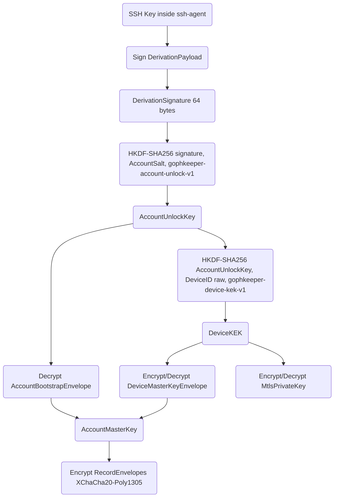
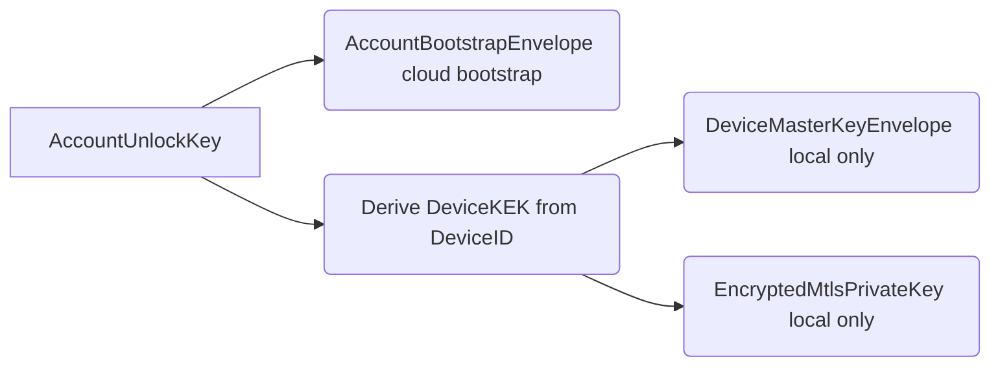
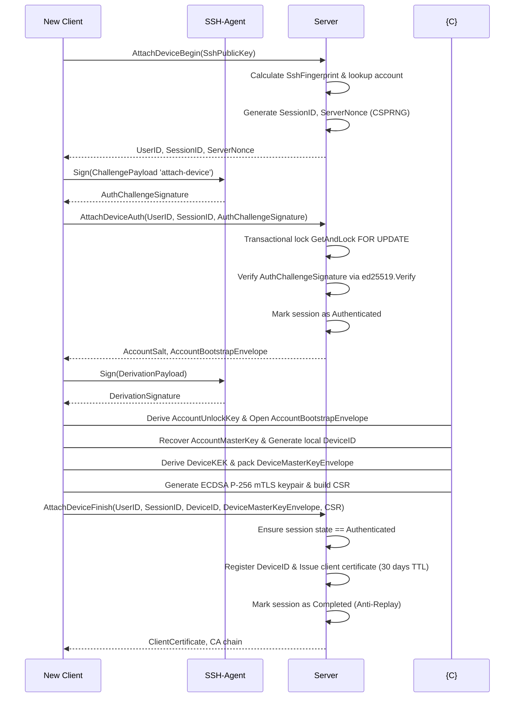
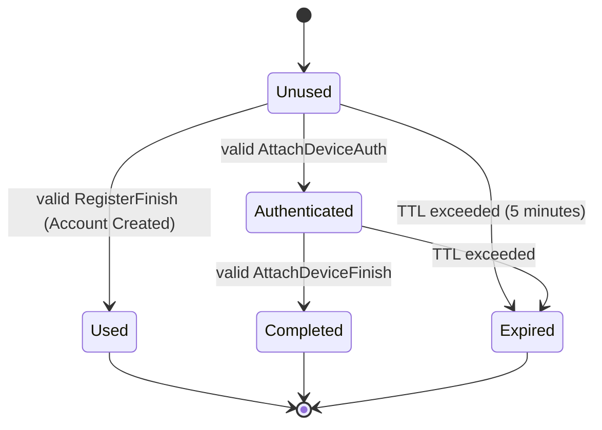

# GophKeeper Crypto v0.0.1
### Дипломный проект Я.Практикум

Привет, гоферы!

[Инструкция по установке](docs/INSTALL.md)

Я получил ТЗ на дипломный проект — хранитель секретов. Система на первый взгляд кажется элементарной (клиент прислал, сервер сохранил), но на самом деле в пассворд-органайзерах большая часть проблем находится глубоко под водой. 

Какими свойствами должен обладать современный менеджер паролей? Он обязан гарантировать абсолютную конфиденциальность на диске и в сети, исключать компрометацию данных при утечке серверной базы и оставаться удобным. Если мы посмотрим на популярные решения (1Password, Bitwarden, KeePass), то увидим общую проблему: пользователи **должны помнить длинный мастер-пароль и каждый раз вводить его вручную** при разблокировке сейфа. 

В условиях реальной эксплуатации это приводит к опасному психологическому феномену: из-за необходимости по несколько десятков раз в день вводить сложную буквенно-цифровую комбинацию, пользователи сознательно идут на компромисс с безопасностью. Они либо катастрофически упрощают мастер-пароли, делая их уязвимыми к брутфорсу, либо вовсе записывают их на бумажных листочках и стикерах, наклеенных на монитор. Таким образом, классическая концепция мастер-паролей сама по себе генерирует критическую брешь в безопасности за счет человеческого фактора.

Автор этого проекта в одной большой ИТ-компании 6 лет подряд страдал от аналогичной каторги: вбивал TOTP-пароли и логины для связки *VPN over VPN*, которые регулярно обрывали коннект. Постоянный ручной ввод токенов — это ад для UX и потенциальная уязвимость для кейлоггеров.

А как обеспечить и криптографически надежный ключ шифрования, и бесшовную, прозрачную аутентификацию? Популярные коммерческие аппаратные решения (YubiKey, FIDO2-токены) отлично справляются с этой задачей, доказывая владение ключом без участия человека. Но что делать, если мы хотим получить такой же уровень безопасности и автоматизации, **вообще не используя аппаратные токены**? 

Ответ прост: превратить ваш повседневный софтверный **`ssh-agent`** в криптографический корень доверия (operational trust anchor). В качестве алгоритма выбран строго **Ed25519** — он обеспечивает абсолютную **детерминированность подписи** (один и тот же пейлоад всегда выдает идентичный байтовый массив сигнатуры), что критически важно для надежного вывода ключей. Именно это архитектурное решение легло в основу беспарольного Zero-Knowledge протокола **GophKeeper**, разработанного в рамках данного диплома.

---

## 1. Техническое задание (Оригинал)

Система проектируется как клиент-серверный комплекс для надежного хранения конфиденциальных данных. 

**Бизнес-логика сервера:**
*   Регистрация, аутентификация и авторизация пользователей.
*   Персистентное хранение приватных данных.
*   Синхронизация данных между несколькими контейнерами одного владельца.
*   Передача приватных данных владельцу по gRPC-запросу.

**Бизнес-логика клиента:**
*   Аутентификация и авторизация на удаленном сервере.
*   Доступ к приватным данным по запросу пользователя.
*   CLI-интерфейс с поддержкой кроссплатформенной сборки (Windows, Linux, macOS) и выводом метаданных сборки (версия, дата).

**Типы хранимой информации:**
1.  Пары логин/пароль (`credentials`).
2.  Произвольные текстовые данные (`text`).
3.  Произвольные бинарные данные (`binary`) с жестким программным лимитом до 10 МБ на запись.
4.  Данные банковских карт (`card`).

> **Важный архитектурный нюанс:** В ТЗ сказано: *«Для любых данных должна быть возможность хранения произвольной текстовой метаинформации»*. В GophKeeper это реализовано через сквозной JSON-конвейер. Вместо проектирования жестких колонок под каждое мета-поле в таблицах СУБД, сущность упаковывается на клиенте в гибкий JSON-документ, содержащий встроенную карту `metadata: map[string]string`. 
> 
> На уровне CLI-интерфейса для этого используется локальная опция команды `create` — **`--meta`**, принимающая текстовую JSON-строку. 
> 
> **Пример сохранения банковской карты с произвольной метаинформацией:**
> ```bash
> ./cmd/gophkeeper/gophkeeper create \
>   --name "salary_card" \
>   --type "card" \
>   --payload "4276123456789012;12/29;123" \
>   --meta '{"bank":"Sber","holder":"ILVIN","atm_pin":"9988","support_phone":"+78005555555"}'
> ```
> Клиентский рантайм атомарно считывает эту строку, валидирует её структуру, объединяет с payload карты, зануляет сырой plaintext в памяти процесса через `.Destroy()` и выдает запечатанный монолитный `RecordEnvelope` алгоритма XChaCha20-Poly1305, полностью скрывая от сервера и внешних наблюдателей как сам номер карты, так и сопутствующие метаданные.
## 2. Инженерное вангование и архитектурные решения

### 2.1. Локальное хранилище: Почему для MVP выбрано «плохое» с точки зрения Highload решение?

В ТЗ не сказано, как именно клиент должен структурировать и держать секреты. Из классического опыта проектирования крупных информационных систем (например, хрестоматийный кейс архитектурной эволюции СУБД «Одноклассников» на этапе хранения фотографий) мы знаем базовое Highload-правило: **маленькие текстовые данные нужно держать в БД, а большие файлы — на диске (в файловом сторадже)**. Запихивание тяжелых бинарных BLOB-массивов внутрь реляционных таблиц забивает Page Cache СУБД, вызывает колоссальный оверхед и лаги при выборке. 

Однако в рамках архитектуры **GophKeeper Crypto v0.0.1 MVP** мы сознательно пошли на архитектурный компромисс и объединили текстовые секреты и бинарные payload **внутри единой базы данных SQLite**. Наш жесткий лимит в **10 Мегабайт** на одну запись — это вынужденное технологическое следствие, на которое мы пошли осознанно, чтобы заблокировать раздувание Page Cache и не убить производительность SQLite.

Первопричиной выбора единой СУБД вместо хранения файлов в папках на диске стали два фундаментальных фактора безопасности:

1. **Обеспечение транзакционности (ACID) как главный приоритет**. Главная проблема хранения зашифрованных файлов в обычной директории ОС — полное отсутствие транзакционности. Если в процессе асинхронной синхронизации (`sync`) или локальной переупаковки ключей (`reconcile`) у пользователя внезапно выключится устройство, система останется в состоянии «полураспада» (часть файлов обновилась, часть повреждена, индексы рассинхронизированы). SQLite предоставляет строгие свойства **ACID**. Вся миграция или синхронизация происходит внутри изолированного блока `BEGIN TRANSACTION ... COMMIT`. Данные либо обновятся целиком, либо гарантированно откатятся к исходному валидному состоянию.
2. **Скрытие топологии и метаданных файловой системы**. Хранение секретов в виде отдельных зашифрованных файлов в папке на диске делает их уязвимыми к анализу метаданных. Сторонний софт, непривилегированные процессы или вредоносное ПО в ОС будут открыто видеть количество ваших секретов, точные размеры файлов и точные временные метки изменений OS File System. Хранение всего контура внутри единого монолитного файла SQLite полностью скрывает внутреннюю структуру и топологию хранилища от внешнего наблюдателя.

**Проблема поиска и компрометации метаданных.** В индустрии информационной безопасности открытые метаданные (названия сайтов, имена серверов, теги категорий) рассматриваются как критическая уязвимость (*Metadata Leakage*). Оставлять их незашифрованными нельзя: они дают злоумышленнику полную карту цифровой личности пользователя и почву для точечных атак. Поэтому в GophKeeper метаинформация полностью зашифрована внутри конверта записи. Поиск по метаданным реализуется исключительно локально на клиенте в оперативной памяти рантайма. Клиент вскрывает сейф, расшифровывает массив `metadata: map[string]string` и производит по нему мгновенную локальную фильтрацию.

**Где физически организовано хранилище?**
Файл базы данных `goph_keeper.db` изолирован по каноничным путям операционных систем:
*   **Linux**: `~/.local/state/gophkeeper/goph_keeper.db`
*   **macOS**: `~/Library/Application Support/GophKeeper/goph_keeper.db`
*   **Windows**: `%LOCALAPPDATA%\GophKeeper\goph_keeper.db`

В рамках MVP таблицы шифруются принудительно на уровне приложения алгоритмом XChaCha20-Poly1305. Однако реляционная архитектура GophKeeper MVP спроектирована с прицелом на легкую будущую миграцию. В следующей версии, при появлении стабильных pure-Go драйверов постраничного шифрования (или при переходе на Enterprise-версии серверов с поддержкой *Transparent Data Encryption — TDE*), систему можно будет бесшовно мигрировать на бесплатный **SQLCipher Community Edition** для клиента и **PostgreSQL Enterprise c TDE** для сервера, полностью сохранив написанную SQL-логику, но переложив задачу сокрытия структуры таблиц на саму СУБД. Прямое использование SQLCipher в MVP было отклонено, так как оно требует компиляции Си-кода (`CGO_ENABLED=1`), что нарушает важнейший критерий ТЗ — поставку клиента в виде чистокровного CGO-free Go-бинарника.
### 2.2. А зачем тогда нужен сервер?
Сервер в GophKeeper выполняет исключительно три функции:
1.  **Слепой персистентный бэкап**: Если ваш ноутбук сгорит, данные не пропадут.
2.  **Слебая асинхронная репликация**: Передача изменений между вашим рабочим ПК, домашним компьютером и сервером автоматизации.
3.  **Центр сертификации (CA) для mTLS**: Сервер выдает каждому легитимному контейнеру уникальный x509-паспорт для доступа к сети.

Сервер принципиально **не умеет** расшифровывать данные. У него нет ключей, нет мастер-паролей, и он оперирует сущностями как абстрактными шифртекстами (*Stateful Blind Storage*).

### 2.3. Серверное приложение с оффлайн-режимом или оффлайн-приложение с синхронизацией?
Архитектурный выбор однозначен: **оффлайн-приложение с возможностью синхронизации**. 

Команда `gophkeeper init` полностью автономна. Вы можете сгенерировать криптографический корень доверия, создавать, читать и удалять секреты, находясь в бункере без связи. Сетевой gRPC-обмен изолирован и запускается пользователем осознанно через команды `register` и `sync`. 

### 2.4. Нагрузка на сервер: Почему нет даже CQRS?
Архитектурные паттерны вроде **CQRS** (Command Query Responsibility Segregation) или сложная хайлоад-архитектура сознательно **оставлены за рамками данного диплома**. Перед нами стоит задача разработки MVP (Minimum Viable Product), ключевой ценностью которого является криптографический конвейер, обеспечение Zero-Knowledge модели и беспарольного доступа. 

Поскольку вся вычислительная нагрузка (шифрование, JSON-сериализация, валидация лимитов) перенесена на клиента, сервер GophKeeper выполняет только линейные операции ввода-вывода (I/O). Конфликты оффлайн-работы решаются по надежной стратегии **Last-Write-Wins (LWW)** на основе сопоставления меток времени `updated_at`. Для такой структуры достаточно реляционной СУБД PostgreSQL с транзакционным уровнем изоляции.

---

## 3. Криптография приложения и Иерархия ключей

### 3.1. Принцип Domain Separation и прозрачная аутентификация
Чтобы избавить инженера от TOTP и паролей, GophKeeper использует приватный ключ **Ed25519**, уже находящийся в вашем `ssh-agent`. Чтобы защитить систему от cross-protocol атак (когда подпись сетевого челленджа используется для вывода ключей), в систему намертво заложен инвариант **Domain Separation** (разделение контекстов подписей). 

Мы запрашиваем у `ssh-agent` два совершенно разных класса подписей над бинарными структурами, выровненными по технологии Big-Endian:

1.  `DerivationSignature`: Подпись детерминированного, статичного `DerivationPayload`. Используется **только локально** как единственный источник энтропии для вывода мастер-ключей. Никогда не передается по сети.
2.  `AuthChallengeSignature`: Подпись динамического, одноразового `ChallengePayload` (включает случайный серверный нонс CSPRNG и `SessionID`). Используется **только для доказательства владения ключом** серверу в рамках пятиминутного TTL.
### 3.2. Зачем нужен AccountMasterKey?
Главным ядром шифрования всех пользовательских записей в приложении является **`AccountMasterKey`**. Он гарантирует, что абсолютно вся ваша база секретов зашифрована **одним единым, несменным ключом**. Это позволяет избежать деградации производительности: при чтении или поиске данных клиенту не нужно генерировать новые ключи под каждую строчку СУБД.

Но как защитить сам мастер-ключ? Здесь вступает в силу двухуровневая модель упаковки. Сам `AccountMasterKey` шифруется **каноническим ключом деривации (`AccountUnlockKey`)**, который локально выводится из детерминированной Ed25519-подписи агента и соли аккаунта, после чего хранится исключительно в виде запечатанных конвертов (`Envelopes`):

*   **`AccountBootstrapEnvelope` (Облачный конверт)**: Мастер-ключ, зашифрованный под `AccountUnlockKey` с использованием в качестве AAD фингерпринта SSH-ключа. Этот конверт публикуется на сервере и используется как слепой канонический bootstrap-источник для подключения новых устройств.
*   **`DeviceMasterKeyEnvelope` (Локальный контейнерный конверт)**: Тот же самый мастер-ключ, зашифрованный под тем же `AccountUnlockKey` в локальной SQLite с привязкой к уникальному `DeviceID` текущего файла в качестве AAD. 



### 3.3. Логическое разделение конвертов


## 4. Диаграммы сетевых протоколов

### 4.1. Трехэтапный протокол привязки нового устройства (Device Attachment)
Когда пользователь инициирует подключение нового оффлайн-контейнера к существующему аккаунту, server реализует тактику **Withholding** (удерживает соль и облачный конверт до момента верификации подписи, исключая перебор аккаунтов).



### 4.2. Диаграмма состояний Challenge-сессий на сервере

Для предотвращения атак повторения (Replay) и состояний конкуренции (Race Conditions) все критические вызовы контролируются конечным автоматом:



---

## 5. Поведение рантайма и гигиена оперативной памяти

GophKeeper MVP компилируется с флагами полной статической сборки без динамических библиотек (`CGO_ENABLED=0`) и упаковывается в пустые Docker-образы `FROM scratch`.

Внутри клиентского процесса реализована жесткая гигиена RAM (раздел 22 спецификации):
*   Критические ключевые материалы (`AccountMasterKey`, `AccountUnlockKey`, расшифрованный `MtlsPrivateKey`) удерживаются в памяти в виде кастомного типа данных `SecretBytes`.
*   Сразу после открытия криптографического конверта или завершения сетевой сессии вызывается метод `Destroy()`, который принудительно зануляет массивы байт в цикле.
*   Для предотвращения агрессивных оптимизаций компилятора Go (который может вырезать зануление неиспользуемой в дальнейшем переменной через Dead-Code Elimination) рантайм принудительно фиксирует объекты вызовами **`runtime.KeepAlive()`**.

---

## 6. Как запустить и протестировать проект (Quick Start)

### Сборка инфраструктуры и запуск облака
```bash
# 1. Сгенерировать чистые, изолированные цепочки Server CA и Device CA
make certs

# 2. Компиляция клиентских и серверных бинарников под текущую ОС и Linux
make build

# 3. Развертывание Docker Compose стека (PostgreSQL + gRPC Server)
make up
```

### Жизненный цикл первого контейнера (Устройство №1)
```bash
# Инициализация локального оффлайн-сейфа
./cmd/gophkeeper/gophkeeper init

# Создание конфиденциальных записей оффлайн
./cmd/gophkeeper/gophkeeper create --name work_vpn --type credentials --payload="user:pswd_123"

# Сетевая passwordless-регистрация устройства (утверждение канона аккаунта)
./cmd/gophkeeper/gophkeeper register --server localhost:443

# Слепая дифференциальная синхронизация с облаком
./cmd/gophkeeper/gophkeeper sync
```

### Симуляция подключения второго контейнера (Устройство №2)
Мы можем развернуть второе изолированное устройство на этой же машине, указав клиенту работать с альтернативным файлом базы данных через глобальный флаг `--sqlite-path`:

```bash
# Инициализируем второй независимый контейнер оффлайн
./cmd/gophkeeper/gophkeeper --sqlite-path="goph_keeper_two.db" init

# Создаем на нем локальную запись
./cmd/gophkeeper/gophkeeper --sqlite-path="goph_keeper_two.db" create --name home_card --type card --payload="4276..."

# Привязываем второй контейнер к существующему облачному аккаунту
# Сработает механизм Reconcile: база автоматически перешифрует себя под серверный канон!
./cmd/gophkeeper/gophkeeper --sqlite-path="goph_keeper_two.db" register --server localhost:443

# Синхронизируем второе устройство
./cmd/gophkeeper/gophkeeper --sqlite-path="goph_keeper_two.db" sync
```

При вызове последней команды произойдет магия: второе устройство вслепую выгрузит в PostgreSQL свой секрет `home_card`, а взамен стянет запись `work_vpn`, созданную на первом ноутбуке. Архитектурный круг распределенного Zero-Knowledge сейфа замкнулся. 

---

## 7. Перспективные направления для версий v5.0+

1.  **Multi-Key Matrix**: Расширение серверной таблицы `users` до связи «один ко многим» к таблице `account_bootstrap_envelopes`. Это позволит привязывать к одному аккаунту до 3-х разных SSH-ключей параллельно и выполнять их бесшовную ротацию без массового перешифрования данных в облаке.
2.  **In-Memory CRL / Revocation List**: Внедрение в gRPC-интерцептор сервера быстрого кэша (например, Redis или встроенных map под мьютексами) для мгновенной проверки отозванных `DeviceID` без лишних походов в СУБД PostgreSQL на каждом TLS-хендшейке.

«В рамках MVP GophKeeper v4.1 было принято осознанное решение связать сетевую и криптографическую личность пользователя (UserID) с детерминированным фингерпринтом его корневого SSH-ключа (SshFingerprint). Это позволило ликвидировать Metadata Leakage, отказаться от генерации плавающих UUID на сервере и обеспечить абсолютную стабильность контекстов защиты AAD Poly1305 при оффлайн-работе. Ограничение данной модели — невозможность ротации корневого SSH-ключа в текущей версии. Механизм multi-key матрицы доступа и плановой ротации ключей без смены ID аккаунта спроектирован в разделе „Пути улучшения после MVP“ и заложен в архитектуру базы данных версии v5.0 через вынос конвертов доступа в промежуточную таблицу связей» [INDEX].