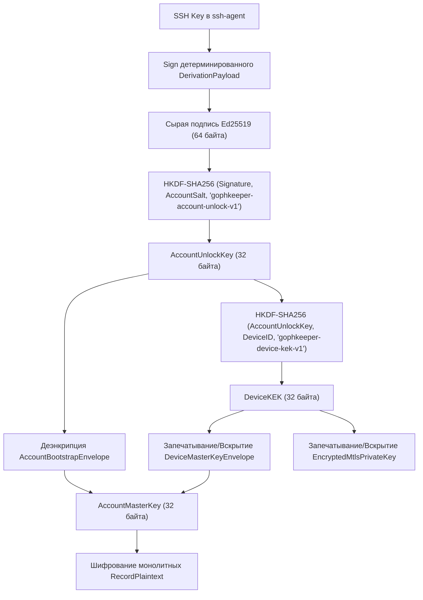
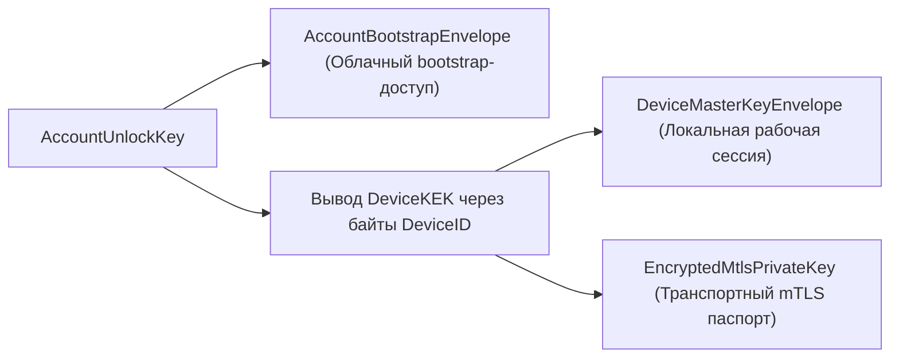

# Комплексная техническая спецификация подсистемы безопасности клиент-серверного приложения GophKeeper Crypto v0.0.1

## 1. НАЗНАЧЕНИЕ И АРХИТЕКТУРНЫЙ БАЗИС ПОДСИСТЕМЫ

Подсистема безопасности клиент-серверного приложения GophKeeper Crypto v0.0.1 спроектирована для обеспечения конфиденциальности, целостности и подлинности конфиденциальных данных пользователя (паролей, текстовых заметок, банковских карт, бинарных файлов) в условиях полностью недоверенной серверной среды. В основе архитектуры лежит парадигма локально-приоритетного хранения (Local-First) в сочетании со сквозным клиентским шифрованием (Zero-Knowledge client-side encryption).

Серверная сторона в данной модели низведена до роли «слепого ретранслятора» и персистентного хранилища. Сервер управляет challenge-сессиями, маршрутизирует зашифрованные пакеты и осуществляет дифференциальную репликацию, но принципиально лишен математической возможности дешифровать контент, извлечь метаданные записей или скомпрометировать ключевой материал.

### 1.1. Фундаментальные принципы рантайма v0.0.1:
1. **Passwordless & Masterless (Беспарольная среда):** Полный отказ от использования интерактивных факторов (мастер-паролей, PIN-кодов, мнемонических фраз) для деривации или авторизации. Криптографическим корнем доверия (Root of Trust) является способность приложения взаимодействовать с приватным ключом Ed25519, размещенным в локальном UNIX-сокете ```ssh-agent``` операционной системы.
2. **Container-Bound Identity (Привязка к контейнеру):** В терминах подсистемы понятие «устройство» (device) жестко абстрагировано от физического хоста, железа или операционной системы. Устройством является изолированный криптографический контейнер — локальный файл СУБД SQLite. Каждый такой файл-синглтон обладает собственной уникальной mTLS-идентичностью (на базе эллиптической кривой NIST P-256) и собственным строковым идентификатором DeviceID (UUID v4), генерируемым на клиенте.
3. **Монолитизация данных (Борьба с Metadata Leakage):** Во избежание утечки контекстной информации (названий секретов, типов данных, пользовательских тегов) в недоверенную среду, подсистема безопасности принудительно упаковывает полезную нагрузку записи (payload) и всю мапу дополнительных метаданных (metadata) в единый монолитный блок JSON перед передачей в крипто-рантайм. В СУБД SQLite и на сервер передаются только открытые неиндексируемые имена для базового поиска и бинарное тело запечатанного крипто-конверта.
4. **Упрощение доменной модели идентификации:** Для ликвидации избыточных циклов синхронизации и зависимости от серверных генераторов идентификаторов, в версии v0.0.1 полностью исключены UUID пользователей, создаваемые на сервере. Введен сквозной доменный инвариант: ```user_id === ssh_fingerprint```, где идентификатором аккаунта во всех сетевых и локальных структурах выступает строковое SHA256-представление публичного SSH-ключа OpenSSH.

## 2. ЦЕЛИ И ТРЕБОВАНИЯ БЕЗОПАСНОСТИ

Подсистема безопасности удовлетворяет жесткому набору требований ИБ, контролируемых на уровне компиляции и рантайма:
1. Сервер не имеет доступа к расшифрованным данным пользователя, а также к промежуточным или корневым ключам деривации (AccountUnlockKey, DeviceKEK, AccountMasterKey) ни на одном из этапов жизненного цикла системы.
2. Локальный крипто-контейнер SQLite аппаратно защищен на уровне файловой системы (маски прав доступа 0600 на файл и 0700 на родительский каталог в UNIX-подобных системах, индивидуальные ACL для текущего SID пользователя в Windows).
3. offline-компрометация и физическое извлечение файла базы данных с диска злоумышленником не приводят к раскрытию секретов. Для расшифровки key-envelopes необходим прямой доступ к активной подписывающей способности (signing capability) зарегистрированного SSH-ключа через сокет агента, так как DeviceKEK динамически выводится из подписи, а не из константных свойств операционной системы.
4. Перехват, модификация или повторное воспроизведение (replay-атаки) сетевого gRPC-трафика аппаратно блокируются на транспортном уровне (строгий односторонний TLS 1.3 на этапе регистрации и взаимный mTLS 1.3 на этапе синхронизации) и на прикладном уровне (одноразовые пятиминутные challenge-сессии со случайными нонсами сервера).
5. Клиент обладает возможностью полной автономной работы. Команда ```gophkeeper init``` разворачивает криптографическую структуру и позволяет выполнять операции записи (create) и чтения (get) секретов локально без сетевого подключения к облаку.
6. При переходе из автономного оффлайн-состояния в онлайн (команда ```register```) система обязана гарантировать сверку локальных компонентов с облачным серверным каноном (Server-canonical account state) для исключения рассинхронизации ключей между множественными контейнерами одного аккаунта. При обнаружении расхождений рантайм обязан выполнить каскадную reconcile-миграцию данных в RAM и зафиксировать её атомарной транзакцией СУБД.

## 3. МОДЕЛЬ УГРОЗ И ГРАНИЦЫ ДОВЕРИЯ

### 3.1. Главное криптографическое допущение безопасности
Безопасность доступа к каноническому мастер-ключу аккаунта (```AccountMasterKey```) и ко всей зашифрованной полезной нагрузке локального и облачного сейфов криптографически эквивалентна способности клиентского рантайма:
- получить стабильную, строго детерминированную подпись ```DerivationPayload``` от приватного SSH-ключ Ed25519 пользователя через активный сокет агента;
- отдельно получить валидную подпись одноразового динамического ```ChallengePayload``` для прохождения Proof of Possession (доказательства владения) на сервере.

Из этого криптографического инварианта следуют жесткие правила рантайма:
1. Любой субъект (процесс, локальный пользователь), получивший несанкционированный доступ к UNIX-сокету ```SSH_AUTH_SOCK```, активному экземпляру ```ssh-agent``` или механизму перенаправления агента (agent forwarding), рассматривается системой как легитимный владелец, обладающий полным правом расшифровки всего хранилища.
2. Клиентское приложение не реализует вторичных интерактивных факторов проверки (биометрии, паролей), полностью делегируя защиту ключевого материала механизмам операционной системы, контролирующим права доступа к сокету агента.
3. Компрометация окружения хоста, при которой сторонний вредоносный процесс способен отправлять команды подписания в сокет агента, означает автоматическую и полную компрометацию локального сейфа SQLite, независимо от выставленных прав доступа ```0600``` на сам файл базы данных.
4. offline-компрометация конкретного локального файла SQLite (например, копирование файла базы данных с диска) не приводит к автоматической компрометации сетевой идентичности других контейнеров или облачного сейфа. Это обеспечивается тем, что приватный mTLS-ключ каждого контейнера (```EncryptedMtlsPrivateKey```) изолирован и упакован под уникальный ```DeviceKEK```, привязанный к конкретному ```DeviceID```.

### 3.2. Противодействие угрозам внешнего периметра
Подсистема рассчитана на эффективное противодействие следующим классам атак:
- **Полная компрометация серверного хранилища:** Утечка или физическое извлечение базы данных PostgreSQL на сервере не приводит к раскрытию секретов, так как сервер хранит записи в виде opaque client-controlled шифртекстов, а облачный bootstrap-конверт запечатан на ключ, отсутствующий на сервере.
- **Перехват и модификация сетевого трафика:** Атаки типа Man-in-the-Middle (MitM) на gRPC-каналы полностью блокируются форсированным TLS 1.3/mTLS 1.3 стеком с жесткой привязкой клиента к встроенному пулу доверенных сертификатов ```ServerCA```.
- **Атаки повторения (Replay):** Перехват валидных управляющих пакетов на этапах регистрации или привязки нового устройства бесполезен для атакующего, так как критические RPC-методы привязаны к одноразовым challenge-сессиям со строгим TTL в 5 минут и атомарным переключением состояний на стороне сервера.

### 3.3. Исключения из модели угроз
Система сознательно не заявляет и не реализует механизмов защиты от:
- Извлечения секретов напрямую из оперативной памяти (RAM) уже разблокированного процесса клиента методом дампа памяти или через отладчик при наличии прав root/локального администратора;
- Действий привилегированного администратора операционной системы хоста;
- Безвозвратной утери оригинального приватного SSH-ключ Ed25519 (механизмы аварийного восстановления или сброса аккаунта сервером исключены из MVP рантайма; утеря ключа означает полную и необратимую потерю доступа к локальным и облачным данным).

## 4. ГИГИЕНА ОПЕРАТИВНОЙ ПАМЯТИ (RAM HYGIENE)

Для минимизации рисков остаточного нахождения ключевого материала в RAM клиентского процесса после завершения криптографических операций, рантайм реализует комплекс мер по принудительной деструкции памяти.

### 4.1. Подавление оптимизаций Dead Code Elimination (DCE)
В компиляторах высокоуровневых языков (включая Go) при оптимизации релизных сборок (флаги ```-O3```, ```-gcflags="-l"```) стандартные циклы обнуления массивов, которые больше не считываются далее по коду, могут быть автоматически удалены как «мертвый код». Для предотвращения этой уязвимости в типе-обертке ```SecretBytes``` обнуление защищено явным вызовом контракта ```runtime.KeepAlive(s)```:

```go
type SecretBytes []byte

func (s SecretBytes) Destroy() {
	if s == nil {
		return
	}
	for i := range s {
		s[i] = 0
	}
	// Удерживаем рантайм от оптимизационного удаления цикла зануления
	runtime.KeepAlive(s)
}
```

### 4.2. Алгоритм экстренного выжигания памяти (Emergency Erasure)
Внутри всех KDF-конвейеров ( HKDF-SHA256) и генераторов случайных чисел внедрен защитный паттерн с флагом отслеживания сбоев. Если на этапе разворачивания ключевого материала ридером энтропии происходит системный сбой, прерывание контекста (Ctrl+C) или паника, выделенный буфер принудительно выжигается нулями в блоке ```defer``` до возврата управления:

```go
cleanUpNeeded := true
defer func() {
	if cleanUpNeeded {
		for i := range buf {
			buf[i] = 0
		}
		slog.Debug("Emergency erasure of key buffer executed due to failure")
	}
}()
// ... операции чтения ключевого материала ...
cleanUpNeeded = false
```

### 4.3. Очистка асимметричных ключей и GC-оптимизация
1. **Деструкция BigInt компонентов:** Иммутабельные структуры и примитивы зануляются стандартно. Однако для закрытых компонентов (больших чисел ```D```) асимметричных ключей ECDSA (паспортов mTLS) реализована точечная деструкция в куче путем принудительного сброса: ```mtlsPrivKey.D.SetInt64(0)``` и переаллокации на пустой указатель ```mtlsPrivKey.D = big.NewInt(0)```.
2. **Разрыв ссылок для Garbage Collector:** После десериализации расшифрованных JSON-моделей в DTO-модели вывода (```GetResponse```), рантайм принудительно итерирует мапу метаданных и вызывает ```delete(metadata, key)```, зануляя также строковый payload. Это обрывает жесткие ссылки на базовые массивы байт в куче, позволяя сборщику мусора Go моментально утилизировать освободившуюся память и снижая время экспозиции конфиденциальных данных в Heap.

## 5. СУЩНОСТИ И СТРУКТУРА КЛЮЧЕВОЙ ИЕРАРХИИ

### 5.1. Канонические сущности подсистемы безопасности
Вся архитектура криптографической защиты рантайма v0.0.1 оперирует строго детерминированным набором сущностей и ключевых материалов.

- **SshPublicKey (bytes):** Публичный ключ пользователя в каноническом формате OpenSSH Wire BLOB (извлекается из ssh-agent). Используется для идентификации аккаунта на сервере и повторной валидации контекста на фазе RegisterFinish.
- **SshFingerprint / UserID (string):** Канонический SHA256-фингерпринт публичного SSH-ключа OpenSSH. Является единственным монолитным идентификатором аккаунта (user_id === ssh_fingerprint) как на клиенте, так и на сервере.
- **DeviceID (string):** Уникальный UUID v4 конкретного локального контейнера, генерируемый случайным образом на клиенте в фазе init. Используется в качестве соли для вывода DeviceKEK и открытого идентификатора mTLS-сертификата.
- **AccountSalt (bytes):** Случайная 32-байтная высокоэнтропийная соль аккаунта. Первично создается клиентом на этапе init, а затем передается серверу на этапе регистрации для фиксации облачного канона.
- **AccountUnlockKey (SecretBytes):** Симметричный 32-байтный KEK аккаунта. Выводится динамически в RAM на основе сырой подписи Ed25519 и AccountSalt. Никогда не сохраняется на диск и не передается серверу.
- **DeviceKEK (SecretBytes):** Симметричный 32-байтный локальный ключ упаковки контейнера. Выводится динамически в памяти на основе AccountUnlockKey и сырых байт DeviceID.
- **AccountMasterKey (SecretBytes):** Единый главный 32-байтный ключ симметричного шифрования (XChaCha20-Poly1305) всех пользовательских записей. Существует в RAM только в момент выполнения операций чтения/записи.
- **AccountBootstrapEnvelope (bytes):** Облачный аккаунтный конверт. Представляет собой JSON-структуру Envelope, содержащую AccountMasterKey, запечатанный под управлением ключа AccountUnlockKey. Хранится на клиенте и сервере.
- **DeviceMasterKeyEnvelope (bytes):** Локальный container-bound конверт. Содержит тот же самый AccountMasterKey, но запечатанный под управлением локального DeviceKEK. Хранится строго на клиенте в таблице device_state.
- **EncryptedMtlsPrivateKey (bytes):** Закрытый транспортный mTLS-ключ контейнера (эллиптическая кривая NIST P-256 в стандарте PKCS#8), запечатанный на DeviceKEK с проверкой целостности по схеме AAD. Хранится строго локально.
- **ClientCertificate (bytes):** Выпущенный сервером (Device Root CA) x509 DER mTLS-сертификат устройства, жестко привязанный к DeviceID.

### 5.2. Диаграмма иерархии ключей рантайма



### 5.3. Логическое разделение зон ответственности конвертов



## 6. ВЫВОД КЛЮЧЕЙ И КОНТЕКСТНОЕ РАЗДЕЛЕНИЕ ПОДПИСЕЙ (DOMAIN SEPARATION)

Для полного исключения атак класса Cross-Protocol Signature Substitution (межпротокольная подмена подписей), при которых подпись, полученная для одной локальной операции, может быть перехвачена и повторно использована злоумышленником в сетевом контексте, подсистема безопасности намертво разводит форматы бинарных payloads, отправляемых на подпись в ssh-agent.

### 6.1. Барьер детерминированности SSH-подписи (Self-Test)
Перед выполнением любой операции инициализации (init) или регистрации (register), рантайм обязан провести внутренний валидационный self-test подписывающего устройства. Для этого генерируется динамический случайный nonce на базе UUID и текущей временной метки с наносекундной точностью (пример: ```gophkeeper-init-nonce-<uuid>-<nanoseconds>```). Клиент запрашивает подпись этого нонса дважды. Если подписи побайтово не совпадают, это свидетельствует о недетерминированной природе подписывающего узла (например, использование аппаратного токена YubiKey с рандомизацией подписи). Такие ключи рантаймом MVP аппаратно блокируются для предотвращения разрушения KDF-цепочки деривации.

### 6.2. Канонизация Ed25519 подписи
Из ответа UNIX-сокета ssh-agent клиентский крипто-движок принудительно извлекает и канонизирует только сырые 64 байта подписи Ed25519 (координаты ```R || S```) после строгой проверки, что тип алгоритма равен ```ssh-ed25519```. Любой внешний SSH-фрейминг, ASN.1 или транспортные обертки агента внутри KDF-конвейера не допускаются.

### 6.3. Бинарная спецификация DerivationPayload
Для вывода AccountUnlockKey используется строго детерминированный, очищенный от одноразовых сессионных параметров бинарный блок. Сериализация в потоке байт выполняется в каноническом формате Big-Endian. Длина динамических полей ограничивается префиксом uint16 (2 байта). В случае превышения лимитов полей (константа 65535 байт) маршалинг аппаратно блокируется во избежание integer overflow.

Спецификация формата:
```
version (4B, BigEndian) + context_len (2B) + context + fingerprint_len (2B) + fingerprint
```

Параметры заполнения структуры:
- **version:** Фиксированное значение uint32 равное 1.
- **context:** Константный строковый маркер домена `"gophkeeper-account-unlock-v1"`.
- **fingerprint:** Строковое SHA256-представление публичного SSH-ключ (SshFingerprint).

*DerivationPayload принципиально не содержит UserID, SessionID, временных меток или параметров сети, что гарантирует абсолютную стабильность вывода KDF на любых устройствах одного аккаунта.*

### 6.4. Бинарная спецификация ChallengePayload
Для прохождения Proof of Possession на сервере используется динамический одноразовый блок челленджа, привязанный к конкретной gRPC-сессии. Сериализация также выполняется в формате Big-Endian с uint16-префиксами длин полей и лимитом безопасности в 65535 байт.

Спецификация формата:
```
version (4B, BigEndian) + context_len (2B) + context + user_id_len (2B) + user_id + session_id_len (2B) + session_id + nonce_len (2B) + nonce + op_len (2B) + op
```

Параметры заполнения структуры:
- **version:** Фиксированное значение uint32 равное 1.
- **context:** Константный строковый маркер домена `"gophkeeper-auth-challenge-v1"`.
- **user_id:** Равен SshFingerprint (согласно инварианту user_id === ssh_fingerprint).
- **session_id:** Строковый UUID challenge-сессии, полученный от сервера через RegisterBegin.
- **nonce:** Высокоэнтропийный ServerNonce, сгенерированный CSPRNG-генератором сервера.
- **op:** Идентификатор операции — строго строка `"register"`.

### 6.5. Математические формулы KDF рантайма
Пусть:
- ```raw_signature_64``` — канонические 64 байта подписи Ed25519 над DerivationPayload;
- ```AccountSalt``` — случайная высокоэнтропийная 32-байтная соль аккаунта;
- ```DeviceID``` — строковое UUID v4 представление идентификатора текущего крипто-контейнера.

Тогда вывод ключевого материала на клиенте выполняется по формулам:
```
AccountUnlockKey = HKDF_SHA256(raw_signature_64, AccountSalt, "gophkeeper-account-unlock-v1", 32)
DeviceKEK = HKDF_SHA256(AccountUnlockKey, []byte(DeviceID), "gophkeeper-device-kek-v1", 32)
```

## 7. СТРУКТУРА КРИПТОГРАФИЧЕСКОГО КОНВЕРТА (ENVELOPE) И СЕМАНТИКА AAD

Симметричная защита всех ключевых материалов и пользовательских записей на диске в SQLite осуществляется через структуру версионированного криптографического контейнера, упаковываемого в JSON-конверт Envelope.

### 7.1. Спецификация JSON-полей Envelope
```json
{
  "version": 1,
  "algorithm": "XChaCha20-Poly1305",
  "nonce": [24, "случайных", "байт", "из", "crypto/rand"],
  "aad_schema": "строковый_маркер_контекста_aad",
  "ciphertext": ["шифртекст", "включая", "хвостовой", "16-байтный", "тег", "Poly1305"]
}
```

### 7.2. Спецификация Big-Endian сериализации контекстов связанных данных (AAD)
Для предотвращения атак типа Ciphertext Substitution (подмена шифртекстов местами в БД или подмена контекста привязки ключа к сущности) рантайм принудительно рассчитывает Big-Endian блоки AAD, передаваемые в функции Seal/Open крипто-шифра.

1. **AAD для AccountBootstrapEnvelope:**
   ```
   version (4B, BigEndian) + schema_len (2B) + "gophkeeper-account-bootstrap-aad-v1" + fingerprint_len (2B) + SshFingerprint
   ```
2. **AAD для DeviceMasterKeyEnvelope & EncryptedMtlsPrivateKey:**
   ```
   version (4B, BigEndian) + schema_len (2B) + "gophkeeper-device-master-key-aad-v1" + user_id_len (2B) + UserID + device_id_len (2B) + DeviceID
   ```
   *Примечание: На фазе автономного init, когда сетевой UserID (равный фингерпринту) еще не легитимизирован в контексте, поле user_id остается пустым (длина 0), формируя precanonical-контекст. После регистрации рантайм переводит его в canonical-вид.*
3. **AAD для RecordEnvelope конкретной пользовательской записи:**
   ```
   version (4B, BigEndian) + schema_len (2B) + "gophkeeper-record-aad-v1" + user_id_len (2B) + UserID + record_id_len (2B) + RecordID
   ```
## 8. ЛОКАЛЬНАЯ ЗАЩИТА СУБД SQLITE И АВТОНОМНЫЙ РЕЖИМ (INIT)

Локальный файл СУБД SQLite является полностью автономным, изолированным криптографическим контейнером-синглтоном. На уровне операционной системы безопасность его размещения контролируется жестким fail-fast ограничением прав доступа: маска `0600` на сам файл базы данных (доступ только текущему владельцу процесса на чтение и запись) и маска `0700` на родительский каталог хранения данных. 

### 8.1. Схема персистентного состояния синглтона
Вся конфигурация и криптографические маркеры привязки текущего контейнера сохраняются в специализированную служебную таблицу `device_state`. Целостность структуры на уровне ядра СУБД аппаратно заблокирована жестким декларативным инвариантом:
```sql
CREATE TABLE device_state (
    id INTEGER PRIMARY KEY,
    server_url TEXT,
    user_id TEXT,
    device_id TEXT NOT NULL,
    ssh_public_key BLOB NOT NULL,
    account_salt BLOB NOT NULL,
    device_master_key_envelope BLOB NOT NULL,
    account_bootstrap_envelope BLOB NOT NULL,
    encrypted_mtls_private_key BLOB,
    client_certificate BLOB,
    created_at TEXT NOT NULL,
    CONSTRAINT single_row_invariant CHECK (id = 1)
);
```

### 8.2. Эксплуатационные прагмы настройки SQLite ядра
Для исключения рисков повреждения структуры файлов, обеспечения максимальной атомарности ACID-транзакций и высокой производительности в конкурентном рантайме Go, соединение с SQLite настраивается принудительным вызовом прагм:
- `PRAGMA foreign_keys = ON;` — жесткий контроль каскадной целостности связей таблиц;
- `PRAGMA busy_timeout = 5000;` — барьер ожидания блокировок файла до 5 секунд перед выбросом Scan Error;
- `PRAGMA journal_mode = WAL;` — перевод логирования в режим Write-Ahead Logging для бесконфликтной параллельной работы конкурентных потоков чтения и записи.

### 8.3. Сценарий автономной локальной инициализации контейнера (`gophkeeper init`)
Команда `gophkeeper init` выполняется полностью локально на клиентском хосте, не требует сетевой сессии и не порождает трафика. Повторный запуск поверх уже существующего файла базы данных аппаратно заблокирован (`os.Stat`) во избежание случайной перезаписи и безвозвратного уничтожения живых крипто-конвертов.

Пошаговый конвейер выполнения:
1. **Сканирование среды:** Клиент опрашивает сокет `SSH_AUTH_SOCK` и вычитывает список публичных идентичностей через `ListED25519()`. При обнаружении нескольких ключей рантайм аварийно останавливается и выводит диагностическую карту-подсказку со списком всех активных фингерпринтов.
2. **Криптографический Self-Test:** Выбранный по фингерпринту ключ пробивается динамическим nonce для верификации детерминированности подписи Ed25519.
3. **Генерация энтропии:** Через системный генератор CSPRNG (`crypto/rand`) создается случайная 32-байтная соль аккаунта (`AccountSalt`) и случайный 32-байтный главный ключ шифрования сейфа (`AccountMasterKey`).
4. **Маршалинг и локальный вывод:** Формируется `DerivationPayload`. Через сокет агента извлекается сырая подпись `DerivationSignature`. Вычисляются `AccountUnlockKey` и `DeviceKEK`.
5. **Генерация идентичности контейнера:** Клиент создает случайный строковый `DeviceID` (UUID v4) и связывает его с `UserID` (который на фазе init превентивно приравнивается к текущему фингерпринту).
6. **Запечатывание мастер-конвертов:** `AccountMasterKey` шифруется алгоритмом XChaCha20-Poly1305 дважды:
   - На ключе `AccountUnlockKey` в контексте `bootstrapAAD` → формируется `AccountBootstrapEnvelope` (облачный bootstrap-конверт);
   - На ключе `DeviceKEK` в контексте `deviceAAD` (состояние precanonical, так как user_id еще не подтвержден сервером) → формируется `DeviceMasterKeyEnvelope` (локальный рабочий конверт).
7. **Фиксация в БД:** Структура упаковывается и персистентно сохраняется в СУБД SQLite в таблицу `device_state`. Только после успешного коммита снимается флаг экстренной очистки памяти, а промежуточные ключи деривации выжигаются нулями.
## 9. УНИФИЦИРОВАННЫЙ СЕТЕВОЙ ПРОТОКОЛ РЕГИСТРАЦИИ И КАСКАДНЫЙ RECONCILE

Протокол сетевой регистрации (команда `gophkeeper register`) совмещает в рамках единого сквозного контракта создание нового облачного аккаунта пользователя и привязку автономно инициализированного pre-initialized контейнера к существующей облачной экосистеме. 

Первичная gRPC-аутентификация происходит внутри изолированного канала TLS 1.3 с форсированной минимальной версией `tls.VersionTLS13`, динамическим извлечением SNI (`ServerName`) и жесткой привязкой клиента к встроенному пулу доверенных сертификатов `ServerCA`.

### 9.1. Пошаговая последовательность RPC-вызовов
1. **Фаза RegisterBegin:** Клиент извлекает сохраненный при init публичный ключ и отправляет запрос `RegisterBeginRequest(ssh_public_key)`. Сервер вычисляет `SshFingerprint`, проверяет наличие аккаунта, генерирует и возвращает клиенту зарезервированный строковый `user_id` (равный фингерпринту), UUID одноразовой challenge-сессии `session_id` и криптографически стойкий случайный `server_nonce` [17.2].
2. **Формирование Proof of Possession:** Клиент собирает бинарный Big-Endian блок `ChallengePayload` для операции `"register"` и запрашивает у сокета ssh-agent сырую подпись `AuthChallengeSignature` [17.3].
3. **Генерация mTLS-идентичности:** Клиент генерирует пару ключей **NIST P-256** (ECDSA) для организации транспортного канала синхронизации и формирует бинарный запрос на выпуск сертификата `CSR` (PKCS#10) [17.3].
4. **Фаза RegisterFinish:** Клиент отправляет на сервер пакет `RegisterFinishRequest`, содержащий: `user_id`, `session_id`, `auth_challenge_signature`, локальный `device_id`, локальную соль `account_salt`, локальный облачный конверт `account_bootstrap_envelope`, локальный рабочий конверт `device_master_key_envelope`, байты `csr` и дублирующий `ssh_public_key` для повторной верификации [17.3].
5. **Поведение сервера и фиксация Канона:** Сервер атомарно валидирует challenge (anti-replay проверка флага одноразовости и 5-минутного TTL) [15.2, 17.4].
   - Если аккаунт для данного `SshFingerprint` регистрируется впервые, сервер фиксирует переданные соль и облачный конверт как канонические для аккаунта, выпускает x509 DER-сертификат и возвращает статус `REGISTRATION_STATUS_ACCOUNT_CREATED` [17.4].
   - Если аккаунт уже существует в облачной БД PostgreSQL, сервер игнорирует присланные локальные крипто-материалы, выпускает x509 DER-сертификат для нового устройства и возвращает уже сохраненные в облаке **канонические серверные значения соли и bootstrap-конверта** со статусом `REGISTRATION_STATUS_ACCOUNT_JOINED` [17.4].

### 9.2. Криптографический конвейер Reconcile-миграции
Получив ответ `RegisterFinishResponse`, клиентский рантайм производит побайтовое сравнение локальной соли и облачного конверта с присланными сервером (`CanonicalAccountSalt`, `CanonicalAccountBootstrapEnvelope`) [17.5]. При обнаружении расхождения (контейнер присоединяется к уже существующему аккаунту) рантайм принудительно инициирует каскадную reconcile-миграцию данных в оперативной памяти процесса [17.6]:

1. **Запрос подписи деривации:** Клиент один раз запрашивает у ssh-agent сырую подпись `DerivationSignature` над стабильной структурой `DerivationPayload`.
2. **Вскрытие старого кэша:** Через старую локальную соль вычисляется `oldUnlockKey` → выводится старый `oldDeviceKEK` → вскрывается локальный конверт `DeviceMasterKeyEnvelope` → извлекается **СТАРЫЙ** `AccountMasterKey`.
3. **Раскрытие канонического корня:** Через полученную от сервера `CanonicalAccountSalt` и новую подпись вычисляется канонический `canonicalUnlockKey` → вскрывается присланный сервером облачный bootstrap-конверт → извлекается **НОВЫЙ канонический** `AccountMasterKey`.
4. **Каскадный пересчет записей:** Все записи последовательно вычитываются из SQLite. Каждая запись расшифровывается ключом `oldAccountMasterKey` в старом контексте связанных данных (AAD). Полученный plaintext мгновенно заново запечатывается под управлением ключа `canonicalAccountMasterKey` в новом каноническом контексте AAD (содержащем полученный от сервера строковый `UserID`), а сырые байты расшифрованной записи в куче принудительно уничтожаются методом `.Destroy()` на каждой итерации цикла.
5. **Миграция mTLS закрытого ключа:** Сгенерированный на фазе регистрации закрытый P-256 ключ `mtlsSecret` запечатывается в крипто-конверт алгоритмом XChaCha20-Poly1305 под управлением нового канонического `DeviceKEK` (выведенного из `canonicalUnlockKey` и текущего `DeviceID`).
6. **Транзакционный Commit:** Сформированный массив мигрированных записей и обновленный синглтон-статус `LocalDeviceState` сбрасываются в СУБД SQLite через единый метод `ExecuteReconcileTransaction`. Процедура выполняется в рамках **одной физической транзакции SQLite**, аппаратно исключая нахождение крипто-контейнера в частично мигрированном или нарушенном состоянии [17.7].
## 10. ДЕТЕРМИНИРОВАННЫЙ ВЫВОД ИДЕНТИФИКАТОРОВ И СЛЕПАЯ LWW-СИНХРОНИЗАЦИЯ

Репликация payload-данных пользовательских секретов в рамках процедур регистрации или привязки устройств аппаратно запрещена. Синхронизация крипто-конвертов вынесена в изолированную команду `gophkeeper sync`, исполняемую строго внутри установленного двустороннего mTLS 1.3 канала.

### 10.1. Детерминированный вывод RecordID (UUID v5)
Для предотвращения коллизий и исключения дублирования данных при параллельной автономной оффлайн-работе множества клиентов, подсистема безопасности v0.0.1 отказывается от использования случайных идентификаторов (UUID v4) для записей. Идентификатор `record_id` детерминированно выводится на клиенте через алгоритм SHA-1 хеширования по спецификации RFC 4122 (UUID v5) на базе фиксированного приватного пространства имен проекта:
```
record_id = uuid.NewSHA1(gophkeeperRecordNamespace, []byte(secretName))
```
*Данный инвариант гарантирует, что независимые оффлайн-клиенты сгенерируют побайтово идентичный ID для записей с одинаковым текстовым именем, что позволяет серверной LWW-логике бесконфликтно объединять и обновлять их в облаке.*

### 10.2. Сверка версий по протоколу Last-Write-Wins (LWW)
1. **RPC SyncCheck:** Клиент считывает из SQLite карту модификаций всех локальных записей и передает ее в gRPC-метод `SyncCheck`. Сериализация временных меток изменений выполняется строго через нативные Protobuf-типы `timestamppb.New(t)` без использования уязвимого строкового парсинга.
2. Сервер производит «слепое» сравнение полученных меток времени со значениями в облачной БД PostgreSQL и возвращает клиенту структуру `SyncCheckResponse`, содержащую два изолированных массива идентификаторов: `ids_to_pull` (записи, которые в облаке новее, чем на клиенте) и `ids_to_push` (записи, которые локально новее, чем на сервере).

### 10.3. Фазы репликации и принцип "Слепого облака"
- **Фаза PULL (`PullRecords`):** Клиент запрашивает пакеты по списку `ids_to_pull`. Сервер извлекает и возвращает структуры `pb.EncryptedRecordPayload`. Клиент принимает их и напрямую перезаписывает персистентные строки в SQLite методом `secretStore.SaveRaw`.
- **Фаза PUSH (`PushRecords`):** Клиент вычитывает из SQLite сырые локальные шифртексты для идентификаторов `ids_to_push`, упаковывает их в Protobuf-пакет и публикует в облаке.
- *Дешифрование контента, проверка сигнатур Poly1305 записей или чтение названий полей на сервере полностью исключены. Облачное хранилище оперирует бинарными JSON-байтами крипто-конверта (`bytes envelope`) как непрозрачным client-controlled текстом.*

## 11. ОТЛИЧИЯ РЕАЛИЗОВАННОЙ ПРОГРАММЫ V0.0.1 ОТ ИЗНАЧАЛЬНОГО КОНЦЕПТА

В процессе практической реализации архитектуры подсистемы безопасности `GophKeeper Crypto v0.0.1` исходный абстрактный концепт был существенно доработан и усилен для обеспечения максимальной криптографической стойкости и надежности рантайма:

1. **Ликвидация серверных UUID пользователей:** Устранена избыточная концепция генерации идентификаторов пользователей на стороне облака. Введен жесткий доменный инвариант `UserID === SshFingerprint`, что упростило логику сессий и сделало аккаунт полностью независимым от серверных состояний.
2. **Внедрение Self-Test проверки ключа:** Добавлен обязательный этап `SelfTestDeterministicED25519` на фазе инициализации для выявления и блокировки аппаратных токенов с недетерминированной подписью Ed25519, способных разрушить KDF-конвейер KEK-деривации.
3. **Детерминированный вывод RecordID:** Идентификаторы записей переведены со случайного UUID v4 на детерминированный UUID v5 (SHA-1), что позволило оффлайн-клиентам бесконфликтно синхронизировать идентичные имена секретов в слепом облаке через LWW-протокол.
4. **Монолитная упаковка записей:** Внедрена монолитная JSON-упаковка структуры `RecordPlaintext` (объединение полезной нагрузки и мапы метаданных в один Plaintext-массив) на уровне крипто-ядра, что полностью устранило угрозу контекстных утечек Metadata Leakage.
5. **Аппаратный барьер KeepAlive:** Циклы обнуления оперативной памяти в деструкторах `SecretBytes` принудительно защищены барьером `runtime.KeepAlive(s)`. Это полностью нивелировало уязвимость Dead Code Elimination (DCE), при которой компилятор Go мог вырезать циклы зануления RAM в релизных оптимизированных сборках.
6. **Нативная работа с Timestamp:** Из сетевого протокола синхронизации полностью исключен строковый парсинг временных меток (вызывавший риски Scan Errors в СУБД). Сериализация дат переведена на нативные типы `google.protobuf.Timestamp` (`.AsTime().UTC()`).
