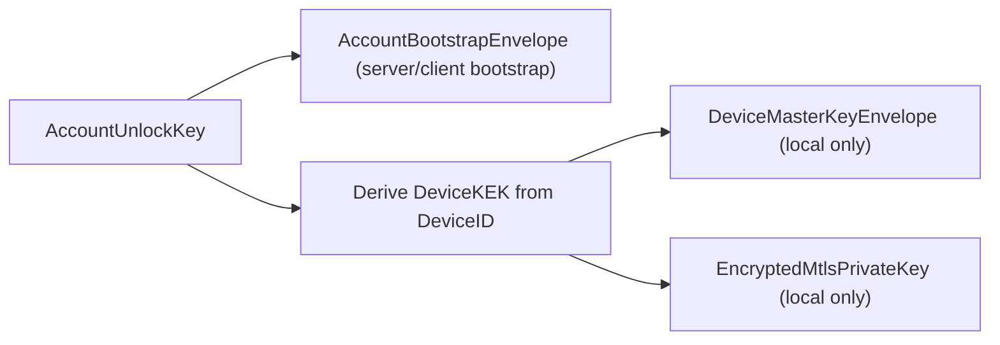
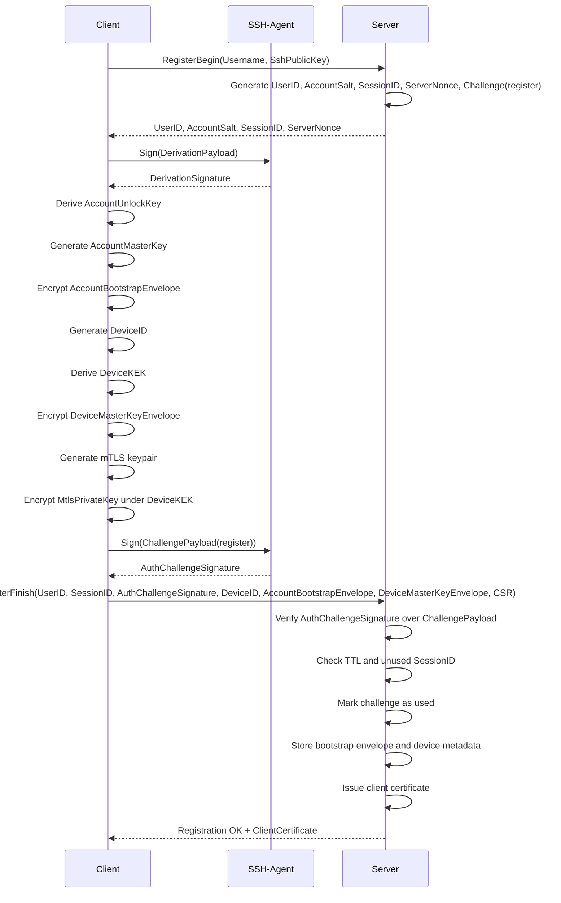
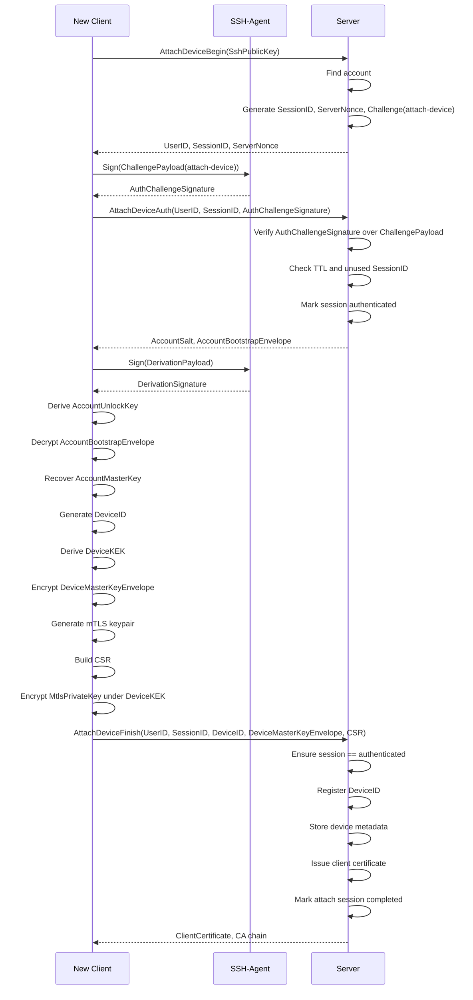
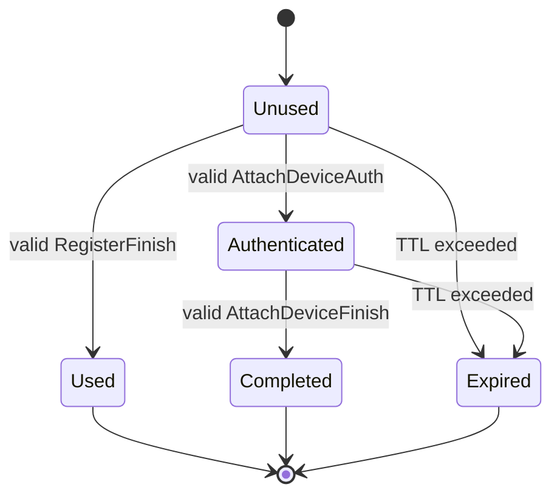
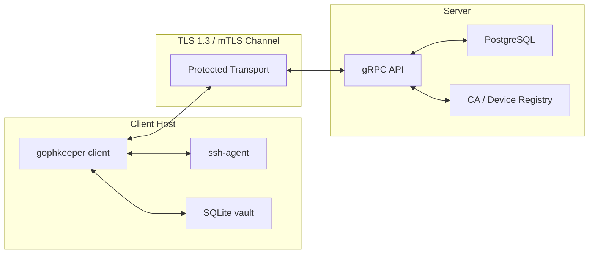
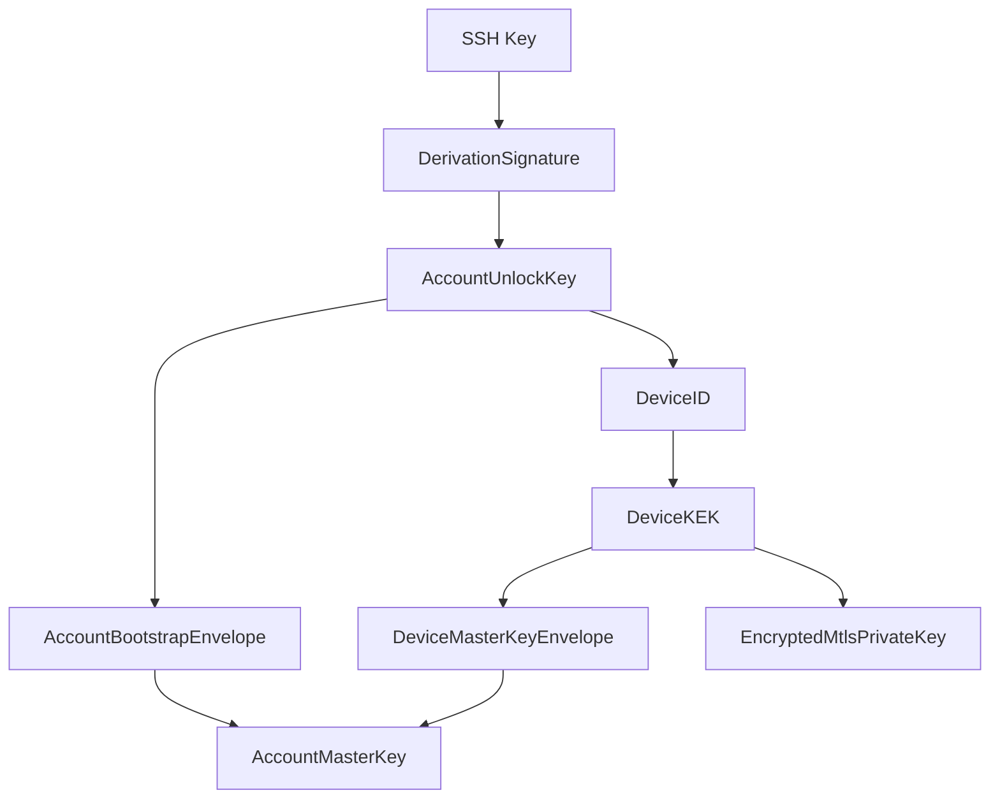

# Спецификация подсистемы безопасности клиент-серверного приложения GophKeeper (Упрощенная модель с device-bound локальной защитой)

## 1. Назначение подсистемы безопасности

Подсистема безопасности клиент-серверного приложения GophKeeper предназначена для обеспечения конфиденциального хранения пользовательских секретов в условиях недоверенной серверной среды. Архитектура системы строится по модели локально-приоритетного хранения (Local-First) со сквозным шифрованием (Zero-Knowledge client-side encryption), при которой сервер выполняет функции слепого персистентного хранения, репликации и синхронизации, но принципиально не обладает возможностью расшифровки пользовательских данных.

Ключевой особенностью решения является полный отказ от использования мастер-пароля. Вместо этого аутентификация пользователя, генерация ключей и восстановление доступа к данным строятся на доказательстве владения зарегистрированным SSH-ключом, доступным через `ssh-agent`. Привязка к инфраструктуре сервера и идентификация осуществляются строго на уровне конкретного локального файла базы данных SQLite, являющегося автономным криптографическим контейнером, а не на уровне физической операционной системы устройства.

Система обеспечивает:
- Беспарольное подтверждение личности пользователя через криптографический вызов;
- Локальную защиту секретов внутри изолированного файла SQLite;
- Синхронизацию зашифрованных блоков данных с минимизацией раскрытия операционных метаданных, неизбежных для обеспечения синхронизации, и полным исключением раскрытия содержимого пользовательских секретов, а также `AccountUnlockKey`, `DeviceKEK` и `AccountMasterKey` серверной стороне;
- Криптографическое разделение облачного bootstrap-доступа к аккаунту и локальной device-bound защиты конкретного контейнера.

## 2. Цели и требования безопасности

Подсистема безопасности удовлетворяет следующим требованиям:
1. Сервер не имеет доступа к расшифрованным пользовательским данным, а также к `AccountUnlockKey`, `DeviceKEK` и `AccountMasterKey` ни на одном из этапов жизненного цикла.
2. Пользователь не вводит мастер-пароль. Подтверждение владения учетной записью и деривация ключей осуществляются через SSH-ключ.
3. Локальный файл SQLite защищен на уровне файловой системы ОС и криптографически привязан к собственному `DeviceID` через локальный `DeviceKEK`.
4. Перенос файла на другой хост без доступа к соответствующему SSH-ключу не позволяет прочитать данные; при этом локальная упаковка мастер-ключа и mTLS-ключа выполняется в device-bound форме.
5. Утечка серверной базы данных PostgreSQL не приводит к раскрытию пользовательских секретов.
6. Повтор критических сетевых сообщений регистрации и привязки нового устройства не должен приводить к повторному успешному выполнению операции.
7. Сервер не выдает `AccountSalt` и `AccountBootstrapEnvelope` до успешного доказательства владения зарегистрированным SSH-ключом в рамках одноразовой challenge-сессии.
8. Локальный `MtlsPrivateKey` шифруется не общим аккаунтным ключом разблокировки, а производным `DeviceKEK`, привязанным к конкретному контейнеру.

## 3. Границы модели угроз

### 3.1. Главное криптографическое допущение безопасности

Безопасность доступа к `AccountMasterKey` и, следовательно, ко всей конфиденциальной полезной нагрузке локального и облачного сейфов криптографически эквивалентна способности клиентского приложения:
- получить детерминированную подпись `DerivationPayload` от зарегистрированного приватного SSH-ключа пользователя;
- отдельно получить валидную подпись одноразового `ChallengePayload` для доказательства владения ключом серверу.

При этом локальная защита конкретного SQLite-контейнера дополнительно зависит от корректного вычисления:
- `DeviceKEK = HKDF_SHA256(AccountUnlockKey, DeviceID_raw, "gophkeeper-device-kek-v1", 32)`

Из этого инварианта следуют правила:
1. Любой субъект, получивший доступ к активному сокету `SSH_AUTH_SOCK`, `ssh-agent` или иному механизму подписания данным ключом, должен рассматриваться как обладающий полным правом расшифровки всего хранилища.
2. Рантайм `gophkeeper` не реализует вторичных интерактивных факторов проверки, делегируя защиту ключевого материала механизмам ОС, контролирующим доступ к сокету агента.
3. Компрометация окружения хоста, при которой сторонний процесс способен отправлять команды подписания в сокет `SSH_AUTH_SOCK`, означает автоматическую и полную компрометацию локального сейфа SQLite, независимо от прав `0600` на сам файл базы данных.
4. Компрометация конкретного локального контейнера не должна автоматически рассматриваться как компрометация сетевой идентичности другого контейнера, поскольку `MtlsPrivateKey` каждого файла упакован под собственный `DeviceKEK`.

### 3.2. Противодействие угрозам внешнего периметра

Подсистема рассчитана на противодействие следующим угрозам:
- Полная компрометация серверного хранилища и несанкционированный доступ к базе данных PostgreSQL;
- Перехват, модификация или повтор сетевого трафика в gRPC-канале;
- Offline-компрометация и физическое извлечение файлов локального клиента SQLite с диска.

При этом система сознательно не заявляет защиты от:
- Полного контроля злоумышленника над клиентской ОС во время выполнения приложения;
- Несанкционированного злоупотребления доступом к локальному сокету `SSH_AUTH_SOCK`;
- Извлечения секретов напрямую из оперативной памяти уже разблокированного процесса клиента;
- Действий привилегированного локального администратора.

## 4. Архитектурные принципы

### 4.1. Zero-Knowledge

Сервер хранит только:
- зашифрованные записи (`Payload`);
- единый зашифрованный `AccountBootstrapEnvelope`;
- открытые служебные метаданные, необходимые для маршрутизации, синхронизации и контроля устройств.

Сервер является "слепым" ретранслятором. Все операции шифрования и расшифрования выполняются исключительно локально на клиенте.

### 4.2. Passwordless

Система полностью исключает использование паролей, пин-кодов или мнемоник в качестве штатного фактора авторизации. Пользовательская идентичность целиком основана на асимметричной криптографии SSH-ключей.

### 4.3. SSH-Agent как корень доверия

Приватный SSH-ключ никогда не считывается приложением напрямую, не сохраняется в памяти в открытом виде и не передается в сеть. Все операции подписи выполняются внутри контекста `ssh-agent`.

### 4.4. Local-First и асинхронность

Все операции записи (`create`, `set`, `update`, `delete`) выполняются атомарно внутри локального файла SQLite. Сетевой обмен с удаленным gRPC-сервером вынесен в изолированную команду `gophkeeper sync`.

### 4.5. Domain Separation

Для всех операций вывода ключей и подписания challenge-сообщений используются уникальные текстовые контексты и строго разделенные `info`-метки HKDF, что исключает повторное использование ключевого материала в разных контекстах.

### 4.6. Разделение подписи деривации и подписи аутентификации

Подсистема жестко разделяет два класса SSH-подписей:
1. `DerivationSignature` — детерминированная подпись стабильного `DerivationPayload`, используемая только локально для вычисления `AccountUnlockKey`;
2. `AuthChallengeSignature` — подпись одноразового `ChallengePayload`, используемая только для доказательства владения ключом серверу и защиты от replay.

Сервер не использует `AuthChallengeSignature` для деривации ключей, а клиент не использует `AuthChallengeSignature` как вход KDF.

### 4.7. Двухуровневая модель защиты ключей

Подсистема использует два разных слоя упаковки `AccountMasterKey`:
1. `AccountBootstrapEnvelope` — облачный аккаунтный конверт, шифрующий `AccountMasterKey` под `AccountUnlockKey` и предназначенный только для bootstrap/attach нового устройства;
2. `DeviceMasterKeyEnvelope` — локальный device-bound конверт, шифрующий тот же `AccountMasterKey` под `DeviceKEK` и предназначенный для повседневной работы конкретного SQLite-контейнера.

## 5. Криптографические алгоритмы

- Пользовательский SSH-ключ: программный OpenSSH `Ed25519`;
- Транспортный уровень: TLS 1.3 с проверкой подлинности сервера на базе встроенного `ServerCA`; опционально — Let's Encrypt TLS;
- Симметричное шифрование секретов и ключей: `XChaCha20-Poly1305`;
- Функция вывода ключей: `HKDF-SHA256`;
- Хеш-функция: `SHA-256`;
- Генерация случайных данных: ОС CSPRNG через `crypto/rand`.

## 6. Ограничения MVP-реализации

В MVP поддерживаются только программные OpenSSH `Ed25519` ключи. Аппаратные токены, FIDO2-ключи и иные варианты с недетерминированной подписью не поддерживаются.

Дополнительные ограничения MVP:
1. На аккаунт поддерживается ровно один SSH-ключ.
2. Ротация SSH-ключей в MVP не реализуется.
3. Аварийное восстановление доступа не реализуется.
4. Модель готовится к будущей миграции на multi-key схему, но соответствующие серверные структуры и RPC в MVP отсутствуют.

## 7. Сущности и ключевые материалы

| Сущность | Место хранения | Назначение |
|---|---|---|
| `SshPublicKey` | Сервер и клиент | Идентификация пользователя и проверка SSH-подписи |
| `SshPrivateKey` | `ssh-agent` | Доказательство владения учетной записью, вывод `AccountUnlockKey` |
| `SshFingerprint` | Сервер и клиент | Идентификатор SSH-ключа |
| `AccountSalt` | Сервер и клиент, открыто | 32-байтная соль аккаунта |
| `AccountUnlockKey` | Не хранится | Корневой KEK аккаунта, выводимый из `DerivationSignature` |
| `DeviceKEK` | Не хранится | Локальный device-bound ключ упаковки, выводимый из `AccountUnlockKey` и `DeviceID` |
| `AccountMasterKey` | Память клиента | Единый мастер-ключ шифрования всех пользовательских записей |
| `AccountBootstrapEnvelope` | Сервер и клиент | Облачный аккаунтный конверт `AccountMasterKey`, шифруемый под `AccountUnlockKey` |
| `DeviceMasterKeyEnvelope` | Клиент в SQLite | Локальный device-bound конверт `AccountMasterKey`, шифруемый под `DeviceKEK` |
| `UserID` | Сервер и клиент, открыто | UUID пользователя |
| `DeviceID` | Сервер и клиент, открыто | UUID конкретного локального контейнера |
| `ServerUrl` | Клиент в SQLite | URL gRPC-сервера |
| `EncryptedMtlsPrivateKey` | Клиент в SQLite | Зашифрованный под `DeviceKEK` приватный mTLS-ключ контейнера |
| `ClientCertificate` | Клиент в SQLite | Клиентский сертификат контейнера |
| `SessionID` | Сервер, временно | Идентификатор challenge-сессии |
| `ServerNonce` | Сервер, временно | Одноразовый nonce challenge-сессии |

## 8. Иерархия ключей

Логика деривации строится по схеме:
1. Существует один `AccountMasterKey` на весь аккаунт.
2. Для аккаунта вычисляется один `AccountUnlockKey`.
3. Для каждого локального контейнера вычисляется собственный `DeviceKEK`.
4. Сервер хранит один `AccountBootstrapEnvelope`.
5. Каждый SQLite-файл хранит собственный `DeviceMasterKeyEnvelope` и собственный зашифрованный `MtlsPrivateKey`.

### Диаграмма иерархии ключей

### Логическое разделение конвертов

## 9. Вывод ключей и типы подписей

### 9.1. Self-test детерминированности SSH-подписи

Перед первичной регистрацией клиент обязан:
1. Получить список публичных идентичностей из `SSH_AUTH_SOCK` через `request_identities`;
2. Дважды подписать один и тот же тестовый `DerivationPayload`;
3. Сравнить две подписи побайтно;
4. При несовпадении считать ключ неподдерживаемым.

### 9.2. Канонизация SSH-подписи

Из ответа `ssh-agent sign` клиент обязан извлечь только канонические сырые 64 байта подписи Ed25519 (`R || S`) после строгой проверки, что тип алгоритма равен `ssh-ed25519`. Внешний SSH framing в KDF не допускается.

### 9.3. Формат DerivationPayload

Для вывода `AccountUnlockKey` используется строго детерминированный `DerivationPayload`:
- `version` = 1 (`uint32`, BigEndian)
- `context` = `"gophkeeper-account-unlock-v1"` (`uint16 length + bytes`)
- `user_id` (`uint16 length + raw UUID bytes`)
- `ssh_fingerprint` (`uint16 length + raw hash bytes`)

`DerivationPayload` не содержит `SessionID`, `ServerNonce`, временных меток или иных одноразовых параметров.

### 9.4. Формат ChallengePayload

Для доказательства владения SSH-ключом серверу используется отдельный одноразовый `ChallengePayload`:
- `version` = 1 (`uint32`, BigEndian)
- `context` = `"gophkeeper-auth-challenge-v1"` (`uint16 length + bytes`)
- `user_id` (`uint16 length + raw UUID bytes`)
- `session_id` (`uint16 length + raw UUID bytes`)
- `server_nonce` (`uint16 length + raw bytes`)
- `operation` (`uint16 length + bytes`), допустимые значения: `"register"`, `"attach-device"`

`ChallengePayload` используется только для получения `AuthChallengeSignature` и только в рамках одной серверной challenge-сессии.

### 9.5. Формулы вывода

Пусть:
- `derivation_signature` — канонические 64 байта подписи `DerivationPayload`;
- `AccountSalt` — случайная 32-байтная соль аккаунта;
- `DeviceID_raw` — 16 сырых байт UUID в canonical network byte order.

Тогда:
`AccountUnlockKey = HKDF_SHA256(derivation_signature, AccountSalt, "gophkeeper-account-unlock-v1", 32)`

`DeviceKEK = HKDF_SHA256(AccountUnlockKey, DeviceID_raw, "gophkeeper-device-kek-v1", 32)`

`AccountUnlockKey` и `DeviceKEK` используются только локально и никогда не передаются серверу.

## 10. Криптографические конверты

Все шифруемые объекты оформляются в виде `versioned envelope`:
- `version` (`uint32`);
- `alg` (например, `"XChaCha20-Poly1305"`);
- `nonce` (24 байта);
- `aad_schema` (строковый идентификатор AAD-контекста);
- `ciphertext` (шифртекст + 16-байтный Poly1305 tag).

## 11. Локальная защита и привязка SQLite

Локальный файл SQLite является автономным криптографическим контейнером. Таблица `device_state` ограничивается инвариантом `CHECK (id = 1)`.

В `device_state` сохраняются:
- `server_url`
- `user_id`
- `device_id`
- `ssh_public_key`
- `device_master_key_envelope`
- `account_bootstrap_envelope`
- `encrypted_mtls_private_key`
- `client_certificate`

`AccountBootstrapEnvelope` может кэшироваться локально для повторного bootstrap-использования, но в повседневной работе контейнер обязан использовать `DeviceMasterKeyEnvelope` как основной способ раскрытия `AccountMasterKey`.

Файл базы данных на диске защищается:
- UNIX: права `0600` на файл и `0700` на каталог;
- Windows: ACL только для текущего SID пользователя.

СУБД настраивается прагмами:
- `PRAGMA foreign_keys = ON;`
- `PRAGMA busy_timeout = 5000;`
- `PRAGMA journal_mode = WAL;`

## 12. Семантика AAD

### 12.1. AAD для AccountBootstrapEnvelope

В состав AAD включаются:
- `version` = 1;
- `schema` = `"gophkeeper-account-bootstrap-aad-v1"`;
- `user_id`;
- `ssh_fingerprint`.

### 12.2. AAD для DeviceMasterKeyEnvelope

В состав AAD включаются:
- `version` = 1;
- `schema` = `"gophkeeper-device-master-key-aad-v1"`;
- `user_id`;
- `device_id`.

### 12.3. AAD для EncryptedMtlsPrivateKey

В состав AAD включаются:
- `version` = 1;
- `schema` = `"gophkeeper-mtls-private-key-aad-v1"`;
- `user_id`;
- `device_id`.

### 12.4. AAD для RecordEnvelope

В состав AAD включаются:
- `version` = 1;
- `schema` = `"gophkeeper-record-aad-v1"`;
- `user_id`;
- `record_id`.

Формула:
`encrypted_record = XChaCha20Poly1305_Enc(AccountMasterKey, nonce, RecordEnvelope, AAD_record)`

## 13. Сетевой транспорт сервера

Сервер слушает один унифицированный порт `--bind-grpc` (по умолчанию `:443`). В стек сервера интегрируется listener на базе `pires/go-proxyproto`.

Если трафик поступает через балансировщик с включенным `proxy_protocol on;`, listener извлекает реальный IP клиента и подменяет им `RemoteAddr()`. Если преамбула отсутствует, соединение обрабатывается как прямое.

## 14. Идентичность контейнера и mTLS

Каждый локальный файл SQLite обладает собственной отзываемой сетевой идентичностью:
- уникальный `DeviceID`;
- собственная пара mTLS-ключей;
- клиентский сертификат, выпущенный серверным Root CA.

При `gophkeeper sync` клиент:
1. извлекает `EncryptedMtlsPrivateKey` из SQLite;
2. вычисляет `DeviceKEK`;
3. расшифровывает `MtlsPrivateKey` с помощью `DeviceKEK`;
4. поднимает mTLS-канал.

Сервер отклоняет handshake, если:
- клиент не предоставил валидный сертификат;
- сертификат не содержит `ExtendedKeyUsage = clientAuth`;
- в SAN отсутствует URI `urn:gophkeeper:file:<uuid>`;
- `DeviceID` отозван или не принадлежит аккаунту.

## 15. Challenge-протоколы и anti-replay

Для всех критически важных операций используются одноразовые challenge-сессии.

### 15.1. Состав challenge-сессии

Сервер создает:
- `SessionID` — случайный UUID;
- `ServerNonce` — случайные байты CSPRNG;
- `UserID`;
- `Operation`;
- `CreatedAt`;
- `ExpiresAt = CreatedAt + 5 минут`;
- флаг состояния `unused`.

### 15.2. Правила валидации

Сервер принимает `AuthChallengeSignature` только если одновременно выполняются все условия:
1. `SessionID` существует;
2. challenge относится к ожидаемой операции;
3. challenge не истек по TTL;
4. challenge еще не помечен как использованный;
5. SSH-подпись валидна относительно зарегистрированного `SshPublicKey`;
6. `user_id`, `session_id`, `server_nonce` и `operation` в сериализованном `ChallengePayload` точно совпадают с сохраненными сервером значениями.

После успешной проверки challenge немедленно переводится:
- в состояние `used` для регистрации;
- в состояние `authenticated` для attach-потока.

Повторное использование того же `SessionID` запрещено.

### 15.3. Обоснование anti-replay

Подсистема противодействует replay на двух уровнях:

1. **Уровень регистрации и привязки устройства**  
   Каждая критическая операция требует отдельной подписи одноразового `ChallengePayload`, включающего `SessionID`, `ServerNonce` и `Operation`. Даже если злоумышленник перехватит `AuthChallengeSignature`, повторно применить ее не удастся, поскольку:
   - challenge одноразовый;
   - challenge имеет TTL 5 минут;
   - challenge после первого успешного применения меняет состояние;
   - challenge жестко привязан к типу операции.

2. **Уровень транспортного канала**  
   Передача выполняется внутри TLS 1.3 или mTLS. Это дает:
   - защиту от пассивного чтения трафика;
   - защиту от незаметной подмены сообщений;
   - криптографическую связанность сообщений с конкретной защищенной сессией;
   - невозможность успешного внедрения произвольного сообщения без прохождения handshake.

Таким образом, защита от перехвата, модификации и повтора трафика обеспечивается совместным действием:
- TLS 1.3 / mTLS;
- одноразовых challenge-сессий;
- жесткой валидации `SessionID`, `ServerNonce`, `Operation` и TTL;
- серверного запрета повторного использования уже завершенных challenge-состояний.

## 16. Сценарий регистрации первого файла SQLite

### 16.1. Этап RegisterBegin

1. Клиент опрашивает `ssh-agent`, извлекает `SshPublicKey` и отправляет `RegisterBegin(Username, SshPublicKey)`.
2. Сервер проверяет уникальность имени.
3. Сервер генерирует:
   - `UserID`;
   - `AccountSalt`;
   - `SessionID`;
   - `ServerNonce`;
   - challenge-сессию для операции `"register"`.
4. Сервер возвращает клиенту:
   - `UserID`;
   - `AccountSalt`;
   - `SessionID`;
   - `ServerNonce`.

### 16.2. Этап RegisterFinish

1. Клиент формирует `DerivationPayload`.
2. Клиент запрашивает у `ssh-agent` `DerivationSignature`.
3. Клиент канонизирует подпись и вычисляет `AccountUnlockKey`.
4. Клиент генерирует случайный `AccountMasterKey`.
5. Клиент шифрует `AccountMasterKey` под `AccountUnlockKey`, получая `AccountBootstrapEnvelope`.
6. Клиент генерирует `DeviceID`.
7. Клиент вычисляет `DeviceKEK`.
8. Клиент шифрует тот же `AccountMasterKey` под `DeviceKEK`, получая `DeviceMasterKeyEnvelope`.
9. Клиент генерирует mTLS-ключевую пару и CSR.
10. Клиент шифрует `MtlsPrivateKey` под `DeviceKEK`.
11. Клиент формирует `ChallengePayload` для операции `"register"`.
12. Клиент отдельно запрашивает у `ssh-agent` `AuthChallengeSignature`.
13. Клиент отправляет `RegisterFinish(UserID, SessionID, AuthChallengeSignature, DeviceID, AccountBootstrapEnvelope, DeviceMasterKeyEnvelope, CSR)`.
14. Сервер:
   - проверяет challenge-сессию;
   - верифицирует именно `AuthChallengeSignature` над `ChallengePayload`;
   - убеждается, что challenge не использован и не просрочен;
   - помечает challenge как `used`;
   - выпускает клиентский сертификат.
15. Сервер сохраняет данные атомарно и возвращает `ClientCertificate`.

### Диаграмма регистрации

## 17. Сценарий добавления нового устройства

### 17.1. Базовый принцип

Аккаунт жестко привязан к одному зарегистрированному SSH-ключу. Новое устройство может быть добавлено только если пользователь способен доказать владение этим ключом.

### 17.2. Предпосылка подключения нового устройства

На новой машине пользователь должен иметь доступ к зарегистрированному ключу:
- через локальный `ssh-agent`;
- через `ssh-agent forwarding`;
- через иной агент-совместимый механизм подписи.

### 17.3. Создаваемые сущности на новом устройстве

Новый локальный контейнер получает:
- собственный `DeviceID`;
- собственную пару mTLS-ключей;
- собственный `ClientCertificate`;
- локальную копию `AccountBootstrapEnvelope`;
- собственный `DeviceMasterKeyEnvelope`;
- локальные sync-метаданные.

### 17.4. Пошаговый сценарий привязки

**Шаг 1. Инициация**  
Клиент получает публичный SSH-ключ и отправляет:
`AttachDeviceBegin(SshPublicKey)`

**Шаг 2. Создание challenge-сессии**  
Сервер:
- находит аккаунт по `SshPublicKey` или `SshFingerprint`;
- создает challenge-сессию для операции `"attach-device"`;
- возвращает только:
  - `UserID`;
  - `SessionID`;
  - `ServerNonce`.

На этом этапе сервер **не возвращает** ни `AccountSalt`, ни `AccountBootstrapEnvelope`.

**Шаг 3. Доказательство владения ключом**  
Клиент формирует `ChallengePayload` для `"attach-device"` и получает у `ssh-agent` `AuthChallengeSignature`.

**Шаг 4. Подтверждение challenge**  
Клиент отправляет:
`AttachDeviceAuth(UserID, SessionID, AuthChallengeSignature)`

Сервер:
- верифицирует именно `AuthChallengeSignature` над `ChallengePayload`;
- проверяет TTL и флаг `unused`;
- переводит challenge в состояние `authenticated`.

Только после этого сервер раскрывает клиенту открытые параметры аккаунта:
- `AccountSalt`;
- `AccountBootstrapEnvelope`.

**Шаг 5. Локальная деривация ключей и раскрытие мастер-ключа**  
Получив `AccountSalt`, клиент:
1. формирует стабильный `DerivationPayload`;
2. получает у `ssh-agent` отдельную `DerivationSignature`;
3. локально вычисляет `AccountUnlockKey`;
4. локально расшифровывает `AccountBootstrapEnvelope`;
5. извлекает `AccountMasterKey`.

**Шаг 6. Генерация идентичности нового контейнера**  
Клиент:
- генерирует новый `DeviceID`;
- вычисляет `DeviceKEK`;
- шифрует `AccountMasterKey` под `DeviceKEK`, формируя `DeviceMasterKeyEnvelope`;
- генерирует mTLS-ключевую пару;
- формирует CSR;
- шифрует `MtlsPrivateKey` под `DeviceKEK`;
- сохраняет служебные поля в локальный SQLite.

**Шаг 7. Завершение привязки**  
Клиент отправляет:
`AttachDeviceFinish(UserID, SessionID, DeviceID, DeviceMasterKeyEnvelope, CSR)`

Сервер:
- убеждается, что challenge-сессия находится в состоянии `authenticated`;
- проверяет, что она относится к операции `"attach-device"`;
- регистрирует `DeviceID`;
- сохраняет device-метаданные;
- выпускает клиентский сертификат;
- помечает attach-сессию как завершенную и недоступную для повторного использования.

Сервер возвращает:
- `ClientCertificate`;
- при необходимости — цепочку доверия CA.

### 17.5. Sequence diagram привязки нового устройства

## 18. Протокол "слепой" синхронизации

Команда `gophkeeper sync` выполняется только внутри установленного mTLS-канала конкретного файла SQLite:
1. клиент локально вычисляет `AccountUnlockKey`;
2. клиент вычисляет `DeviceKEK` по своему `DeviceID`;
3. клиент раскрывает `AccountMasterKey` из `DeviceMasterKeyEnvelope`;
4. клиент вычитывает локальные измененные записи;
5. записи уже зашифрованы на `AccountMasterKey`;
6. клиент передает их по mTLS-каналу;
7. сервер сохраняет шифртексты и метаданные синхронизации;
8. сервер возвращает клиенту зашифрованную дельту от других устройств того же аккаунта.

Сервер разрешает `sync` только если:
- предъявлен валидный mTLS-сертификат;
- сертификат не отозван;
- `DeviceID` принадлежит аккаунту.

## 19. Управление устройствами и отзыв

### 19.1. Регистрация устройства

Для каждого устройства сервер хранит:
- `DeviceID`;
- публичную часть `ClientCertificate`;
- статус (`active` / `revoked`);
- время регистрации;
- время последней синхронизации.

### 19.2. Отзыв устройства

При отзыве устройства:
1. сервер помечает `DeviceID` как `revoked`;
2. сервер блокирует клиентский сертификат;
3. сервер запрещает новые `sync`-сессии;
4. `AccountMasterKey` не меняется;
5. другие устройства продолжают работать;
6. перешифрование пользовательских записей не требуется.

### 19.3. Аудит-лог

Изменения статусов устройств логируются в:
`audit_device_events(event_id, timestamp, user_id, device_id, action, operator_ip)`

## 20. Инфраструктура и жизненный цикл mTLS-сертификатов

1. TTL клиентского сертификата устройства составляет 30 суток.
2. Автоматический рефреш выполняется при `gophkeeper sync`, если до конца срока осталось менее 7 суток.
3. Повторное использование `serial_number` запрещено и блокируется уникальным индексом в PostgreSQL.
4. Отзыв сертификата проверяется сервером на этапе gRPC-интерцепции через статус устройства.

## 21. Очистка памяти и ограничения рантайма

После завершения операций клиент обязан занулять:
- `AccountMasterKey`;
- `AccountUnlockKey`;
- `DeviceKEK`;
- `DerivationSignature`;
- `AuthChallengeSignature`, если она временно буферизуется в памяти;
- расшифрованный `MtlsPrivateKey`.

В Go для уменьшения риска оптимизаций компилятора используется `runtime.KeepAlive()`.

Эти меры:
- уменьшают время жизни секретов в RAM;
- но не заменяют secure memory;
- и не защищают от полной компрометации хоста.

## 22. Исключение аварийного восстановления из MVP

В рамках MVP механизмы аварийного восстановления не реализуются. Безвозвратная утеря оригинального приватного SSH-ключа означает полную и необратимую потерю доступа к локальному и облачному хранилищу. Сервер не имеет средств сброса или восстановления ключей.

## 23. Отличия от сложной модели

| Аспект | Сложная модель | Текущая модель |
|---|---|---|
| Количество SSH-ключей на аккаунт | До 3-х | Ровно 1 |
| Ключевая иерархия | `SSH -> RootSecret -> KEK(DeviceID) -> DeviceMasterKeyEnvelope -> AccountMasterKey` | `SSH -> AccountUnlockKey -> DeviceKEK(DeviceID) -> DeviceMasterKeyEnvelope -> AccountMasterKey` + `AccountBootstrapEnvelope` |
| Количество облачных конвертов MasterKey | Множество | Ровно 1 `AccountBootstrapEnvelope` |
| `AccountBootstrapEnvelope` | Есть | Есть |
| `DeviceMasterKeyEnvelope` | Есть | Есть |
| KEK на устройство | Есть | Есть (`DeviceKEK`) |
| Multi-key matrix | Есть | Отсутствует |
| Деривационная подпись и auth-подпись | Могут быть разведены | Жестко разведены как обязательное правило |
| Выдача `AccountSalt`/bootstrap до auth | Необязательно | Запрещена |
| mTLS-идентичность | Может быть встроена глубже в матрицу доступа | Используется как device-bound транспортная идентичность |
| Ротация SSH-ключей | Есть | Отсутствует в MVP |
| Сложность | Высокая | Средняя |

## 24. Ключевые архитектурные решения

1. **Единый `AccountUnlockKey` на аккаунт**  
   Упрощает реализацию и управление ключами в MVP.

2. **Разделение `DerivationSignature` и `AuthChallengeSignature`**  
   Исключает смешение функций стабильной деривации и одноразовой серверной аутентификации.

3. **Выдача `AccountSalt` и `AccountBootstrapEnvelope` только после успешной challenge-аутентификации**  
   Снижает ненужную экспозицию служебных данных и шифртекста.

4. **Введение `DeviceKEK`**  
   Возвращает локальную криптографическую привязку контейнера к собственному `DeviceID`.

5. **Разделение `AccountBootstrapEnvelope` и `DeviceMasterKeyEnvelope`**  
   Разводит bootstrap-доступ к аккаунту и локальную device-bound упаковку мастер-ключа.

6. **Шифрование `MtlsPrivateKey` под `DeviceKEK`**  
   Отделяет сетевую идентичность контейнера от общего аккаунтного unlock-ключа.

7. **Local-First и асинхронная синхронизация**  
   Обеспечивают автономность работы клиента и простоту UX.

## 25. Формальные инварианты безопасности

Система считается корректно реализованной только при соблюдении следующих инвариантов:

1. `AccountUnlockKey` может быть вычислен только локально на клиенте и только из:
   - `DerivationSignature`;
   - `AccountSalt`;
   - фиксированного HKDF-контекста.

2. `DeviceKEK` может быть вычислен только локально и только из:
   - `AccountUnlockKey`;
   - сырых 16 байт `DeviceID`;
   - фиксированного HKDF-контекста.

3. `DerivationSignature` и `AuthChallengeSignature` вычисляются над разными payload и не взаимозаменяемы.

4. Сервер никогда не принимает `AuthChallengeSignature` повторно для того же `SessionID`.

5. Сервер никогда не выдает `AccountSalt` и `AccountBootstrapEnvelope` до успешной верификации `AuthChallengeSignature` в attach-потоке.

6. `AccountMasterKey` никогда не передается на сервер в открытом виде.

7. Все пользовательские записи шифруются только под `AccountMasterKey`.

8. Локальный контейнер обязан раскрывать `AccountMasterKey` через `DeviceMasterKeyEnvelope` в штатной работе.

9. `MtlsPrivateKey` каждого контейнера шифруется только под `DeviceKEK` этого контейнера.

10. Все сетевые операции синхронизации выполняются только внутри TLS 1.3 / mTLS-сессии.

## 26. Минимальные требования к реализации сервера

Сервер обязан:
- хранить challenge-сессии с TTL и флагом одноразового использования;
- атомарно переводить состояние challenge:
  - `unused -> used` для регистрации;
  - `unused -> authenticated -> completed` для attach;
- отклонять любые повторные запросы с тем же `SessionID`;
- проверять соответствие `Operation` ожидаемому RPC-методу;
- логировать проваленные и успешные попытки регистрации/attach;
- ограничивать частоту попыток по IP и по `SshFingerprint`;
- хранить `AccountBootstrapEnvelope` как единственный облачный bootstrap-конверт аккаунта;
- хранить реестр устройств и статусы mTLS-сертификатов.

## 27. Минимальные требования к реализации клиента

Клиент обязан:
- выполнять self-test детерминированности подписи;
- канонизировать Ed25519-подпись до сырых 64 байт;
- сериализовать `DerivationPayload` и `ChallengePayload` строго детерминированно;
- не использовать `AuthChallengeSignature` как вход в KDF;
- не передавать `DerivationSignature` на сервер;
- локально вычислять `DeviceKEK` только из `AccountUnlockKey` и `DeviceID`;
- использовать `DeviceMasterKeyEnvelope` как основной локальный конверт рабочего контейнера;
- локально стирать критические секреты после использования.

## 28. Итоговая модель безопасности

Итоговая модель обеспечивает:
- zero-knowledge хранение пользовательских секретов;
- беспарольный доступ на основе SSH-agent;
- безопасную первичную регистрацию и привязку новых устройств;
- криптографически обоснованную защиту от replay критических управляющих сообщений;
- транспортную защиту от перехвата и модификации трафика;
- локальную криптографическую изоляцию контейнеров через `DeviceKEK`;
- изоляцию сетевых идентичностей устройств на уровне отдельных mTLS-сертификатов и отдельных локальных упаковок `MtlsPrivateKey`.

При этом модель сознательно не обеспечивает:
- мультиключевую матрицу доступа;
- ротацию SSH-ключей в MVP;
- аварийное восстановление доступа.

## 29. Пути улучшения после MVP

Для повышения управляемости доступа, зрелости эксплуатации и поддержки ротации ключей система проектируется так, чтобы в следующей версии можно было выполнить простую миграцию без перешифрования пользовательских записей.

### 29.1. Цель миграции

Будущая расширенная модель должна поддержать:
- более одного SSH-ключа на аккаунт;
- добавление резервного SSH-ключа;
- отзыв старого SSH-ключа;
- плановую ротацию ключей доступа без смены `AccountMasterKey`;
- сохранение уже существующих локальных `DeviceMasterKeyEnvelope` и `DeviceID`.

### 29.2. Принцип миграции

Миграция должна выполняться не через перешифрование всех записей аккаунта, а только через добавление новых bootstrap-конвертов доступа к уже существующему `AccountMasterKey`.

Иными словами:
- `AccountMasterKey` остается тем же;
- `DeviceMasterKeyEnvelope` локальных контейнеров остается тем же;
- все пользовательские `RecordEnvelope` остаются без изменений;
- изменяется только серверный слой bootstrap-доступа.

### 29.3. Минимальная будущая доработка серверной модели

Для поддержки ротации в следующей версии достаточно заменить одиночное хранение:
- одного `AccountBootstrapEnvelope`

на хранение набора bootstrap-конвертов:
- по одному `AccountBootstrapEnvelope` на каждый разрешенный `SshFingerprint`.

Таким образом, серверная модель естественно эволюционирует от:
- `account_bootstrap_envelope`

к:
- `account_bootstrap_envelopes(user_id, ssh_fingerprint, envelope, created_at, revoked_at)`

### 29.4. Сценарий будущего добавления нового SSH-ключа

После появления поддержки multi-key миграция с MVP выполняется так:
1. Пользователь входит в аккаунт по старому SSH-ключу.
2. Клиент локально раскрывает `AccountMasterKey` через существующий путь:
   - `DerivationSignature_old -> AccountUnlockKey_old -> DeviceKEK -> DeviceMasterKeyEnvelope -> AccountMasterKey`
3. Новый SSH-ключ проходит отдельное доказательство владения (`Proof-of-Possession`).
4. Клиент вычисляет `AccountUnlockKey_new` для нового SSH-ключа.
5. Клиент создает новый `AccountBootstrapEnvelope_new`, шифруя тот же `AccountMasterKey` под `AccountUnlockKey_new`.
6. Сервер сохраняет новый bootstrap-конверт рядом со старым.
7. После этого оба SSH-ключа могут независимо bootstrap-ить новые устройства.

### 29.5. Сценарий будущего отзыва старого SSH-ключа

1. Пользователь входит по оставшемуся валидному SSH-ключу.
2. Сервер помечает `SshFingerprint_old` как отозванный.
3. Сервер удаляет или инвалидирует связанный `AccountBootstrapEnvelope_old`.
4. Существующие локальные контейнеры продолжают работать, потому что их локальные `DeviceMasterKeyEnvelope` уже упакованы под собственные `DeviceKEK`.
5. Перешифрование пользовательских данных не требуется.

### 29.6. Почему миграция из MVP проста

Миграция из текущей схемы на схему с ротацией проста, потому что:
- `AccountMasterKey` уже отделен от SSH-ключа;
- локальный `DeviceMasterKeyEnvelope` уже отделен от облачного bootstrap-конверта;
- пользовательские записи уже шифруются единым `AccountMasterKey`;
- добавление нового SSH-ключа требует только создания дополнительного bootstrap-конверта, а не пересоздания локальных контейнеров и не массового перешифрования данных.

### 29.7. Ограничение MVP

Несмотря на готовность архитектуры к такой миграции:
- операции добавления и отзыва SSH-ключей,
- хранение набора bootstrap-конвертов,
- и ротация SSH-ключей

в рамках MVP не реализуются и не входят в обязательный объем разработки.

## 30. Рекомендуемые последовательности RPC

### 30.1. Регистрация

1. `RegisterBegin(Username, SshPublicKey)`
2. Сервер возвращает:
   - `UserID`
   - `AccountSalt`
   - `SessionID`
   - `ServerNonce`
3. Клиент локально выполняет:
   - `DerivationSignature = Sign(DerivationPayload)`
   - `AccountUnlockKey = HKDF(DerivationSignature, AccountSalt, ...)`
   - `AccountMasterKey = random(32)`
   - `AccountBootstrapEnvelope = Encrypt(AccountMasterKey, AccountUnlockKey)`
   - `DeviceKEK = HKDF(AccountUnlockKey, DeviceID, ...)`
   - `DeviceMasterKeyEnvelope = Encrypt(AccountMasterKey, DeviceKEK)`
   - `AuthChallengeSignature = Sign(ChallengePayload(register))`
4. Клиент отправляет:
   `RegisterFinish(UserID, SessionID, AuthChallengeSignature, DeviceID, AccountBootstrapEnvelope, DeviceMasterKeyEnvelope, CSR)`

### 30.2. Привязка нового устройства

1. `AttachDeviceBegin(SshPublicKey)`
2. Сервер возвращает:
   - `UserID`
   - `SessionID`
   - `ServerNonce`
3. Клиент локально выполняет:
   - `AuthChallengeSignature = Sign(ChallengePayload(attach-device))`
4. Клиент отправляет:
   `AttachDeviceAuth(UserID, SessionID, AuthChallengeSignature)`
5. Сервер после успешной проверки возвращает:
   - `AccountSalt`
   - `AccountBootstrapEnvelope`
6. Клиент локально выполняет:
   - `DerivationSignature = Sign(DerivationPayload)`
   - `AccountUnlockKey = HKDF(DerivationSignature, AccountSalt, ...)`
   - `AccountMasterKey = Decrypt(AccountBootstrapEnvelope, AccountUnlockKey)`
   - `DeviceKEK = HKDF(AccountUnlockKey, DeviceID, ...)`
   - `DeviceMasterKeyEnvelope = Encrypt(AccountMasterKey, DeviceKEK)`
7. Клиент отправляет:
   `AttachDeviceFinish(UserID, SessionID, DeviceID, DeviceMasterKeyEnvelope, CSR)`

### 30.3. Синхронизация

1. Клиент вычисляет `AccountUnlockKey`
2. Клиент вычисляет `DeviceKEK`
3. Клиент раскрывает `AccountMasterKey` через `DeviceMasterKeyEnvelope`
4. Клиент поднимает mTLS-сессию сертификатом устройства
5. Сервер валидирует сертификат и статус `DeviceID`
6. Выполняется обмен зашифрованными дельтами

## 31. Диаграмма состояний challenge-сессии

## 32. Диаграмма доверительных границ

## 33. Диаграмма двухуровневой защиты ключей

## 34. Пояснение по достаточности защиты от replay

Для дипломной формализации защита от replay считается достаточной, поскольку:
1. Атакующий не может повторно использовать завершенный challenge из-за одноразового `SessionID` и статусов `used/authenticated/completed`;
2. Атакующий не может модифицировать содержимое challenge без инвалидирования SSH-подписи;
3. Атакующий не может незаметно подменить транспортные сообщения внутри TLS 1.3 / mTLS-сессии;
4. Даже повторная отправка ранее наблюденных зашифрованных sync-пакетов не раскрывает содержимого секретов, так как сервер не обладает ключом расшифрования и принимает данные только в рамках уже аутентифицированного канала устройства.

## 35. Заключение

Данная модель является целостной криптографической схемой для MVP-подсистемы безопасности GophKeeper. Она сохраняет ключевые свойства:
- zero-knowledge;
- passwordless;
- local-first;
- SSH-agent-based trust;
- защищенную регистрацию и привязку устройств;
- разделение стабильной деривации и одноразовой аутентификации;
- локальную криптографическую изоляцию контейнеров;
- формально обоснованную защиту от replay для критических операций;
- готовность к дальнейшей эволюции в сторону multi-key ротации без перешифрования пользовательских данных.

При этом модель сознательно остается проще полной multi-key схемы, что делает ее пригодной для реализации, анализа и защиты в рамках дипломного проекта.

