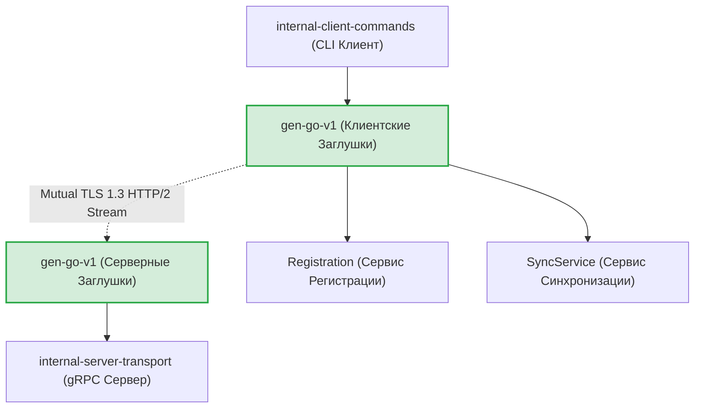
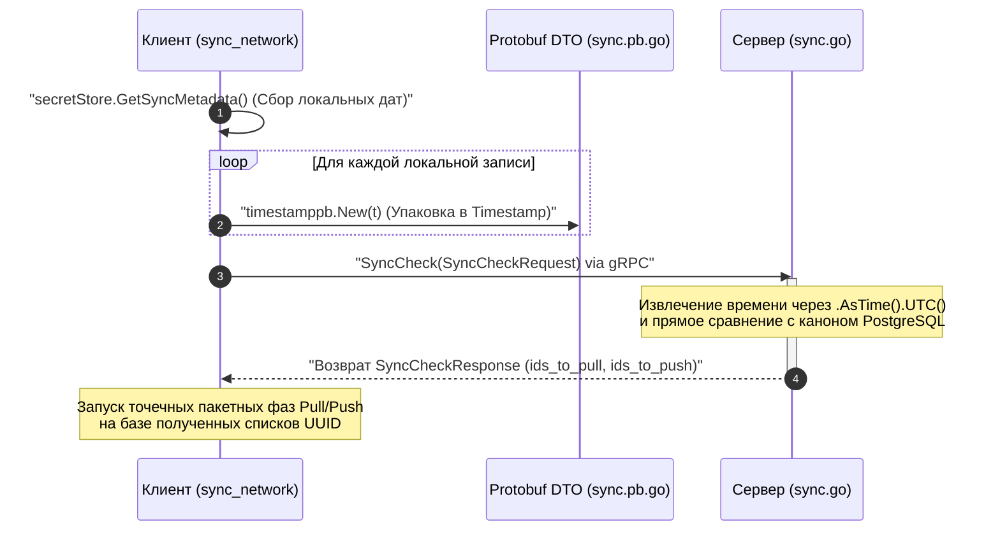

# Спецификация API-контрактов Protobuf (`api/proto/gophkeeper/v1`)

Данная директория содержит канонические декларации сетевых интерфейсов и структур данных GophKeeper, скомпилированных в строго типизированные gRPC-заглушки для Go-рантайма (`gen/go/gophkeeper/v1`). Сетевой слой намертво изолирован от деталей реализации бизнес-логики и СУБД, выступая единым контрактом взаимодействия между оффлайн-клиентом и облачным сервером.

## 📌 Состав сетевых сервисов

Архитектура API разделена на два изолированных домена ответственности:

1. **`register.proto` (Сервис `Registration`)**:
   * Обслуживает двухэтапный Zero-Knowledge Challenge протокол беспарольной авторизации владения ключом.
   * Управляет выпуском индивидуальных mTLS-паспортов устройств на базе отправляемых PKCS#10 CSR шаблонов.
   * Координирует безопасное слияние криптографических контекстов соли (`canonical_account_salt`) при подключении новых устройств.

2. **`sync.proto` (Сервис `SyncService`)**:
   * Обеспечивает дифференциальную пакетную репликацию зашифрованных Poly1305 конвертов.
   * Поддерживает сквозную Last-Write-Wins (LWW) стратегию разрешения распределенных конфликтов версий.
   * Реализует разделение трафика на легкую фазу сверки метаданных (`SyncCheck`) и тяжелые фазы передачи контента (`PullRecords`/`PushRecords`).

---

## 🏗 Архитектурная карта сетевых потоков данных

Схема сквозного взаимодействия клиентской и серверной частей приложения через строго типизированные Protobuf-заглушки. Вся разметка полностью совместима с рендером VSCode.

---

## 📊 Диаграмма сквозного обмена фазы дифференциальной сверки (`SyncCheck`)

Пошаговый процесс маппинга строго типизированных наносекундных объектов времени `google.protobuf.Timestamp` при обмене метаданными между клиентом и сервером.

---

## 🔒 Промышленные ИБ-инварианты контрактов API

* **Бескомпромиссная нативная типизация времени**: В промышленной версии полностью ликвидирован ненадёжный текстовый разбор дат через RFC3339-строки. Контроль версий репликации Last-Write-Wins переведен на нативный импорт `google/protobuf/timestamp.proto`. Это гарантирует аппаратное сравнение меток времени до наносекунд, полностью защищая данные от коллизий часовых поясов или Scan Errors на стыке Go и PostgreSQL.
* **Строгость бизнес-состояний (Type Safety)**: Поле статуса регистрации в ответе `RegisterFinishResponse` переведено со свободных текстовых MVP-строк на жестко типизированное перечисление `enum RegistrationStatus`. Это исключает риски порчи логики из-за опечаток на стороне сервера и позволяет компилятору Go верифицировать ветвления на этапе сборки.
* **Backward Compatibility (Обратная совместимость)**: Контракты спроектированы по правилам Google Protocol Buffers Style Guide. Порядковые индексы полей (теги 1–9) зафиксированы монолитно, что гарантирует бесшовное обновление клиентских CLI-утилит у пользователей без нарушения работоспособности развернутых облачных серверов.

---

## 🔬 Валидация сборки схемы (`proto_test.go`)

Целостность и компилируемость сетевых контрактов защищена автоматизированными юнит-тестами компиляции дескрипторов (файлы `register_proto_test.go` и `sync_proto_test.go`). Тест-кейсы верифицируют успешную регистрацию сгенерированных Go-структур в глобальном реестре Protobuf, проверяют корректность маппинга интерфейсов `protoreflect.Name` и контролируют точное соответствие индексов перечислений доменным инвариантам GophKeeper, гарантируя стопроцентную стабильность сетевого слоя.
