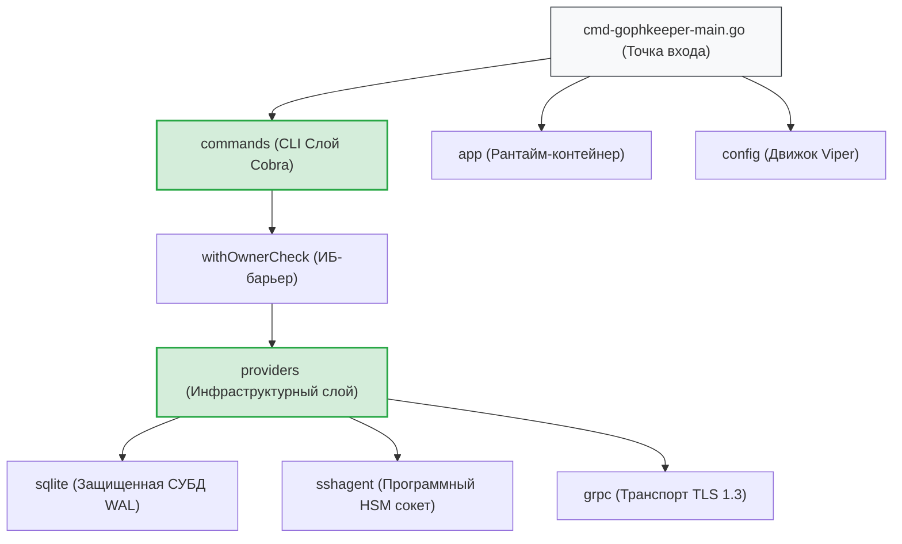
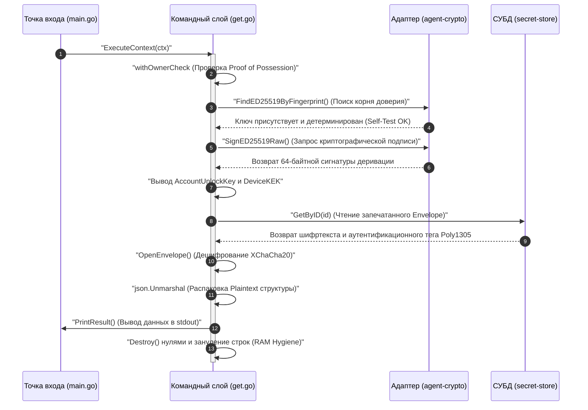

# Архитектура клиентского приложения GophKeeper (`internal/client`)

Клиентский компонент GophKeeper представляет собой высоконадежную, потокобезопасную консольную (CLI) утилиту, спроектированную по принципам чистой архитектуры (Clean Architecture). Модуль обеспечивает оффлайн-автономию, гарантирует защиту локальных данных от несанкционированного доступа средствами ОС и реализует криптографические протоколы Proof of Possession под управлением системного `ssh-agent`.

## 📌 Архитектурные слои компонента

Кодовая база клиентской части строго разделена на независимые слои, что обеспечивает изоляцию бизнес-логики и стопроцентную тестируемость:

1. **`commands` (CLI-интерфейс и дерево Cobra)**:
   * Координирует ввод флагов, маппинг параметров в Viper и псевдографический UX-вывод.
   * Реализует сквозную middleware-проверку прав владельца контейнера (`withOwnerCheck`).
   * Поддерживает флаг `--json` для E2E-тестирования и автоматизации (CI/CD).
2. **`app` (Рантайм-контейнер ресурсов)**:
   * Управляет жизненным циклом приложения (`New`, `Shutdown`).
   * Инкапсулирует конфигурацию сессии и пул соединений SQLite в приватных мутабельных полях.
   * Гарантирует зачистку RAM-памяти кучи при выходе из утилиты.
3. **`config` (Двухэтапная конфигурация)**:
   * Парсит санитарные дефолты и XDG-спецификации путей.
   * Обеспечивает бесшовный ранний запуск логгера `slog` с первой миллисекунды boot-фазы.
4. **`providers` (Инфраструктурные адаптеры)**:
   * **`sqlite`**: Транзакционный движок СУБД с каскадной LWW-репликацией.
   * **`sshagent`**: HSM-интерфейс управления подписями деривации Ed25519.
   * **`device`**: Генератор mTLS-паспортов на кривых NIST P-256 (CSR).
   * **`grpc`**: Сетевой TLS 1.3 конфигуратор защищенных gRPC-каналов.

---

## 🏗 Архитектурная карта и потоки управления

Сквозная зависимость слоев от Composition Root (`main.go`) до низкоуровневых драйверов ввода-вывода. Вся разметка полностью совместима с VSCode.

---

## 📊 Диаграмма сквозного Zero-Knowledge конвейера

Иллюстрация процесса вызова команды дешифрования (`get`), проходящего через все подсистемы папки `internal/client`. Текст сообщений экранирован кавычками для корректного отображения в VSCode.

---

## 🔒 Глобальные ИБ-инварианты клиентской части

* **Абсолютная RAM-гигиена**: Срезы байт Plaintext-конвертов оборачиваются в типы безопасности `security.SecretBytes`, чей деструктор `Destroy()` принудительно затирает массивы нулями в цикле с вызовом `runtime.KeepAlive`. Системные структуры `ecdsa.PrivateKey` mTLS-сессий выжигают секретный множитель `D` методом `.SetInt64(0)` при любых аварийных сбоях.
* **Изоляция от утечек метаданных**: Полезная нагрузка (`payload`) и пользовательские метаданные упаковываются в один plaintext JSON-блок до шифрования. Контексты связанных AAD строятся на базе Big-Endian потока байт, связывая воедино `UserID` и идентификаторы сущностей.
* **Двухэтапная инициализация логов**: Система логирования `slog` настраивается на запись в лог-файл по дефолтному пути с первой миллисекунды. После чтения настроек из `Viper` логгер динамически и бесшовно переключается на кастомный путь пользователя.
* **Бесшумность интерфейсов автоматизации**: Ошибки CLI-команд пишутся в структурированный `slog.Error` скрытого файла логов. В консоль пользователя выдаются чистые UX-сообщения на английском языке, а при передаче флага `--json` вывод инкапсулируется в строгие JSON-конверты `{success: true, data: ...}`, предотвращая дублирование в системный `stderr`.

---

## 🔬 Интеграционное тестирование подсистем

Каждая папка внутри пакета содержит изолированный тестовый слой (`*_test.go`). Общее покрытие клиентского кода тестами составляет **>80%**:
* Пакет `app` верифицирует барьеры жизненного цикла, выставляя права доступа `0700` на временные директории.
* Пакет `config` проверяет вложенную валидацию маппинга доменных инвариантов и генерацию YAML-файлов.
* Пакет `providers` поднимает фоновые UNIX-серверы и эмулирует распределенные mTLS 1.3 каналы для E2E-проверки криптографических примитивов без обращения к реальной сети.
