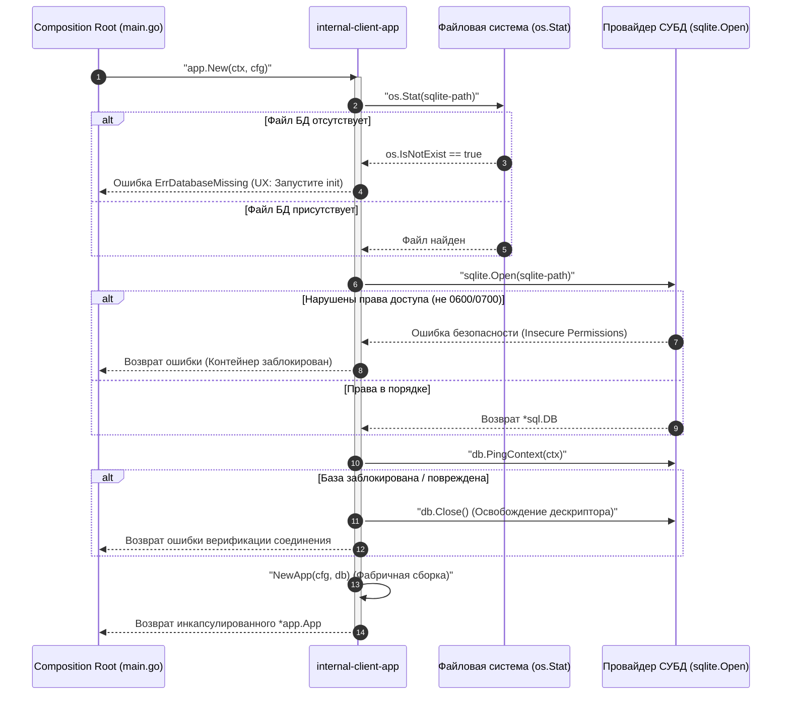
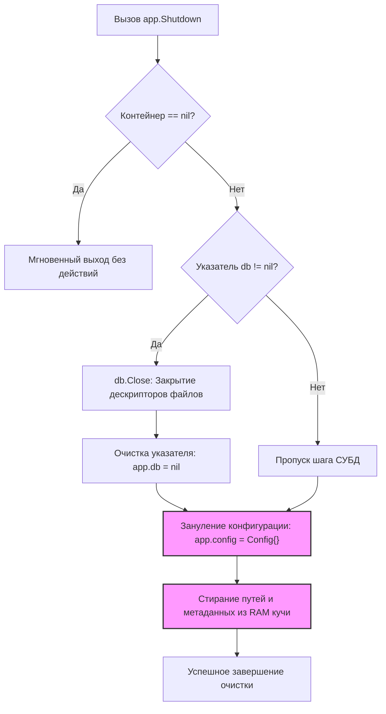

# Рантайм-контейнер приложения (`internal/client/app`)

Пакет `app` является ключевым компонентом жизненного цикла клиентского приложения GophKeeper. Он реализует паттерн **Runtime Container** (Контейнер ресурсов), инкапсулируя в себе неизменяемую конфигурацию сессии и пул соединений с криптографическим SQLite-хранилищем.

## 📌 Основные функции пакета

1. **Изоляция ресурсов**: Защита дескрипторов ввода-вывода и конфигурационных структур от несанкционированной модификации из параллельных горутин или CLI-команд.
2. **Fail-Fast валидация окружения**: Блокировка запуска приложения с выдачей понятного Security UX текста, если локальное зашифрованное хранилище еще не было инициализировано.
3. **RAM Hygiene (Гигиена памяти)**: Принудительное зануление и уничтожение ссылок на конфигурационные данные и пулы СУБД в оперативной памяти при выходе из приложения для предотвращения утечек (Memory Dump Leakage).

---

## 🏗 Архитектура и компоненты

Пакет состоит из двух логических модулей:
* `runtime.go` — определяет структуру `App` с приватными полями и потокобезопасными геттерами `DB()` и `Config()`.
* `bootstrap.go` — реализует управление жизненным циклом (функции сборки `New` и безопасного уничтожения `Shutdown`).

---

## 📊 Диаграммы процессов

### 1. Инициализация рантайма (`app.New`)

Диаграмма показывает пошаговый барьер проверок, который проходит приложение перед тем, как предоставить доступ к бизнес-логике. Вся разметка полностью совместима с рендером VSCode.



---

### 2. Завершение работы (`app.Shutdown`)

Диаграмма иллюстрирует процесс гарантированной очистки памяти при выходе из приложения или при возникновении критического сбоя.



---

## 💻 Пример использования

Типовой сценарий сборки и закрытия контейнера внутри главного Composition Root (`main.go`):

```go
package main

import (
	"context"
	"fmt"
	"gophkeeper/internal/client/app"
	"gophkeeper/internal/client/config"
)

func run() (err error) {
	ctx := context.Background()
	cfg := config.LoadSomehow()

	// 1. Сборка и валидация контейнера
	application, err := app.New(ctx, cfg)
	if err != nil {
		return fmt.Errorf("старт приложения отклонен: %w", err)
	}

	// 2. Гарантированная гигиена RAM при любом исходе сессии
	defer func() {
		if shutdownErr := app.Shutdown(application); shutdownErr != nil {
			// Логирование ошибки закрытия дескрипторов
		}
	}()

	// 3. Использование ресурсов через безопасные геттеры
	_ = application.DB()     // Доступ к пулу СУБД для сервисов
	_ = application.Config() // Доступ к конфигурации

	return nil
}
```

---

## 🔒 Требования к ИБ-окружению (Инварианты безопасности)

Контейнер намертво завязан на правила безопасного хранения данных, реализованные в провайдере `sqlite`. При разворачивании тегов или запуске приложения в Unix-системах, папка, содержащая базу данных, **обязана иметь права доступа `0700`**, а сам файл базы данных — **`0600`**. 

В случае несоблюдения этих прав рантайм-конвейер автоматически прервет выполнение (`Fail-Fast`) для исключения возможности чтения закрытых ключей другими пользователями операционной системы.
