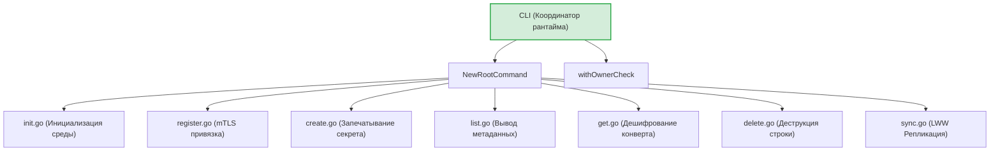
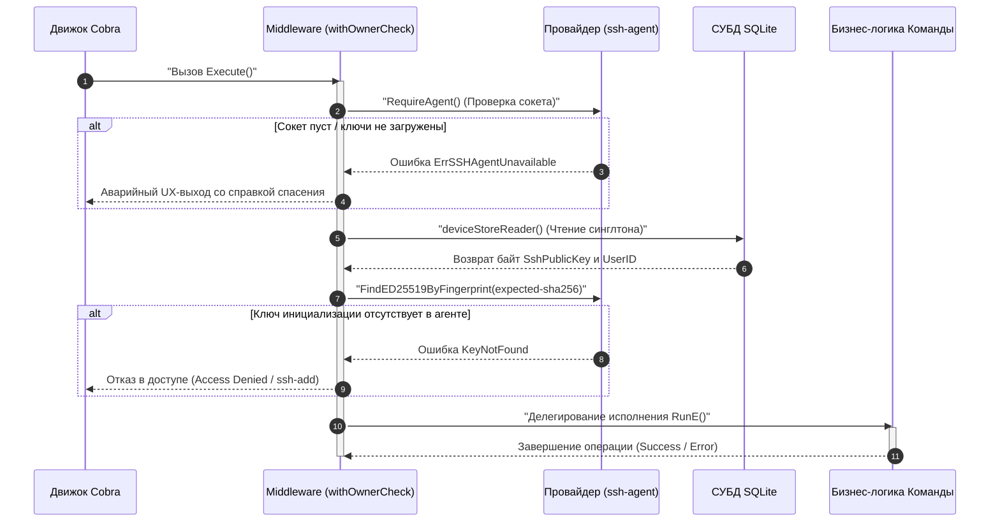

# CLI-интерфейс и слой консольных команд (`internal/client/commands`)

Пакет `commands` является центральным узлом консольного интерфейса (CLI) клиентского приложения GophKeeper. Он координирует дерево команд Cobra, реализует сквозные инфраструктурные middleware-перехватчики (Proof of Possession) и инкапсулирует Composition Root для сборки сервисов прямо в точках вызова.

## 📌 Основные функции пакета

1. **Централизованная координация CLI**: Построение, валидация и запуск дерева команд утилиты (`init`, `register`, `create`, `list`, `get`, `delete`, `sync`).
2. **Криптографический барьер (withOwnerCheck)**: Сквозная middleware-проверка прав владения локальным контейнером. Блокирует доступ к данным, если в `ssh-agent` отсутствует оригинальный закрытый ключ деривации.
3. **Унификация вывода (PrintResult/PrintError)**: Поддержка флага `--json` для бесшовной интеграции CLI-утилиты в CI/CD пайплайны и автоматизированные E2E-тесты.
4. **RAM Hygiene (Гигиена памяти)**: Принудительное затирание промежуточных plaintext-байтов и деструкция DTO-структур ответов (`GetResponse.Destroy()`) сразу после вывода данных на экран.

---

## 🏗 Архитектура и структура пакета

Пакет спроектирован по принципу разделения ответственности. Каждая команда вынесена в изолированный файл со своими внутренними валидаторами:



---

## 📊 Диаграмма сквозного барьера безопасности (`withOwnerCheck`)

Процесс перехвата управления и математической верификации Proof of Possession перед выполнением любой операционной команды (`get`, `create`, `list` и т.д.):



---

## 🔒 Инварианты безопасности слоя команд

* **Защита от утечек дескрипторов**: Все системные подключения к UNIX-сокету агента (`agentClient.Close()`) и gRPC-соединения (`conn.Close()`) финализируются принудительно с явной обработкой ошибок и записью сбоев в `slog.Error`.
* **Защита памяти от Memory Dump**: В команде `get.go` расшифрованная структура `RecordPlaintext` оборачивается в объекты безопасности `security.SecretBytes` и уничтожается через `defer` нулями. Поля DTO-ответа очищаются вызовом метода `Destroy()`.
* **Отказоустойчивость синхронизации**: При парсинге временных меток в `sync.go` ошибки валидации дат gRPC-ответа сервера обрабатываются явно. Любое повреждение меток приводит к пропуску пакета, защищая локальный инвариант Last-Write-Wins (LWW).

---

## 💻 Пример интеграции E2E автоматизации

При передаче флага `--json` вывод переключается со стандартного текстового интерфейса на структурированные JSON-конверты, обрабатываемые парсерами автоматизации:

**Успешный ответ (Success Envelope):**
```json
{
  "success": true,
  "data": {
    "name": "yandex-account",
    "type": "credentials"
  }
}
```

**Ответ со сбоем (Failure Envelope):**
```json
{
  "success": false,
  "error": "ошибка дешифрования секрета: chacha20poly1305: message authentication failed"
}
```
