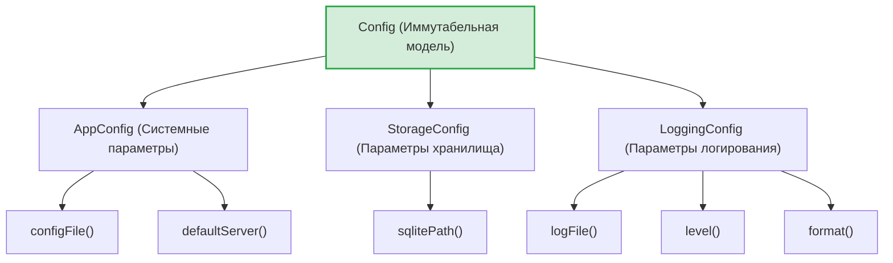
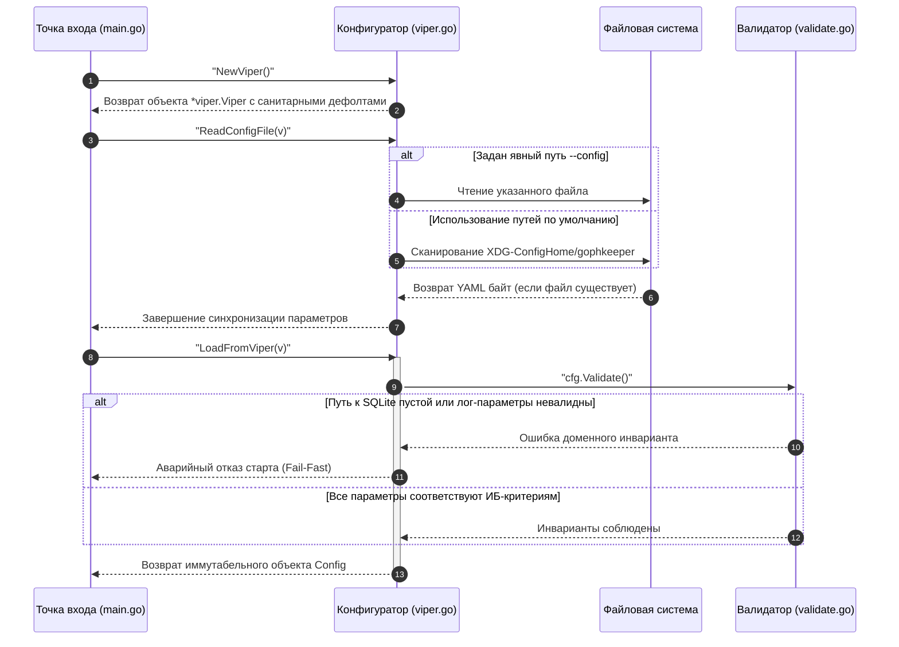

# Подсистема конфигурации клиентской части (`internal/client/config`)

Пакет `config` отвечает за декларативное описание, двухэтапное чтение, строгую валидацию и сохранение параметров функционирования CLI-клиента GophKeeper.

## 📌 Основные функции пакета

1. **Строгая инкапсуляция параметров**: Защита путей к зашифрованной СУБД, файлам логирования и сетевым адресам от неконтролируемого изменения во время выполнения сессии (защита от Race Conditions).
2. **Двухэтапная инициализация**: Возможность безопасного старта системы логирования с первой миллисекунды работы утилиты с последующим динамическим переключением на кастомные пользовательские файлы.
3. **Безопасная персистентность**: Генерация и сохранение конфигурационных файлов по умолчанию со строгими ИБ-правами доступа (`0700` на директории и `0600` на файлы).

---

## 🏗 Архитектура данных и DTO слой

Для обхода ограничений инкапсуляции приватных полей и сохранения иммутабельности бизнес-логики, пакет разделен на строгую доменную модель `Config` (доступную только через геттеры) и плоские структуры DTO для сериализации в YAML.



---

## 📊 Диаграмма жизненного цикла конфигурации

Процесс сканирования окружения, разбора дефолтных путей спецификации XDG и сборки объектного графа.



---

## 🔒 Инварианты безопасности и Валидация (`validate.go`)

Пакет реализует концепцию **Fail-Fast** верификации до старта основных систем. Запуск CLI-инструмента мгновенно прерывается со строгим логированием в `slog.Error` в следующих случаях:
* Путь к локальной базе данных (`storage.sqlite_path`) пуст или состоит только из пробелов.
* Задан неподдерживаемый текстовый уровень логирования (допустимы строго: `debug`, `info`, `warn`, `error`).
* Задан неподдерживаемый формат сериализации структуры логов (допустимы строго: `text`, `json`).

---

## 💻 Пример использования подсистемы

Типовой сценарий взаимодействия с пакетом на этапе сборки Composition Root:

```go
package main

import (
	"fmt"
	"gophkeeper/internal/client/config"
)

func run() error {
	// 1. Создание загрузчика
	v, err := config.NewViper()
	if err != nil {
		return err
	}

	// 2. Поиск и применение файлов на диске
	if err := config.ReadConfigFile(v); err != nil {
		return fmt.Errorf("сбой конфигурации: %w", err)
	}

	// 3. Фабричная сборка валидированной иммутабельной модели
	cfg, err := config.LoadFromViper(v)
	if err != nil {
		return fmt.Errorf("ошибка валидации инвариантов: %w", err)
	}

	// 4. Безопасное использование без рисков случайной модификации
	_ = cfg.Storage().SQLitePath()
	_ = cfg.Logging().Level()

	return nil
}
```
