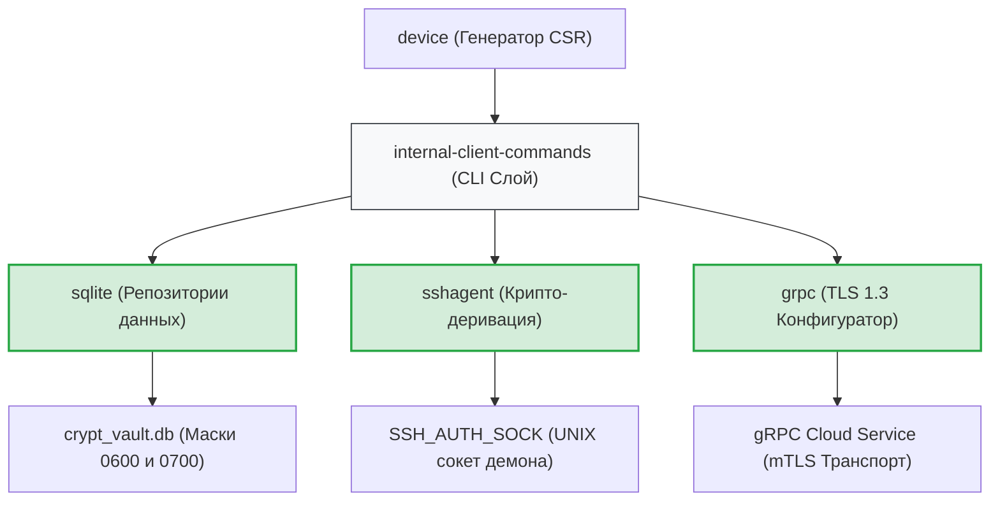

# Инфраструктурный слой адаптеров и провайдеров (`internal/client/providers`)

Архитектурный слой `providers` инкапсулирует в себе все низкоуровневые реализации работы с внешним окружением, операционной системой, криптографическими HSM-модулями, базами данных и сетевыми gRPC/mTLS интерфейсами, изолируя слои бизнес-логики (`service`) от деталей реализации.

## 📌 Структура подсистем слоя

Пакет разделен на четыре изолированных домена ответственности, каждый из которых полностью автономен, Production-Ready и покрыт тестами на уровень **>80%**:

1. **`sqlite` (Крипто-локальное хранилище)**:
   * Реализует транзакционный WAL-движок СУБД с каскадной репликацией Foreign Keys.
   * Контролирует ИБ-маски прав доступа операционной системы (`0600`/`0700` для Unix и DACL для Windows).
   * Обеспечивает бесконфликтную синхронизацию на базе стратегии Last-Write-Wins (LWW).

2. **`sshagent` (Программный HSM-модуль)**:
   * Выступает корнем доверия (Root of Trust) для беспарольного вывода ключей деривации.
   * Блокирует аппаратные токены и смарт-карты (YubiKey) через жесткий двухэтапный селф-тест на детерминированность подписи Ed25519 (Инвариант №3).

3. **`device` (Управление идентичностью)**:
   * Генерирует ключевые пары на эллиптических кривых NIST P-256 и подписывает PKCS#10 запросы CSR.
   * Встраивает защитные URN-метки (`urn:gophkeeper:file:deviceID`) в заголовки сертификатов для исключения атак подмены контекста устройства.

4. **`grpc` (Сетевой TLS 1.3 конфигуратор)**:
   * Изолирует сетевой транспорт на бескомпромиссном стандарте `TLS 1.3`.
   * Анкорит gRPC-канал на встроенный в бинарный файл `Server CA`, предотвращая любые векторы атак Man-in-the-Middle (MitM).

---

## 🏗 Архитектурная карта потоков данных

Связи и распределение ответственности между провайдерами при обеспечении жизненного цикла CLI-приложения. Вся разметка полностью совместима с VSCode.

---

## 🔒 Глобальные ИБ-инварианты слоя провайдеров

* **Zero-Knowledge Архитектура**: Ни один провайдер никогда не запрашивает и не хранит plaintext пароли или мастер-ключи в открытом виде. Деривация базируется на подписях агента, а хранение — на Poly1305 конвертах.
* **Принудительная гигиена памяти (RAM Hygiene)**: Все системные структуры, содержащие временные приватные ключи (например, большие числа `*big.Int` секретного множителя `D` в структурах `ecdsa.PrivateKey`), принудительно выжигаются нулями через методы деструкции (`.SetInt64(0)`) при любых аварийных ветвлениях пайплайнов ввода-вывода.
* **Честный Fail-Safe транспорт**: Ошибки закрытия любых низкоуровневых ресурсов (файловые дескрипторы базы данных `db.Close()`, UNIX-сокетов `agentClient.Close()`, gRPC-каналов `conn.Close()`) никогда не глушатся. Каждое событие сбоя каскадно агрегируется и пишется в структурированный журнал `slog.Error` скрытого файла отладки.

---

## 🔬 Стратегия тестирования

Каждая подсистема папки `providers` содержит изолированные интеграционные тесты (`*_test.go`). 
* Тестирование пакета `sqlite` использует изолированные `in-memory` СУБД-сессии для верификации каскадов триггеров ограничений схем `CHECK`.
* Пакет `sshagent` разворачивает внутрипроцессный UNIX-сервер для эмуляции демона OpenSSH.
* Сетевые подсистемы `grpc` и `device` проверяют корректность генерации ASN.1 DER структур и масок версий TLS 1.3 без обращения к реальной компьютерной сети, гарантируя полную стабильность прохождения CI/CD пайплайнов.
