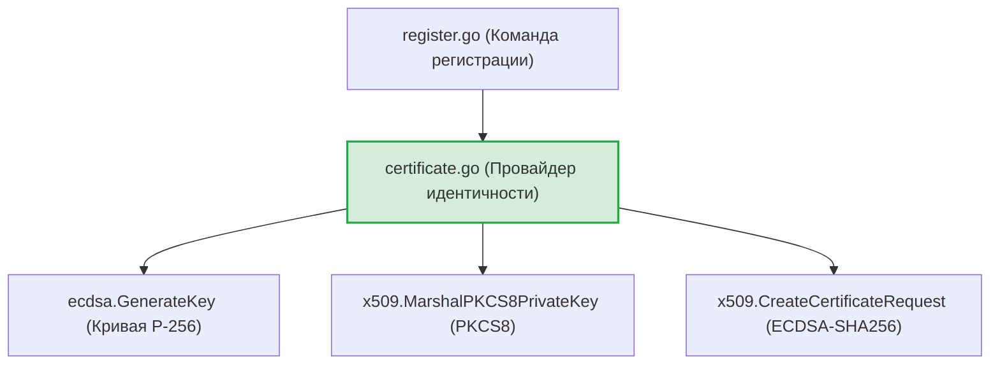
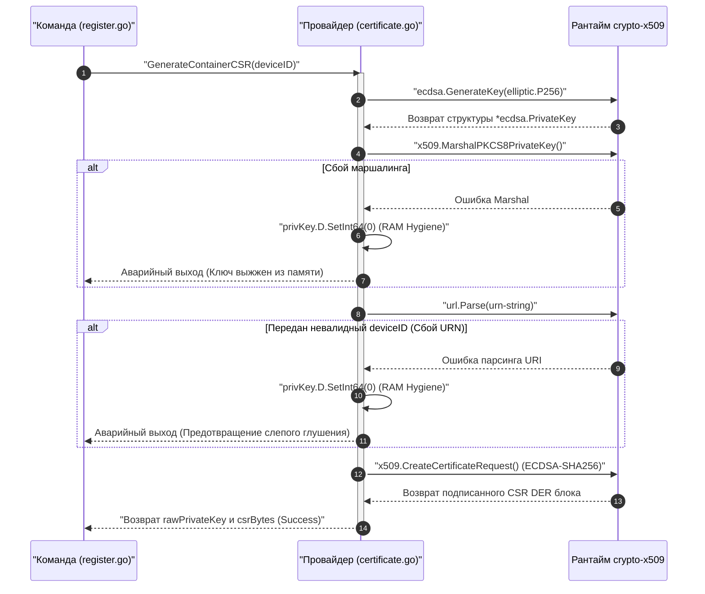

# Провайдер идентичности устройства (`internal/client/providers/device`)

Пакет `device` предоставляет низкоуровневые криптографические адаптеры для генерации аппаратных паспортов клиентских контейнеров GophKeeper. Он отвечает за создание пар ключей на эллиптических кривых и формирование подписанных запросов на выпуск сертификатов (CSR) для mTLS 1.3 авторизации.

## 📌 Основные функции пакета

1. **Генерация пар ключей ECDSA P-256**: Перевод MVP-криптографии с медленного и ресурсоемкого алгоритма RSA на современный, высокоскоростной стандарт NIST P-256 (ECDSA), оптимизированный для CLI-утилит.
2. **Контейнеризация PKCS8**: Маршалинг сгенерированных закрытых ключей в универсальный и кроссплатформенный стандарт ASN.1 DER (PKCS#8).
3. **mTLS SAN-Изоляция**: Внедрение жесткого ИБ-инварианта на уровне сетевой привязки — вшивание в поле Subject Alternative Name (SAN) уникального идентификатора контейнера (`urn:gophkeeper:file:deviceID`). Это предотвращает атаки подмены контекста устройства (Identity Spoofing) на стороне центра сертификации сервера.
4. **RAM Hygiene (Экстренная очистка)**: Пресечение утечек ключевого материала. Если конвейер сборки или подписания CSR падает, приватный компонент `D` структуры `ecdsa.PrivateKey` мгновенно выжигается нулями в памяти кучи рантайма.

---

## 🏗 Архитектурные связи компонента

Пакет вызывается на этапе двухшагового Zero-Knowledge протокола регистрации устройства из Composition Root команды `register.go`:

## Диаграмма конвейера генерации паспорта (GenerateContainerCSR)
Пошаговый процесс вычисления ключей, парсинга доменного URN и сборки подписанного бинарного CSR-блока с защитой от утечек данных в оперативную память.

