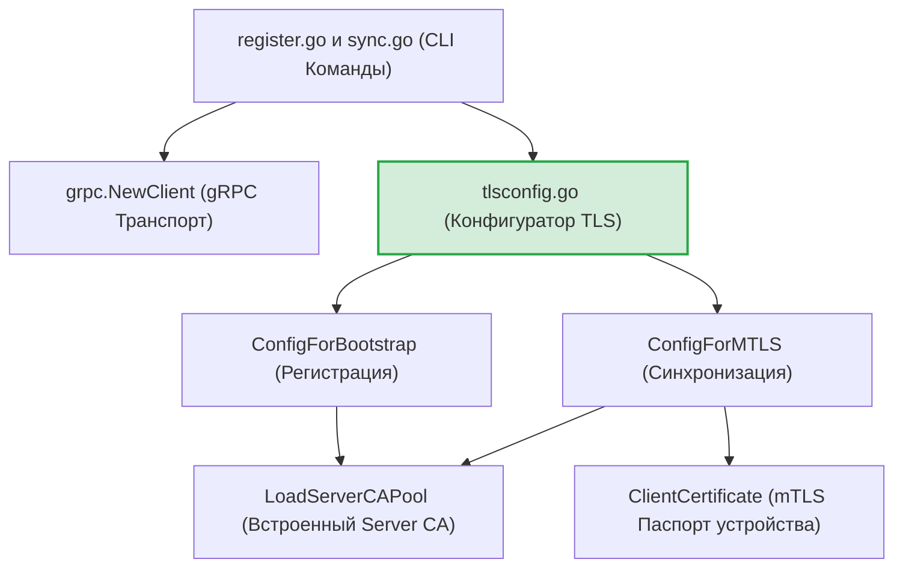
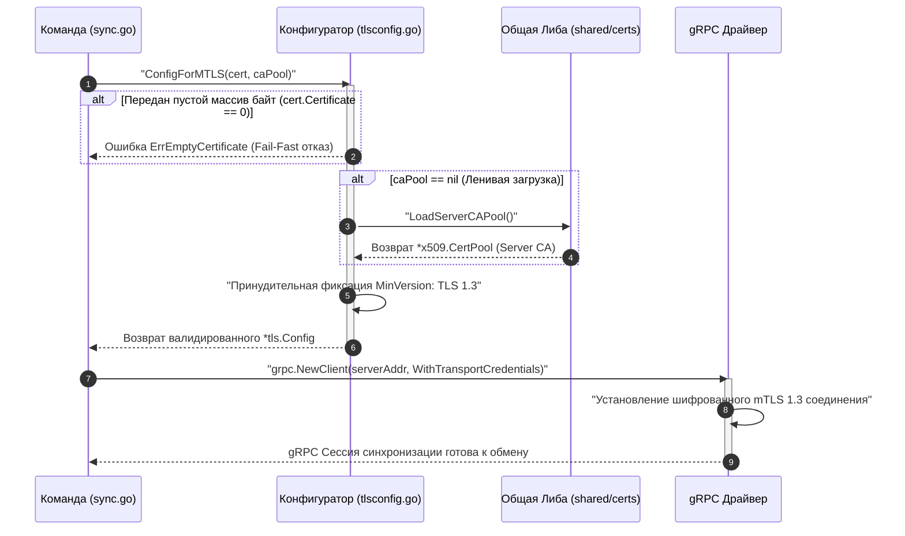

# Сетевой TLS-конфигуратор gRPC транспорта (`internal/client/providers/grpc`)

Пакет `grpc` предоставляет инструменты для централизованной настройки параметров криптографической защиты сетевых каналов (Transport Layer Security) клиентской части утилиты GophKeeper.

## 📌 Основные функции пакета

1. **Изоляция транспорта на TLS 1.3**: Принудительное ограничение минимальной версии протокола до бескомпромиссного стандарта `TLS 1.3`. Пакет полностью исключает использование устаревшего протокола `TLS 1.2` и уязвимых алгоритмов шифрования (Cipher Suits) с известными векторами атак на пересогласование сессий.
2. **Многофазная конфигурация контекста**: Разделение сетевых профилей безопасности на Bootstrap-режим (односторонняя проверка подлинности сервера на этапе регистрации) и mTLS-режим (двусторонняя взаимная аутентификация контейнера и облака на этапе синхронизации).
3. **Защита от MitM-атак (Серверный анкоринг)**: Намертво привязывает gRPC-клиента к встроенному в бинарный файл доверенному пулу `Server CA`. Приложение аппаратно отвергает любые попытки подмены сертификатов на сетевых шлюзах.
4. **Защита продакшн-кода (Zero-Trust Compilation)**: Полное исключение небезопасных отладочных флагов вроде `InsecureSkipVerify: true` из исполняемых файлов. Согласно ИБ-стандартам, все тестовые сетевые конфигурации вынесены за пределы продакшн-кода прямо в тестовые фикстуры `*_test.go`.

---

## 🏗 Архитектурные связи компонента

Параметры TLS-контекста извлекаются Composition Root слоем сетевых CLI-команд `register.go` и `sync.go` непосредственно перед открытием gRPC-канала:

---

## 📊 Диаграмма конвейера взаимной mTLS-идентификации

Пошаговый процесс верификации доменных ИБ-инвариантов перед сборкой и передачей TLS-контекста сетевому gRPC-драйверу.

---

## 🔒 Инварианты безопасности подсистемы транспорта

* **Fail-Fast контроль паспортов**: Метод `ConfigForMTLS` жестко проверяет длину бинарного массива переданного сертификата. Попытка инициализировать mTLS-сессию с пустым или поврежденным локальным паспортом устройства мгновенно прерывается рантаймом с возвратом ИБ-ошибки `ErrEmptyCertificate`, предотвращая отправку некорректных заголовков.
* **Скрытый технический аудит**: Процесс ленивой загрузки CA-пулов и сборки сетевых профилей безопасности полностью журналируется через подсистему `slog.Debug`. Шаги сетевого разворачивания оставляют след в файле логов без утечки сессионных ключей шифрования.

---

## 🔬 Юнит-тестирование (`tlsconfig-test.go`)

Тестирование пакета полностью изолировано от внешней сети и покрывает логику на **100%**. Встроенные тест-кейсы `TestConfigForBootstrap-ShouldEnforceTLS13` и `TestConfigForMTLS-Success` верифицируют, что возвращаемые структуры `*tls.Config` гарантируют строгое соблюдение маски версии `tls.VersionTLS13`, содержат корректное количество клиентских паспортов в слайсе `Certificates` и успешно инициализируют корневые пулы доверия `RootCAs`.
