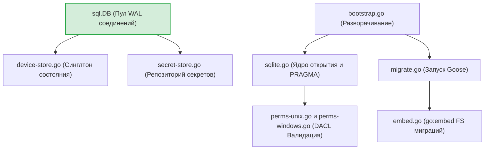
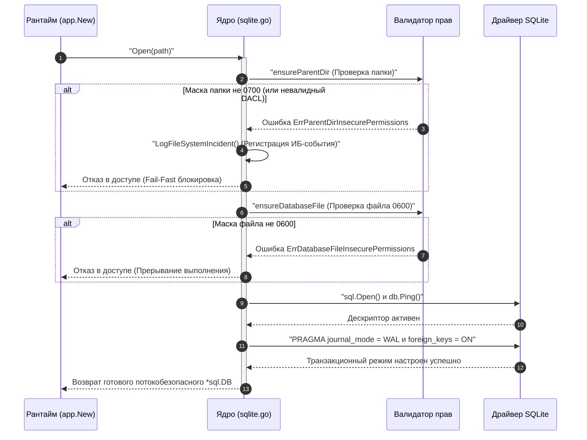

# Провайдер локального зашифрованного хранилища (`internal/client/providers/sqlite`)

Пакет `sqlite` реализует низкоуровневый инфраструктурный слой работы с файловой базой данных SQLite (на базе чистого Go-драйвера `modernc.org/sqlite`). Он отвечает за кроссплатформенную валидацию прав доступа ОС, транзакционную настройку отказоустойчивости PRAGMA, накат встроенных SQL-миграций Goose и атомарную репликацию записей по стратегии Last-Write-Wins (LWW).

## 📌 Основные функции пакета

1. **Жесткий ИБ-контроль доступа**: Принудительная блокировка запуска (Fail-Fast), если директория базы данных не имеет маски `0700` или сам файл контейнера открыт с правами, отличными от `0600` (поддерживаются как POSIX Unix, так и строгие списки DACL Windows).
2. **Атомарная репликация LWW**: Метод `SaveRaw` контролирует бесконфликтное слияние данных с облаком. Обновление строки применится только в том случае, если входящая временная метка `updated_at` строго свежее локальной.
3. **Бесшовная WAL-конфигурация**: Перевод СУБД в режим `journal_mode = WAL` и лимитирование пула до `SetMaxOpenConns(1)` гарантирует потокобезопасность CLI-команд в конкурентной среде и защиту от повреждения страниц при сбоях питания.
4. **Каскадные обновления (Reconcile)**: Использование реляционных связей `FOREIGN KEY` с флагом `ON UPDATE CASCADE` позволяет каскадно обновлять сетевой `user_id` у всех локальных секретов в рамках одной ACID-транзакции.

---

## 🏗 Архитектура и структура пакета

Компонент спроектирован по принципам Clean Architecture и скрывает детали реализации SQL-запросов за интерфейсами репозиториев слоя `repository`:

---

## 📊 Диаграмма жизненного цикла открытия хранилища (`sqlite.Open`)

Процесс пошаговой верификации ИБ-прав перед предоставлением дескриптора соединения горутинам приложения. Вся разметка полностью совместима с рендером VSCode.

---

## 🔒 Инварианты безопасности подсистемы хранения

* **Изоляция от утечек дескрипторов**: При сбоях на этапе пинга или прагма-конфигурации метод `db.Close()` перехватывается явно. Ошибки закрытия объединяются с корневым сбоем, исключая появление "зомби-дескрипторов" в ОС.
* **Защита от повреждения LWW дат**: Ошибки парсинга строк времени `time.Parse(time.RFC3339, ...)` обрабатываются принудительно. Если СУБД вернет поврежденную строку, запись пропускается, защищая базу от перезаписи нулевым временем `time.Time{}`.
* **Бесшумность CLI**: Стандартный вывод логирования мигратора `goose` полностью подавлен через вызов `goose.SetLogger(goose.NopLogger())`. Технический след пишется строго в структурированный `slog.Debug` скрытого файла отладки, сохраняя чистоту терминала для UX и автоматизации.

---

## 💻 Спецификация схемы данных

База данных жестко контролирует типы и размеры полей на уровне СУБД через ограничения `CHECK`:

**Таблица `device_state` (Глобальный синглтон, `CHECK (id = 1)`):**
* `device_id`: Строго 36 символов (Валидация UUID).
* `account_salt`: Строго 32 байта бинарных данных (Криптографический барьер размера соли).
* `user_id`: Флаг `UNIQUE` для обеспечения корректности реляционных связей `FOREIGN KEY` со смежными таблицами.

**Таблица `records` (Хранилище крипто-конвертов):**
* `type`: Ограничение `CHECK (type IN ('credentials', 'text', 'binary', 'card'))` (Исключает запись несанкционированных категорий секретов).
* `user_id`: Каскадный ключ `REFERENCES device_state(user_id) ON UPDATE CASCADE` (Обеспечивает автоматическую атомарную смену владельца всех секретов при миграциях Reconcile Container).
