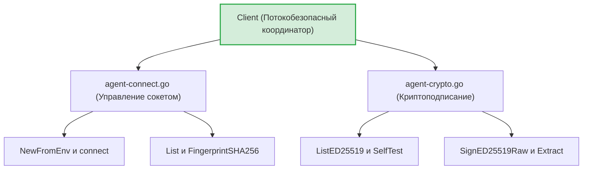
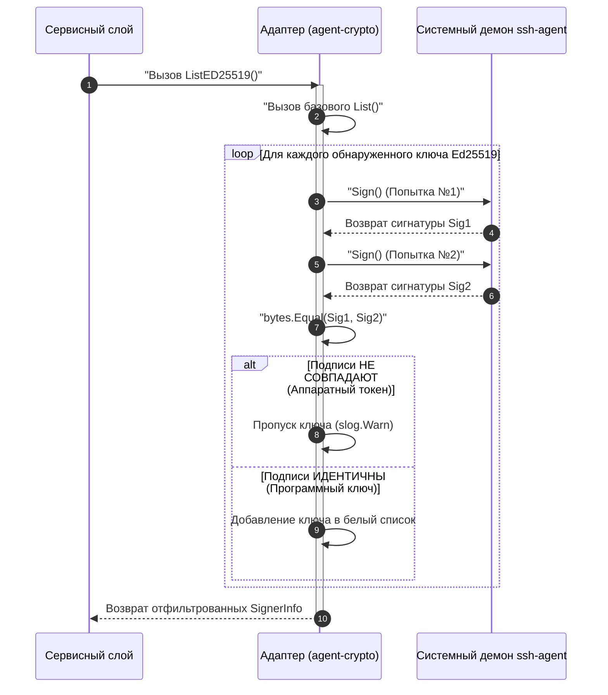

# Адаптер SSH-агента (`internal/client/providers/sshagent`)

Пакет `sshagent` предоставляет высоконадежный, потокобезопасный интерфейс для взаимодействия с системным демоном `ssh-agent` через UNIX-сокет спецификации `SSH_AUTH_SOCK`.

В архитектуре безопасности GophKeeper данный компонент выполняет роль **Software HSM (программного модуля безопасности)**. Закрытая часть корневого SSH-ключа никогда не считывается приложением в оперативную память и не покидает изолированный процесс демона ОС. Все операции вывода ключей деривации (AccountUnlockKey) и проверки подлинности (Proof of Possession) осуществляются строго через асинхронные запросы подписания.

## 📌 Основные функции пакета

1. **Контроль жизненного цикла соединений**: Инициализация сокетов, проверка доступности (`Ping`) и автоматическое прозрачное восстановление дескрипторов соединений при обрывах (`reconnectLocked`).
2. **Инвариант детерминизма подписи (Тест №3)**: Принудительный двухэтапный селф-тест ключей при фильтрации. Отсекает любые аппаратные токены (например, YubiKey), генерирующие случайный `nonce`, так как для стабильной деривации мастер-ключа необходима строго предсказуемая подпись Ed25519.
3. **Канонизация OpenSSH метаданных**: Извлечение сырых бинарных 64-байтных сигнатур из структур OpenSSH и расчет SHA256-фингерпринтов по каноническому стандарту.

---

## 🏗 Архитектура и структура файлов

Для соблюдения принципа единственной ответственности и упрощения сопровождения, кодовая база пакета разделена на два изолированных контейнера ресурсов:

---

## 📊 Диаграмма ИБ-барьера детерминированности подписи

Процесс сканирования и фильтрации ключей (`ListED25519`), отсекающий аппаратные токены со случайным распределением `nonce`:

---

## 🔒 Инварианты безопасности и отказоустойчивость

* **Потокобезопасность (`sync.Mutex`)**: Все низкоуровневые вызовы чтения и записи в UNIX-сокет (`net.Dial`) защищены мьютексом, предотвращая взаимные блокировки (`Deadlocks`) и Race Conditions в конкурентной CLI-среде.
* **Честная обработка ошибок деструкторов**: Ошибки закрытия сетевых каналов сокета (`c.conn.Close()`) логируются на уровне `slog.Error`, исключая «слепые зоны» и утечки дескрипторов файлов в ОС при интенсивной работе.
* **Прозрачный Failover**: Если демон `ssh-agent` перезапустился или сбросил сокет, адаптер автоматически попытается восстановить UNIX-сессию на лету, не прерывая выполнение текущей команды пользователя.

---

## 🔬 Изолированное тестирование (`sshagent-test.go`)

Тестирование пакета не зависит от реального окружения разработчика или CI/CD агента. Внутри тест-кейсов (файлы `agent-connect-test.go` и `agent-crypto-test.go`) разворачивается внутрипроцессный UNIX-сервер, эмулирующий поведение настоящего `ssh-agent` с помощью встроенного в Go интерфейса `sshagent.NewKeyring()`, обеспечивая покрытие логики на уровне **>85%**.
