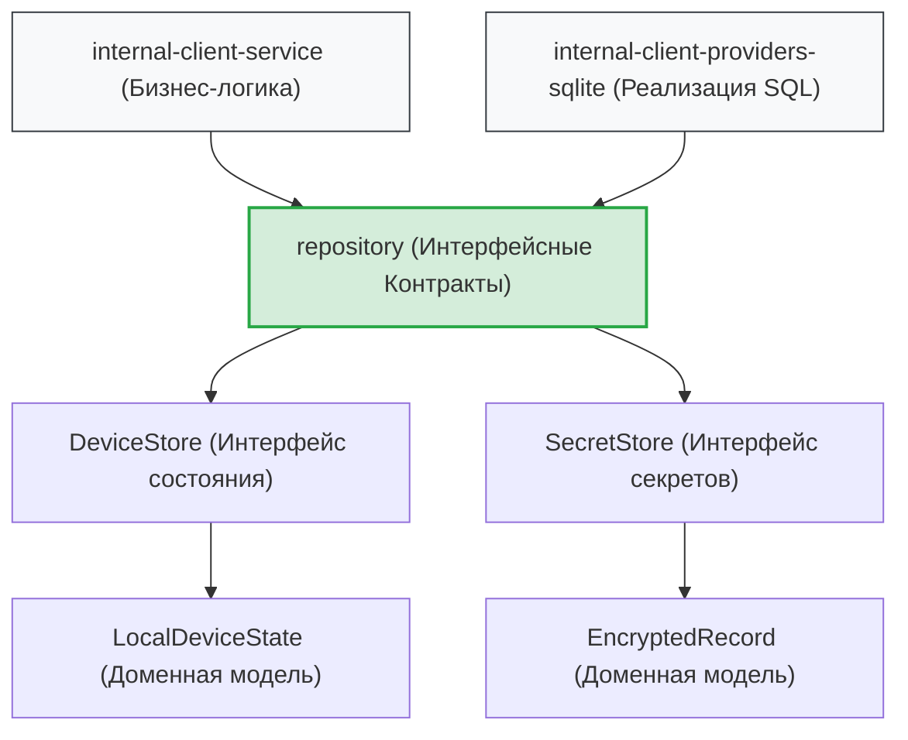
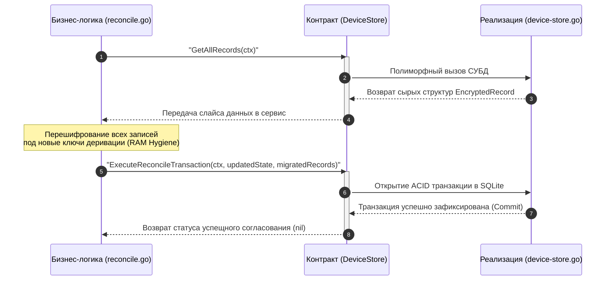

# Доменный слой контрактов и репозиториев (`internal/client/repository`)

Пакет `repository` определяет канонические структуры данных и строгие абстрактные интерфейсы (контракты) для взаимодействия с персистентным слоем хранения утилиты GophKeeper. 

Данный компонент находится на вершине иерархии инверсии зависимостей (Dependency Inversion Principle) внутри архитектуры клиента. Слои бизнес-логики (`service`) и консольных команд (`commands`) опираются исключительно на декларации этого пакета, что полностью изолирует ядро приложения от деталей реализации конкретных драйверов СУБД (SQLite, PostgreSQL или плоских файлов).

## 📌 Основные компоненты пакета

1. **`device_store.go`**:
   * Декларирует модель `LocalDeviceState` — синглтон-состояние клиентской среды (соли, KEK, метаданные, mTLS-паспорта).
   * Определяет интерфейс `DeviceStore` для управления жизненным циклом окружения и фиксации ACID-транзакций миграции.
2. **`secret_store.go`**:
   * Декларирует модель `EncryptedRecord` — защищенный доменный конверт XChaCha20-Poly1305.
   * Декларирует модель `RecordMetadata` — легковесный слепок записи для быстрой индексации.
   * Определяет интерфейс `SecretStore` для CRUD-операций и репликации по распределенной стратегии Last-Write-Wins (LWW).

---

## 🏗 Архитектурные границы слоев

Схема полиморфного взаимодействия слоев через интерфейсные барьеры пакета `repository`. Вся разметка полностью совместима с рендером VSCode.

---

## 📊 Диаграмма роли контрактов в транзакции согласования (`Reconcile`)

Иллюстрация того, как сервисный слой прозрачно использует абстракции `DeviceStore` для атомарной пакетной миграции данных без прямой зависимости от SQL-драйверов.

---

## 🔒 Инварианты безопасности и RAM-гигиена контрактов

* **Превентивная зачистка ссылок (`Destroy`)**: Доменные структуры данных выступают временными контейнерами при маппинге байт из СУБД в криптографическое ядро. Для исключения зависания ссылок на тяжелые бинарные шифртексты и соли в памяти кучи Go, модели `LocalDeviceState` и `EncryptedRecord` снабжены явными методами деструкции `.Destroy()`. Они принудительно обнуляют срезы байт и аннулируют ссылки сразу после фиксации операций, помогая сборщику мусора (`GC`) предотвращать Memory Dump утечки.
* **Поддержка NULL на уровне указателей**: Поля сетевой идентификации (`ServerURL`, `UserID`, `ClientCertificate`) объявлены как указатели на типы (`*string`, `*[]byte`). Это нативно отражает реляционное состояние базы данных на этапах жизненного цикла: до прохождения команды `register` эти поля равны `nil` (`NULL` в СУБД), проходя жесткую Fail-Fast валидацию доменных инвариантов в Use-Case сервисах.

---

## 🔬 Изолированное тестирование моделей (`repository-test.go`)

Поскольку пакет состоит из абстракций, юнит-тестирование (файлы `device-store-test.go` и `secret-store-test.go`) сфокусировано на стопроцентной проверке ИБ-поведения методов деструкции памяти. Тест-кейсы `TestLocalDeviceState-Destroy-ShouldZeroFillSensitiveData` и `TestEncryptedRecord-Destroy-ShouldClearReferences` гарантируют, что вызовы `.Destroy()` физически выжигают массивы солей нулями, обнуляют длины бинарных конвертов шифртекста и корректно защищены от паник разыменования при передаче пустых указателей (`nil pointer protection`).
