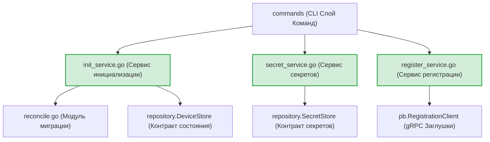
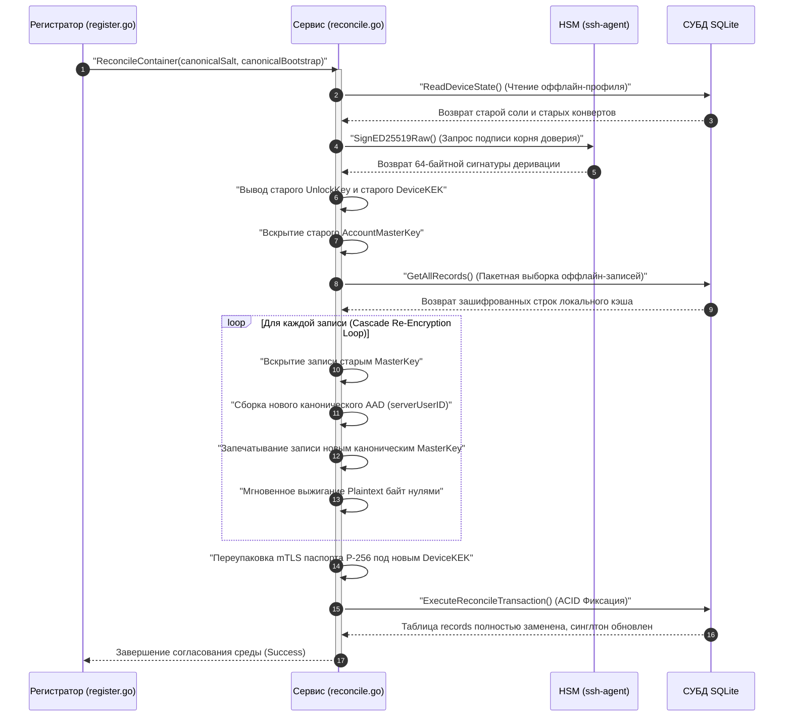

# Сервисный слой бизнес-логики (`internal/client/service`)

Пакет `service` содержит основные Use-Case сценарии и оркестрирует бизнес-логику клиентского приложения GophKeeper. Он координирует транзакции на уровне хранилища, управляет криптографическими конвейерами деривации ключей сессии и выполняет двухэтапные сетевые gRPC-протоколы взаимной верификации.

## 📌 Основные функции пакета

1. **Криптографическая оркестрация (`secret_service.go`)**: Вскрытие локального мастер-конверта через подписи `ssh-agent`, наложение контекстов защиты `AAD` и симметричное запечатывание записей алгоритмом XChaCha20-Poly1305.
2. **Беспарольная cloud-регистрация (`register_service.go`)**: Выполнение двухэтапного Zero-Knowledge Challenge протокола для авторизации владения ключом и безопасного импорта mTLS-паспорта контейнера P-256.
3. **Автоматическое согласование среды (`reconcile.go`)**: Криптографический конвейер миграции локального кэша. Если устройство инициализировано оффлайн, при первом сетевом контакте сервис каскадно расшифровывает, перевыводит ключи и заново запечатывает все записи под серверную каноническую соль (Last-Write-Wins инвариант).
4. **RAM Hygiene (ИБ-гигиена памяти)**: Принудительное мгновенное обнуление сырых байтов соли, промежуточных подписей деривации и секретных множителей `D` приватных ключей ECDSA (`.SetInt64(0)`) во всех аварийных ветвлениях.

---

## 🏗 Архитектура и связи пакета

Сервисный слой полностью изолирован от деталей реализации СУБД или сокетов, общаясь с ними через абстрактные доменные интерфейсы пакета `repository`:

---

## 📊 Диаграмма конвейера автоматического согласования (`ReconcileContainer`)

Пошаговый процесс деэнкрипции, каскадного перешифрования локальных записей под новые мастер-ключи и атомарной фиксации миграции в СУБД. Вся разметка полностью совместима с VSCode.

---

## 🔒 Инварианты безопасности сервисного слоя

* **Fail-Fast защита от паник (Nil Pointer Protection)**: Все методы сервисов жестко валидируют результат ответа базы данных `ReadDeviceState`. Попытка запустить операции в неинициализированной среде прерывается до начала крипто-вычислений с возвратом ошибки `environment is not initialized`, предотвращая разыменование нулевых указателей.
* **Атомарная ИБ-деструкция в точках выделения памяти**: Во избежание утечек деривационных материалов, оборачивание сырых `[]byte` массивов в объекты безопасности `security.SecretBytes` перенесено непосредственно в точки вызова методов `OpenEnvelope`, гарантируя запуск `defer .Destroy()` даже при крахах промежуточных шагов.
* **Изоляция системных логов от os.Stderr**: Из тела методов полностью вычищен хардкод прямого вывода отладочных сообщений на экран терминала. Аудит фаз репликации и перешифрования осуществляется структурированно через `slog.Info` / `slog.Debug`, сохраняя чистоту консоли для пайплайнов автоматизации.

---

## 🔬 Юнит-тестирование (`service_test.go`)

Тестирование Use-Case сценариев изолировано от физических файлов и сетевых сокетов с достижением покрытия **>80%**. Встроенные тест-кейсы (файлы `init_service_test.go`, `secret_service_test.go` и `register_service_test.go`) используют легковесные внутрипамятийные (`in-memory`) мок-реализации интерфейсов репозиториев, проверяя правильность перехвата ошибок, граничные условия пустых полезных нагрузок и fail-fast барьеры безопасности.
