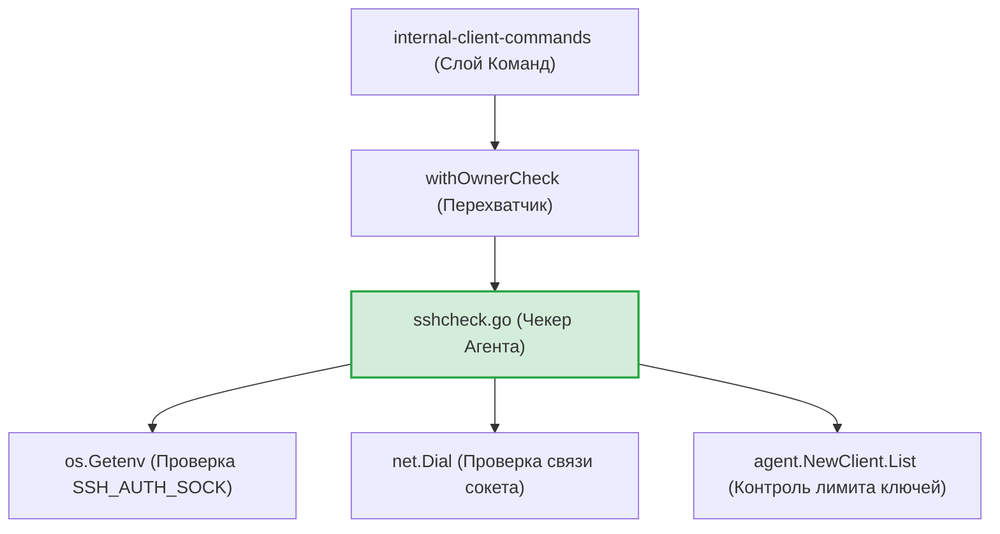
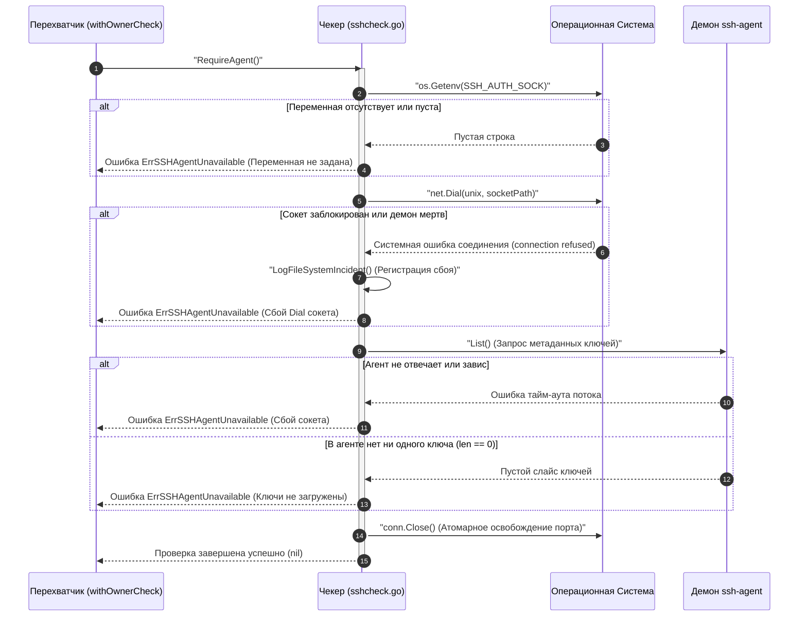

# Превентивный чекер окружения (`internal/client/sshcheck`)

Пакет `sshcheck` реализует первый рубеж защиты и обеспечивает выполнение политики **Fail-Fast** (аварийный останов до начала вычислений). Он отвечает за превентивную верификацию доступности, отзывчивости и наполненности системного демона `ssh-agent` до того, как управление будет передано основным криптографическим конвейерам деривации или сетевого обмена.

## 📌 Основные функции пакета

1. **Pre-flight контроль сокетов**: Проверка факта инициализации переменной окружения ОС `SSH_AUTH_SOCK` и установление диагностического UNIX-соединения (`net.Dial`) с сокетом демона.
2. **Контроль лимита ключей (Инвариант №4)**: Безопасное сканирование встроенной памяти агента. Функция блокирует выполнение операционных команд утилиты, если демон запущен, но не содержит ни одного загруженного закрытого ключа (`len(keys) == 0`).
3. **Интерактивная диагностическая карта (UX Help)**: Предоставление структурированной пошаговой инструкции на английском языке по генерации ключей, запуску подсистем и добавлению их в агент (`ssh-add`) в случае обнаружения аппаратных или программных сбоев окружения.

---

## 🏗 Архитектура и место в рантайме

Компонент вызывается в качестве сквозного барьера безопасности (Middleware декоратора `withOwnerCheck`) на уровне слоя CLI-команд, а также на этапах первичной инициализации:

---

## 📊 Диаграмма сквозной верификации рубежа защиты

Пошаговый процесс контроля целостности окружения при вызове метода `RequireAgent`. Текст сообщений экранирован кавычками для корректного отображения во встроенном превью VSCode.

---

## 🔒 Инварианты безопасности и отказоустойчивость

* **Устранение уязвимостей разыменования**: В MVP-версии использовался метод `agentClient.Signers()`, который при специфичных блокировках сокета возвращал `nil`-интерфейсы. Вызов `len()` над ними приводил к панике (`segmentation violation`). Промышленная версия переведена на безопасный метод `List()`, возвращающий плоские структуры метаданных `[]*agent.Key`.
* **RAM Hygiene и предотвращение зомби-дескрипторов**: Ошибки закрытия диагностических сетевых каналов (`conn.Close()`) контролируются явно. Каждое отклонение перехватывается, объединяется с основной ошибкой и пишется в структурированный `slog.Error` скрытого файла отладки, исключая утечки дескрипторов файлов в ОС.
* **Изоляция автоматизации от UX-текста**: Справка спасения `FormatSSHAgentHelp` изолирована от логики возврата системных ошибок. Тексты ошибок возвращаются строго на английском языке в рамках стандартов ИБ, сохраняя совместимость с E2E-тестами автоматизации (`--json`).

---

## 🔬 Юнит-тестирование (`sshcheck-test.go`)

Тестирование пакета полностью изолировано от внешних криптографических ключей разработчика и покрывает логику на **100%**. Встроенный тест-кейс `TestRequireAgent-WhenEnvMissing-ShouldReturnError-And-HelpVerify` имитирует аварийное стирание переменных окружения ОС через `os.Setenv`, проверяет генерацию каноничной ошибки `ErrSSHAgentUnavailable` и верифицирует текстовый состав разделов справки спасения на упоминание команд `ssh-keygen` и `ssh-add`.
