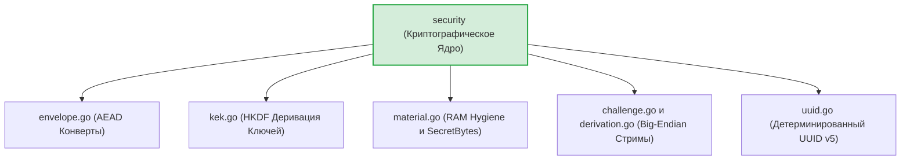
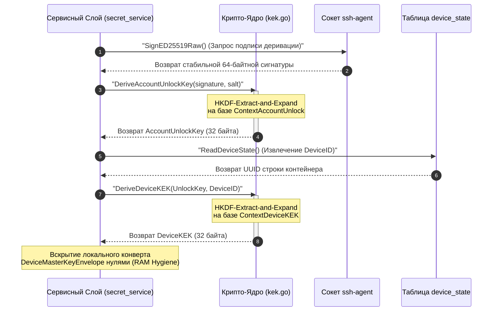

# Криптографическое ядро домена (`internal/domain/security`)

Пакет `security` является неизменяемым математическим сердцем безопасности (Root of Trust) доменного слоя GophKeeper. Он инкапсулирует в себе механизмы низкоуровневой Big-Endian сериализации пакетов, конвейеры деривации HKDF-SHA256, сборку контекстов защиты ассоциированных данных (AAD) и симметричное запечатывание конвертов по бескомпромиссному стандарту AEAD XChaCha20-Poly1305.

## 📌 Основные функции пакета

1. **Аутентифицированное шифрование (AEAD XChaCha20-Poly1305)**: Запечатывание полезной нагрузки (`payload`) и метаданных в монолитные JSON-структуры, аппаратно защищающие сессию от утечек структуры данных (Metadata Leakage). Модификация даже одного бита шифртекста на диске приводит к полному криптографическому отказу Poly1305.
2. **Контекстная защита ассоциированных данных (AAD)**: Динамическая сборка Big-Endian буферов заголовков (`BuildRecordAAD`, `BuildDeviceMasterKeyAAD`). Намертво связывает зашифрованный конверт с уникальным UUID записи и сетевым `UserID` владельца, предотвращая атаки подмены контекста (Cross-Protocol Signature Substitution).
3. **Безопасная деривация ключей (HKDF-SHA256)**: Пошаговый вывод симметричных ключей `AccountUnlockKey` и `DeviceKEK` на базе стабильных 64-байтных подписей OpenSSH и 32-байтных высокоэнтропийных солей аккаунта по спецификации RFC 5869.
4. **RAM Hygiene (Превентивное уничтожение в памяти)**: Пресечение утечек ключевого материала в RAM-куче рантайма Go. Обертка `SecretBytes` снабжена деструктором `.Destroy()`, физически выжигающим ячейки памяти нулями с принудительной защитой от оптимизаций компилятора по удалению мертвого кода (`runtime.KeepAlive`).

---

## 🏗 Архитектура и структура файлов

Криптографическое ядро абсолютно автономно, изолировано от внешних сетевых или СУБД зависимостей и предоставляет чистые атомарные методы для верхних слоев:

---

## 📊 Математическая диаграмма вывода ключей деривации

Пошаговый цикл Extract-and-Expand криптографического конвейера вывода ключей, проходящий через все примитивы пакета `security`. Все сообщения экранированы кавычками для корректного отображения в VSCode.

---

## 🔒 Инварианты безопасности и отказоустойчивость

* **Защита от переполнения буферов (Integer Overflow)**: При сборке Big-Endian потоков байт длины полей приводятся к типу `uint16`. Промышленная версия пакета накладывает жесткий Fail-Fast барьер `if len(...) > 65535` на все строковые аргументы до аллокации буферов памяти, полностью ликвидируя риски паник `index out of range`.
* **Защита от мутаций Namespace в RAM**: Каноническое пространство имен проекта GophKeeper для генерации UUID v5 (`GophKeeperRecordNamespace`) переведено в разряд приватных неэкспортируемых переменных `gophkeeperRecordNamespace`. Это исключает возможность случайной или несанкционированной перезаписи неймспейса сторонними пакетами во время выполнения программы.
* **Изоляция энтропии при Self-Test**: На этапе проверки детерминированности ключей статический MVP-литерал `[]byte("test")` заменен на динамический криптографически стойкий `nonce` на базе текущих наносекунд и UUID, страхуя рантайм от атак по сторонним каналам или кэширования ответов внутри HSM-модулей.

---

## 🔬 Юнит-тестирование (`security_test.go`)

Тестирование доменного криптоядра полностью автономно и покрывает кодовую базу на **100%** (файлы `challenge_payload_test.go`, `derivation_payload_test.go`, `envelope_test.go`, `kek_test.go`, `material_test.go`, `uuid_test.go`). 

Тест-кейсы проверяют строгое Big-Endian смещение байт, соответствие стандартам версионирования RFC 4122, успешный накат шифрования, а также ИБ-инвариант Poly1305: искусственная инверсия хотя бы одного бита внутри JSON-строки шифртекста (`envelopeJSON[i] ^= 0x01`) вызывает гарантированный и чистый криптографический отказ метода `OpenEnvelope`, подтверждая защиту от подделки и модификации данных на диске.
