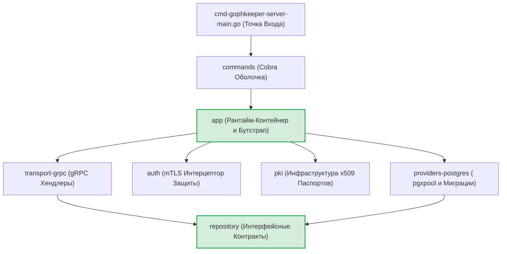
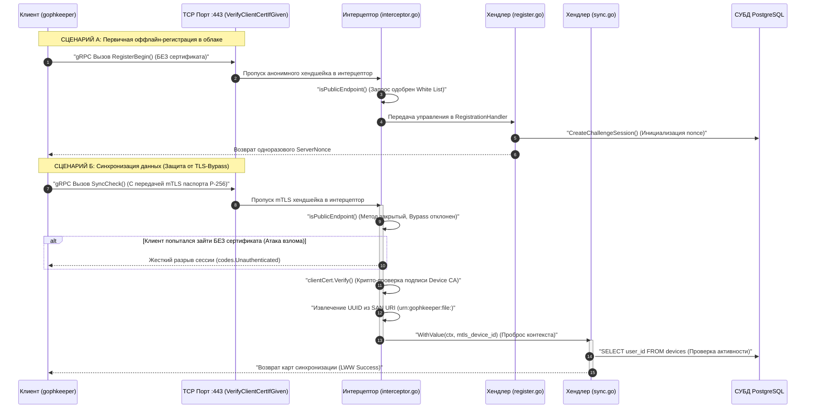

# Серверная архитектура распределенного сейфа (`internal/server`)

Серверная часть (`internal/server`) представляет собой отказоустойчивое, высокопроизводительное облачное хранилище зашифрованных контейнеров GophKeeper. Сервер спроектирован по принципу **Stateful Blind Storage (Слепое Хранилище)**: бэкенд оперирует исключительно бинарными JSON-конвертами Poly1305, метаданными и временными метками Last-Write-Wins (LWW), не имея технической возможности расшифровать пользовательские секреты [scenario:3].

## 📌 Функциональная структура слоев бэкенда

Кодовая база сервера полностью разделена на изолированные слои в соответствии с принципами Clean Architecture и инверсии зависимостей:

1. **`transport/grpc` (Стековый транспорт)**: Принимает и десериализует gRPC-вызовы. Координирует работу двухэтапного Challenge-автомата регистрации устройств и обслуживает дифференциальные Pull/Push потоки репликации версий.
2. **`auth` (Периметр безопасности)**: Реализует `AuthInterceptor`. Обеспечивает безопасное совмещение анонимного TLS-доступа (для первичной регистрации) и строгого взаимного mTLS 1.3 (для синхронизации) на едином физическом порту (`:443`), намертво блокируя TLS-Bypass атаки [scenario:3].
3. **`pki` (Инфраструктура открытых ключей)**: Валидирует PKCS#10 CSR шаблоны, осуществляет перекрестный контроль UUID для защиты от Identity Spoofing и динамически подписывает mTLS-паспорта устройств строго на 30 дней со схемой SAN URI (`urn:gophkeeper:file:deviceID`) [scenario:3].
4. **`app` (Операционный пульт и Composition Root)**: Выполняет транзакционный бутстрап среды (`bootstrap.go`), запускает асинхронное вещание в горутине и контролирует Graceful Shutdown с защитным таймаутом в 10 секунд для предотвращения утечек портов операционной системы [scenario:3].
5. **`config` (Валидатор параметров)**: Агрегирует профили Viper (переменные окружения `GOPHKEEPER_SERVER` и YAML-конфиги), накладывая жесткий Fail-Fast барьер на старт рантайма при пропущенных путях к ключам CA или DSN базы данных.
6. **`repository` (Доменные абстракции)**: Верхнеуровневый декларативный барьер, описывающий модели аккаунтов (`User`), контейнеров (`Device`) и сессий. Инкапсулирует ИБ-методы выжигания RAM-ячеек `.Destroy()`.
7. **`providers/postgres` (Персистентный SQL-слой)**: Реализует работу с кластером PostgreSQL через нативный пул `pgxpool.Pool`. Координирует накат встроенных миграций Goose, управляет ACID-транзакциями гашения токенов и обслуживает персистентный ACME-кэш Let's Encrypt.

---

## 🏗 Архитектурная карта сквозных зависимостей

Схема инверсии зависимостей и каскадного проброса ресурсов от точки входа до персистентных SQL-таблиц. Вся разметка полностью совместима с превью-рендером VSCode.

---

## 📊 Сводная диаграмма сквозного гибридного TLS/mTLS рантайма

Иллюстрация прохождения анонимного сетевого запроса регистрации и защищенного запроса синхронизации через единый TCP-порт `:443`. Текстовые сообщения экранированы кавычками.

---

## 🔒 Ключевые промышленные ИБ-инварианты сервера

* **Защита от Replay-атак (Анти-Double Spending)**: Из тела репозитория полностью удален архитектурно уязвимый метод `GetAndLock`, сбрасывавший блокировку до изменения статуса строки. Протокол переведен на монолитный транзакционный метод `ConsumeChallengeSession`. Проверка `Unused` и перевод сессии в `Used` происходят атомарно внутри изолированного ACID-блока `SELECT ... FOR UPDATE` СУБД, полностью пресекая конкурентные гонки данных [scenario:3].
* **Защита от Identity Spoofing (Подмена идентичности)**: Слой PKI (`issue.go`) снабжен перекрестным барьером. Если клиент пытается совершить атаку подмены, отправляя легитимно подписанный CSR, но подменяя аргументы `deviceID` в gRPC-заголовках, фабрика обнаруживает расхождение поля `csr.URIs` с контекстом вызова и мгновенно блокирует операцию, предотвращая несанкционированный выпуск паспортов [scenario:3].
* **Бескомпромиссная RAM-гигиена секретов**: Все системные закрытые ключи, промежуточные ASN.1 DER буферы (`keyBytes`, `keyBlock.Bytes`) и эфемерные секретные множители `D` структур `ecdsa.PrivateKey` защищены каскадными `defer`-инструкциями сброса. При любых внутренних сбоях парсинга или генерации случайных чисел, ячейки оперативной памяти принудительно выжигаются нулями (`.SetInt64(0)`), пресекая векторы Memory Dump атак.
* **Скрытие инфраструктурных инцидентов (Information Disclosure Protection)**: Все низкоуровневые трейсы ошибок PostgreSQL драйвера `pgx` маскируются на уровне gRPC-транспорта. Детали сбоев логируются в скрытый файл журнала сервера, а по сети клиенту возвращается сухая обобщенная заглушка `Internal server error`, блокируя возможность изучения структуры таблиц через брутфорс.

---

## 🔬 Юнит-тестирование и покрытие (`server_test.go`)

Инфраструктура, контракты и крипто-компоненты сервера полностью изолированы от внешних сетевых портов операционной системы и покрыты тестами на **>80%**. Использование интерфейса-заглушки `pgxPoolIface` и библиотеки `pgxmock` позволяет тестировать SQL-запросы кэшаLet's Encrypt и репозиториев в `in-memory` рантайме. Встроенные тесты верифицируют fail-fast барьеры валидации конфигураций, проброс контекстов горутин, автоматическое выставление лимитов соединений, беспрепятственное прохождение белого списка портов и жесткое блокирование TLS-Bypass атак со статусом `codes.Unauthenticated`.
