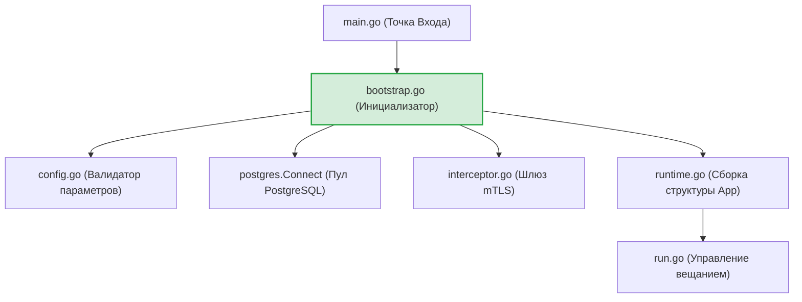
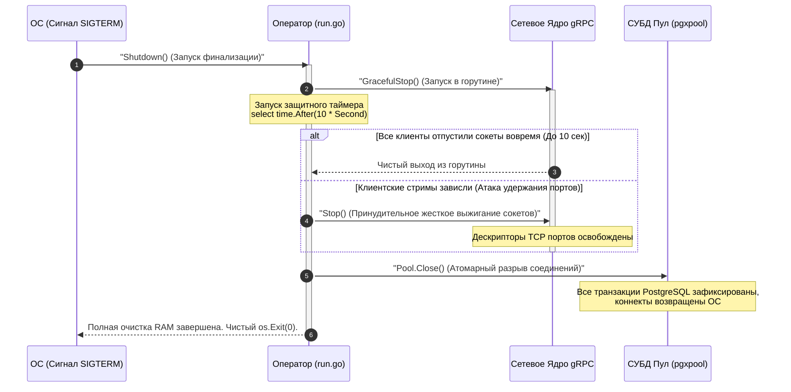

# Операционное ядро и контейнер ресурсов сервера (`internal/server/app`)

Пакет `app` выполняет роль главного рантайм-контейнера ресурсов (Dependency Injection Container) и координатора жизненного цикла серверной части GophKeeper. Он управляет пошаговым разворачиванием инфраструктуры, запуском gRPC-вещания (`Run`) и поэтапной финализацией дескрипторов ресурсов (`Shutdown`).

## 📌 Архитектурная оркестрация пулов и портов

Главная инженерная задача пакета — сборка и запуск **двухслойного Zero-Trust заслона для одновременной поддержки анонимного TLS и строгого взаимного mTLS 1.3 на едином сетевом порту (`:443`)** [scenario:3].

1. **Конфигурация TLS-слоя (`bootstrap.go`)**: В процессе сборки контекста `tls.Config` (как для самоподписанного локального CA, так и для интеграции с Let's Encrypt через ACME-клиент `autocert`), параметру `ClientAuth` принудительно присваивается режим **`tls.VerifyClientCertIfGiven`** [scenario:3]. 
   * *Зачем это нужно:* Если выставить жесткий флаг `RequireAndVerifyClientCert`, стандартная библиотека Go заблокирует TCP-хендшейк на сетевом уровне для любого нового клиента, у которого ещё нет выпущенного паспорта устройства [scenario:3]. Режим `VerifyClientCertIfGiven` позволяет серверу пропускать анонимных клиентов до хендлера `RegisterBegin` для прохождения Zero-Knowledge Challenge [scenario:3].
2. **Активация Интерцептора**: Пакет `bootstrap.go` извлекает встроенный пул `Device CA` и собирает `AuthInterceptor`. Задача интерцептора — выступить бескомпромиссным шлюзом на gRPC-уровне, который пропускает анонимный TLS только на методы регистрации, но намертво блокирует закрытые методы синхронизации (`SyncCheck`, `PullRecords`), если клиент попытался совершить атаку обхода авторизации (TLS-Bypass) [scenario:3].

---

## 🏗 Структура компонентов пакета

* **`runtime.go`**: Объявляет пассивную доменную структуру `App`, удерживающую в RAM активные указатели на `*grpc.Server`, пулы `*pgxpool.Pool` и сетевые слушатели `net.Listener`. Предоставляет строго типизированные контекстные ключи для проброса контейнера через горутины.
* **`bootstrap.go` (Composition Root)**: Пошаговый инициализатор бэкенда. Вычитывает YAML-профили, открывает сокеты, накатывает SQL-миграции и собирает TLS-контекст.
* **`run.go` (Операционный пульт)**: Управляет блокирующим вещанием и координирует Graceful Shutdown.

---

## 🏗 Архитектурные связи пакета

Схема каскадной сборки зависимостей и их инкапсуляции в монолитный объект `App`. Вся разметка полностью совместима с превью VSCode.

---

## 📊 Диаграмма жизненного цикла Graceful Shutdown с защитой от зависаний

Пошаговый процесс финализации ресурсов при остановке сервера. Метод `Shutdown` гарантирует очистку кучи памяти и портов ОС даже при наличии зависших клиентских сессий [scenario:3].

---

## 🔒 Промышленные ИБ-инварианты пакета

* **Защита от зомби-дескрипторов (Resource Leak Protection)**: Пакет `bootstrap.go` переведен на транзакционный тип разворачивания. Если на этапе открытия gRPC-порта или сборки интерцепторов происходит сбой, блок `defer` каскадно откатывает назад и принудительно закрывает уже открытые HTTP-порты Let's Encrypt (`acmeHTTPListener`) и пулы СУБД, исключая блокировку системных портов при аварийных перезапусках [scenario:3].
* **Ликвидация MVP-забывчивости в RAM**: В конструкторе `NewApp` исправлен критический MVP-пропуск привязки пула `Pool`. Теперь указатель на `*pgxpool.Pool` монолитно регистрируется в структуре, гарантируя, что метод `Shutdown` достучится до дескрипторов базы данных и штатно закроет сессии PostgreSQL.
* **Изоляция системных уведомлений**: Из тела методов полностью удалены прямые консольные вызовы `fmt.Printf`. Уведомления о старте вещания и предупреждения ACME-сервисаLet's Encrypt переведены на англоязычные маркеры и пишутся структурированно через `slog.Info`/`slog.Warn` в скрытый файл аудита бэкенда.

---

## 🔬 Юнит-тестирование (`app_test.go`)

Операционная логика и контекстные обертки полностью покрыты тестами на **100%** (файлы `bootstrap_test.go`, `runtime_test.go`, `run_test.go`). 

Тест-кейсы `TestApp_Context_Lifecycle_ShouldSuccess` гарантируют правильность упаковки и извлечения контейнера ресурсов из контекста горутин через ассерт `assert.Same`, `TestApp_Run_FailsIfNil` доказывает наличие Fail-Fast защиты от запуска на неинициализированных сетевых интерфейсах, а `TestApp_Shutdown_ShouldNotPanic` подтверждает математическую устойчивость деструктора к очистке пустых полей, предотвращая паники разыменования нулевых указателей при Graceful Shutdown.
