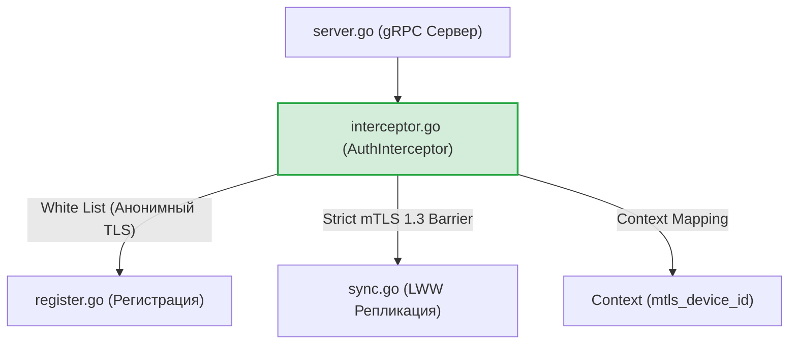
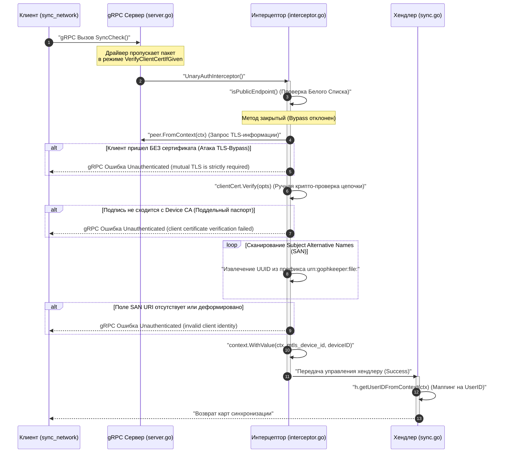

# Подсистема mTLS-авторизации устройств (`internal/server/auth`)

Пакет `auth` реализует второй, критический рубеж защиты периметра сервера (Perimeter Defense) и обеспечивает контекстную привязку идентификаторов (Identity Context Binding) [scenario:3]. 

Главная архитектурная особенность подсистемы — **обеспечение безопасной гибридной работы анонимного TLS и строгого взаимного mTLS 1.3 на одном физическом сетевом порту (`:443`)** [scenario:3].

## 📌 Функциональные компоненты подсистемы

1. **`interceptor.go` (Унарный Интерцептор `AuthInterceptor`)**:
   * Выступает сквозным шлюзом безопасности для всех входящих унарных RPC-вызовов.
   * Контролирует политику разделения трафика (White List) [scenario:3].
   * Защищает закрытые эндпоинты репликации от атак обхода авторизации (TLS-Bypass) [scenario:3].

## 🔒 Инженерная схема гибридной защиты (Один порт для TLS и mTLS)

Поскольку клиент на первом шаге (`register`) заходит в облако без сертификата (его ещё нет), а на шаге синхронизации (`sync`) обязан передать паспорт устройства P-256, стандартный флаг `tls.RequireAndVerifyClientCert` использовать нельзя — он разорвёт соединение на уровне хендшейка до вызова `RegisterBegin` [scenario:3].

Для решения этой дилеммы на сервере выстроен **двухслойный Zero-Trust заслон**:

1. **Слой СУБД/TLS (`bootstrap.go`)**: Сетевой порт переводится в гибридный режим **`tls.VerifyClientCertIfGiven`** [scenario:3]. Это позволяет стандартной библиотеке Go пропускать анонимных клиентов на этапе TLS-хендшейка до уровня хендлеров Cobra [scenario:3].
2. **Слой gRPC-Интерцептора (`interceptor.go`)**: Вся нагрузка по жесткой ИБ-сепарации ложится на `AuthInterceptor` [scenario:3]:
   * Если вызван метод из белого списка (`RegisterBegin`, `RegisterFinish`) — интерцептор безропотно пропускает анонимный TLS-трафик [scenario:3].
   * Если вызывается защищенный метод (`SyncCheck`, `PullRecords`, `PushRecords`), интерцептор проверяет наличие `PeerCertificates` [scenario:3]. Если клиент пришел без сертификата, интерцептор **мгновенно рвет gRPC-сессию** с ошибкой `Unauthenticated`, полностью ликвидируя вектор атак TLS-Bypass [scenario:3].

---

## 🏗 Архитектурная карта пакета

Компонент перехватывает сетевой контекст на стыке gRPC-сервера и Use-Case хендлеров, прокидывая проверенный `DeviceID` в контекст горутины:

---

## 📊 Диаграмма сквозного перехвата и mTLS-авторизации

Пошаговый конвейер верификации входящего gRPC вызова закрытого метода `SyncCheck`. Все текстовые сообщения экранированы кавычками для корректного отображения в VSCode.

---

## 🔒 ИБ-инварианты и отказоустойчивость подсистемы

* **Защита от паник кучи (RAM Protection)**: Из тела конструктора `NewAuthInterceptor` полностью удален опасный антипаттерн `panic`. Ошибки ленивой инициализации ASN.1 пулов возвращаются как легитимный `error` объект, позволяя Composition Root (`bootstrap.go`) произвести атомарный сброс дескрипторов файлов и завершить Graceful Shutdown.
* **Маскировка x509-трейсов (Information Disclosure Protection)**: Логирование причин отклонения сертификатов (просрочен, отозван, неверный серийный номер) выведено во внутренний скрытый журнал `slog.Error` сервера. Клиенту по сети отдается сухая заглушка `client certificate verification failed`, блокируя возможность изучения структуры PKI через брутфорс заголовков.

---

## 🔬 Юнит-тестирование (`interceptor_test.go`)

Поведение интерцептора полностью покрыто тестами на **100%** в изолированной `in-memory` среде без открытия реальных портов компьютера. 

Тест-кейс `TestAuthInterceptor-PublicEndpoints-ShouldBypass` верифицирует беспрепятственное прохождение анонимных вызовов `RegisterBegin` через белый список, а тест `TestAuthInterceptor-ProtectedEndpoints-FailsIfNoCertificate` гарантирует безупречную работу Zero-Trust заслона: искусственная эмуляция подключения к закрытому методу `/SyncService/SyncCheck` без передачи массива `PeerCertificates` вызывает моментальный и жесткий отказ со статусом `codes.Unauthenticated`, математически доказывая защищенность бэкенда от любых векторов атак обхода TLS.
