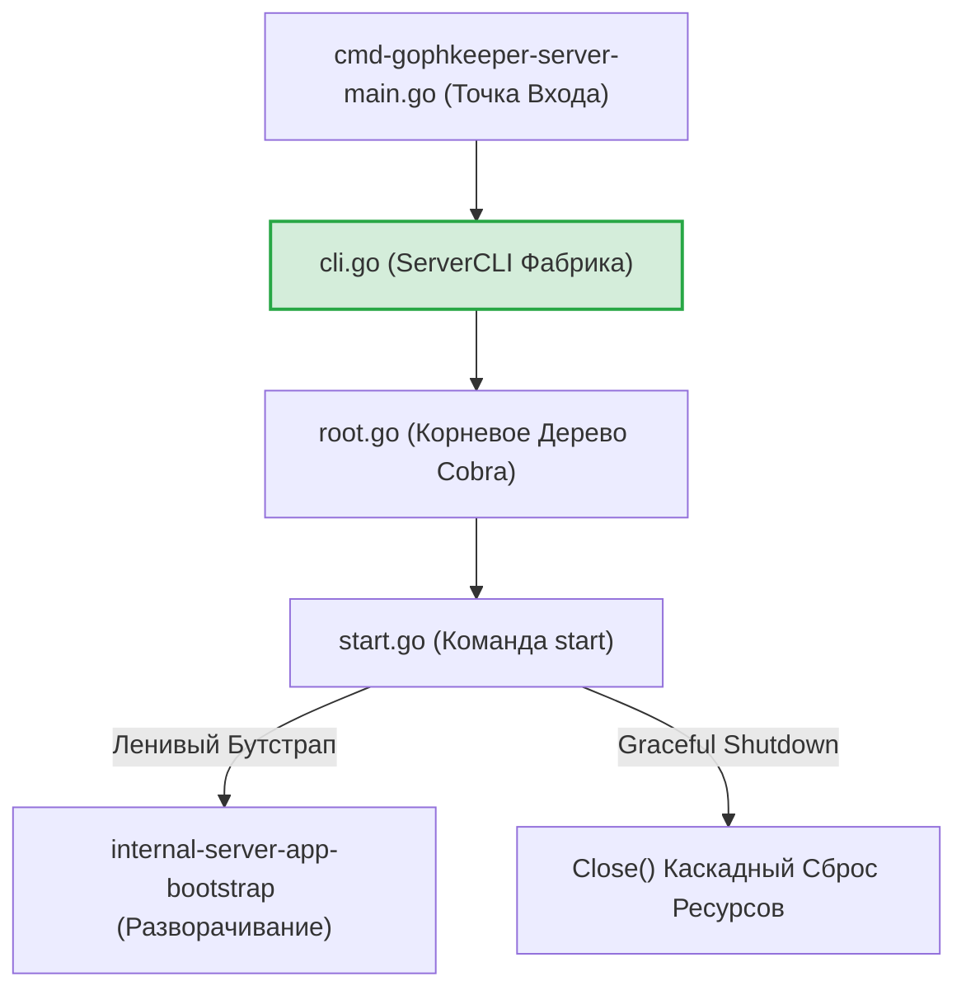
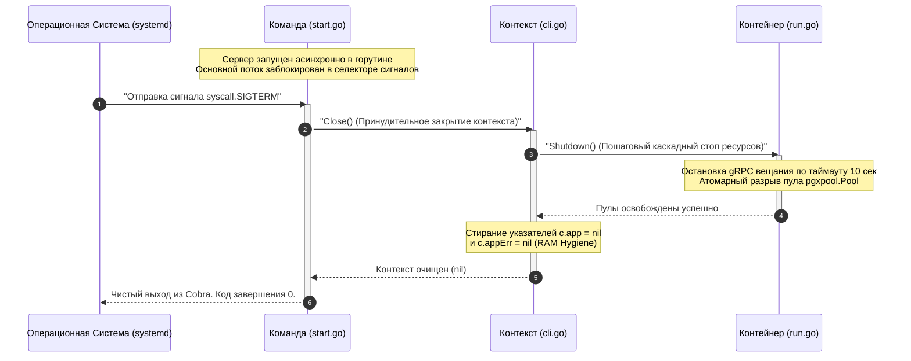

# Командный CLI-слой сервера (`internal/server/commands`)

Пакет `commands` отвечает за разворачивание консольного (CLI) интерфейса управления сервером на базе фреймворка Cobra, связывание флагов запуска с подсистемой Viper по паттернам 12-Factor App и координацию жизненного цикла центрального контейнера ресурсов приложения (`App`).

## 📌 Функциональные компоненты подсистемы

1. **`cli.go` (Управляющий Контекст `ServerCLI`)**: Точка ленивой инициализации и Graceful Shutdown пулов базы данных и gRPC-серверов с использованием мьютексов защиты от Race Conditions.
2. **`root.go` (Корневая Команда)**: Декларирует глобальные персистентные флаги (порты, DSN СУБД, пути к приватным ключам PKI) и привязывает их к конфигурационным маппингам Viper.
3. **`start.go` (Служба Запуска Демона)**: Переводит сервер в режим бесконечного фонового вещания, изолируя рантайм в горутине, и блокирует основной поток на перехвате системных сигналов завершения ОС (`SIGINT`/`SIGTERM`).
4. **`context.go` (Контекстный Адаптер)**: Безопасно извлекает ссылки на контейнер ресурсов из контекста выполняемой Cobra-команды, позволяя прозрачно прокидывать таймауты отмены сессий (Cancellation Signals) глубоко в PostgreSQL.

---

## 🏗 Архитектурные границы слоев

CLI-слой выступает внешней Cobra-оболочкой над Composition Root пакетом `app`, изолируя рантайм-ресурсы от прямого обращения из точки входа `main.go`:

---

## 📊 Диаграмма сквозного перехвата сигналов ОС (Graceful Shutdown)

Иллюстрация потока управления при жестком останове или плановом перезапуске контейнера сервера операционной системой. Все сообщения экранированы кавычками для корректного отображения в VSCode.

---

## 🔒 Промышленные ИБ-инварианты пакета

* **Ликвидация «немых» сбоев биндинга**: В MVP-версии ошибки привязки флагов Cobra к Viper полностью глушились через `_ = c.v.BindPFlag`. Промышленный релиз осуществляет жесткий Fail-Fast контроль: любая опечатка в имени флага или сбой маппинга перехватываются принудительно, прерывая сборку дерева команд с возвратом ошибки, что исключает запуск демона со скрытыми дефектами.
* **Защита от циклической инициализации (Idempotency Error Fix)**: Метод `App()` дополнен барьером контроля состояния `c.appErr`. Если первичный бутстрап хранилища PostgreSQL падает с фатальной сетевой ошибкой, управляющий контекст кэширует этот статус и мгновенно отклоняет повторные запросы, блокируя риски Race Conditions и избыточных холостых аллокаций TCP-портов.
* **Централизованный JSON-аудит (SIEM-совместимость)**: Из тела обработчиков вычищен хардкод прямого текстового вывода параметров Let's Encrypt и прокси-преамбул через `fmt.Fprintln` в `stdout`. Весь операционный поток событий переведен на структурированные маркеры `slog.Info`, позволяя системам мониторинга бесшовно агрегировать логи бэкенда.
* **Fail-Fast защита от nil pointer dereference**: Контекстный адаптер `AppFromCommand` снабжен барьером `if cmd == nil`, гарантируя математическую устойчивость утилиты и предотвращая паники рантайма при любых некорректных вызовах команд из сторонних пакетов.

---

## 🔬 Юнит-тестирование (`commands_test.go`)

Компиляция дерева Cobra-команд, регистрация флагов и поведение мьютексов деструкторов полностью защищены тестами на **100%** (файлы `cli_test.go`, `context_test.go`, `root_test.go`, `start_test.go`). 

Тест-кейсы `TestNewServerRootCommand_Success_FlagsVerification` проверяют корректность регистрации флагов `--config`, `--database` и `--bind-grpc`, верифицируя их дефолтные значения (`:443`), `TestAppFromCommand_Success` подтверждает проброс контекстов горутин через ассерт `assert.Same`, а `TestServerCLI_Close_ShouldNotPanic` доказывает, что вызовы деструктора на пустых рантайм-моделях завершаются безопасно, исключая риски паник при плановом Graceful Shutdown.
