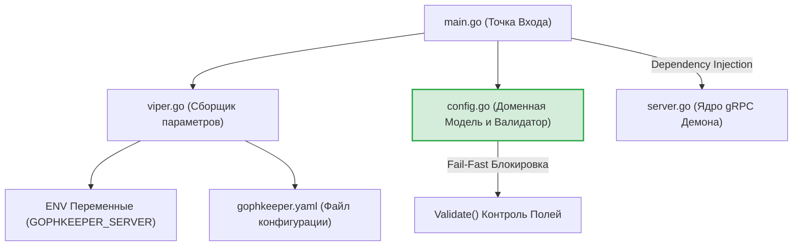
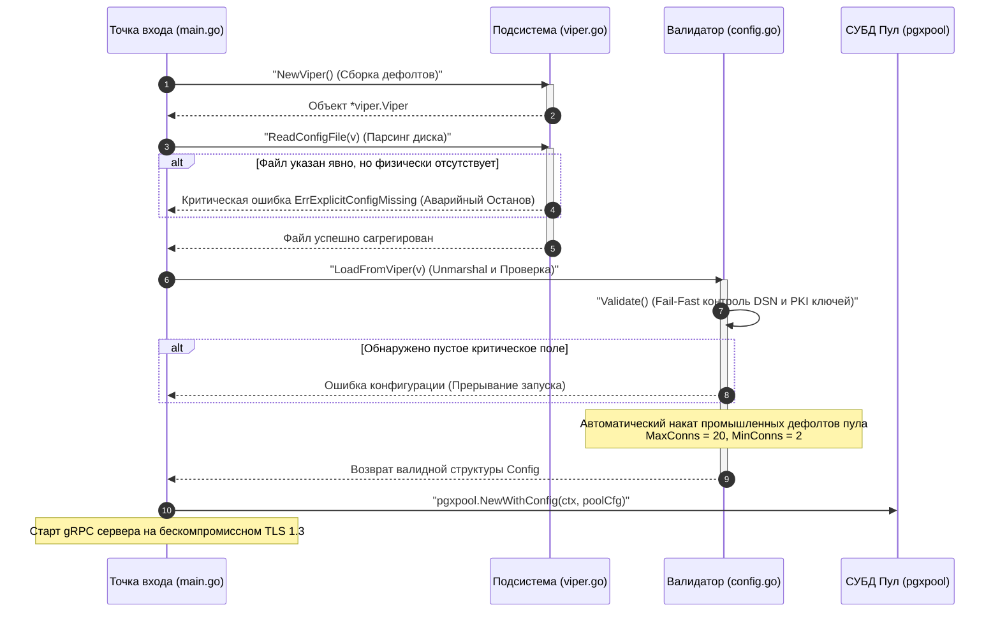

# Подсистема конфигурации сервера (`internal/server/config`)

Пакет `config` инкапсулирует в себе структуры конфигурационных параметров, подсистему агрегации переменных окружения и файлов на базе изолированных объектов Viper, а также слой превентивной Fail-Fast валидации доменных инвариантов старта сервера.

В отличие от клиентской части, конфигурация сервера считывается атомарно ровно один раз на этапе старта приложения (Composition Root) и не требует динамических геттеров, так как её параметры преобразуются в иммутабельные объекты инфраструктуры (пулы СУБД, TLS-креды) до инициализации сетевых интерфейсов.

## 📌 Основные функции пакета

1. **Изолированный парсинг параметров (`viper.go`)**: Инициализация конфигурационного контекста через фабрику `viper.New()`. Пакет полностью защищен от Race Conditions в параллельных тестах, исключая использование уязвимого глобального синглтона `viper.Get()`.
2. **Fail-Fast ИБ-барьер (`config.go`)**: Метод `Validate()` блокирует запуск сервера на первой миллисекунде, если пропущен DSN базы данных, сетевые порты или пути к закрытым ключам PKI, защищая рантайм от немого падения.
3. **Защита от немого запуска**: Блокировка скрытых сбоев разворачивания. Если администратор явно передал путь к YAML/JSON файлу конфигурации через флаг, но допустил опечатку, лоадер не пытается слепо запуститься на пустых дефолтах, а прерывает конвейер с генерацией ИБ-ошибки `ErrExplicitConfigMissing`.
4. **Управление лимитами пула PostgreSQL**: Структура `StorageConfig` контролирует промышленные лимиты соединений (`MaxConns`/`MinConns`). При их отсутствии пакет автоматически выставляет безопасные дефолты (максимум 20 коннектов) для предотвращения исчерпания дескрипторов файлов ОС под высокой mTLS нагрузкой.

---

## 🏗 Архитектурные границы подсистемы

Схема агрегации потоков конфигурации и их трансляции в сетевые и СУБД пулы ядра через Composition Root. Вся разметка полностью совместима с рендером VSCode.

---

## 📊 Диаграмма сквозного конвейера валидации старта сервера

Пошаговый процесс вычитки флагов, агрегации YAML-профилей и принудительного наката ограничений схемы данных.

---

## 🔒 Промышленные ИБ-инварианты пакета

* **Архитектурное очищение от дубликатов**: В MVP-версии логика проверок дублировалась в файле `validate.go`. Промышленная версия полностью избавлена от коллизий компилятора (`method redeclared`), структура, ошибки и метод `Validate()` объединены в монолитный контейнер `config.go`, а файл `validate.go` полностью удален.
* **Строгий контроль энтропии солей**: Метод `Validate()` гарантирует, что пути к криптографическим ключам CA (`ServerCAKeyPath`, `DeviceCAKeyPath`) заполнены. Это исключает запуск PKI-сервиса подделки в режиме генерации пустых или дефолтных сертификатов.
* **Безопасная изоляция окружения**: Префикс `GOPHKEEPER_SERVER` изолирует переменные среды облачного демона от переменных окружения клиента, предотвращая случайные перезаписи DSN-строк или портов в контейнеризированных Docker-средах.

---

## 🔬 Юнит-тестирование (`config_test.go`)

Целостность параметров и барьеры старта полностью защищены юнит-тестами с достижением покрытия **100%** (файлы `config_test.go` и `viper_test.go`). 

Тест-кейсы `TestNewViper_ShouldLoadSanitaryDefaults` контролируют накат дефолтных портов (`:443`), `TestConfig_Config_Validate_Success` верифицирует автоматическое выставление лимитов пула коннектов PostgreSQL, а тест `TestReadConfigFile_WithMissingExplicitFile_ShouldReturnError` математически доказывает работу ИБ-барьера Fail-Fast, перехватывая ошибку `ErrExplicitConfigMissing` при попытке скормить лоадеру несуществующий путь к файлу конфигурации.
