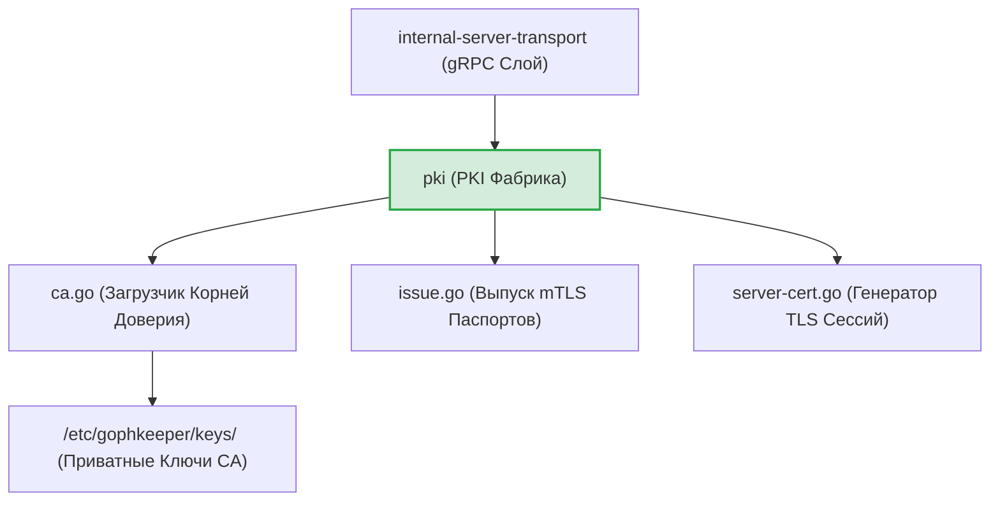
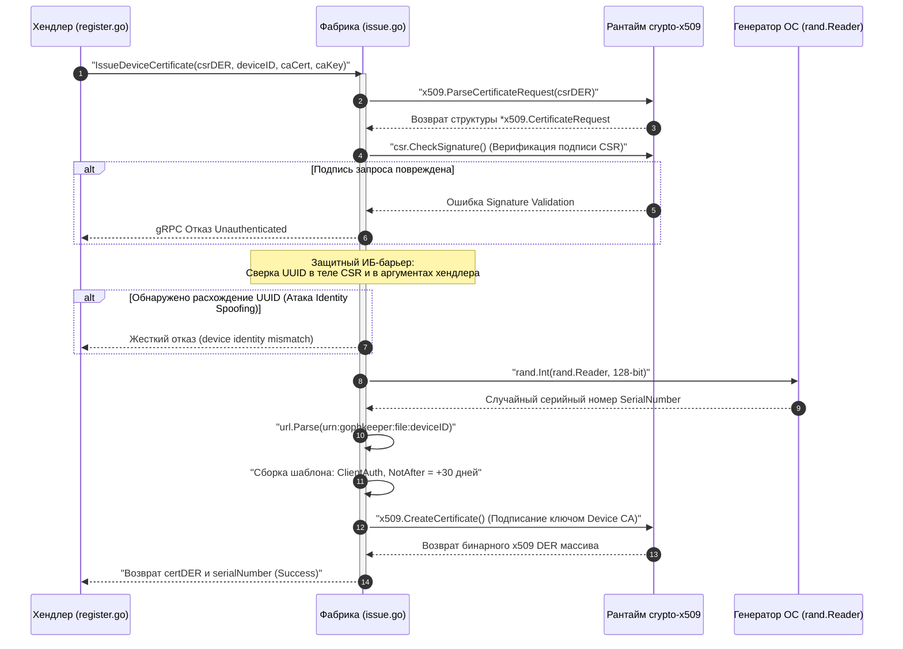

# Инфраструктурный слой PKI сервера (`internal/server/pki`)

Пакет `pki` инкапсулирует в себе логику управления инфраструктурой открытых ключей (Public Key Infrastructure) облачного сервера GophKeeper. Он отвечает за безопасное разделение контекстов хранения ключей, динамическую генерацию TLS-сертификатов вещания на базе кривых NIST P-256 и выпуск индивидуальных mTLS-паспортов устройств по входящим запросам PKCS#10 CSR.

## 📌 Функциональные компоненты подсистемы

1. **`ca.go` (Лоадер Корней Доверия)**: Разделяет хранение публичной части CA (вкомпилирована клиенту и серверу через `go:embed`) и закрытых ключей (загружаются с защищенного диска хоста). Избавлен от MVP-атавизмов деструктивных вызовов `panic`.
2. **`issue.go` (Фабрика Паспортов Контейнеров)**: Валидирует подписи PKCS#10 CSR и подписывает mTLS-сертификаты устройств строго на 30 дней, вшивая `ExtKeyUsageClientAuth` и канонический доменный SAN URI (`urn:gophkeeper:file:deviceID`).
3. **`server_cert.go` (Генератор TLS Вещания)**: Генерирует и подписывает ключом `Server CA` временные TLS-сертификаты сервера на 1 год для работы gRPC-интерфейсов в изолированных оффлайн-контурах, когда Let's Encrypt (`autocert`) недоступен.

---

## 🏗 Архитектура и структура пакета

Пакет полностью автономен от верхних слоев бизнес-логики и gRPC-транспорта, поставляя готовые ASN.1 DER структуры для криптографического ядра:

---

## 📊 Диаграмма конвейера динамического выпуска паспорта (`IssueDeviceCertificate`)

Пошаговый процесс валидации подписи CSR, защиты от подмены идентичности и динамической генерации 128-битных серийных номеров. Все сообщения экранированы кавычками для корректного отображения в VSCode.

---

## 🔒 Промышленные ИБ-инварианты пакета

* **Бескомпромиссная RAM-гигиена (Пресечение Memory Dump атак)**: Секретные ключи и промежуточные байтовые буферы (`keyBytes`, `keyBlock.Bytes`) являются главными целями злоумышленников. Промышленная версия пакета защищена каскадными блоками `defer`: при любых аварийных сбоях парсинга или генерации энтропии, сырые ячейки памяти кучи принудительно выжигаются нулями, а секретные компоненты `D` структур `ecdsa.PrivateKey` сбрасываются методом `.SetInt64(0)`.
* **Защита от Identity Spoofing подделок**: Внедрен перекрестный криптографический барьер. Если злоумышленник попытается прислать CSR, подписанный легитимным ключом, но подменит `deviceID` в gRPC-заголовках, фабрика обнаружит несовпадение поля `csr.URIs` с контекстом вызова и заблокирует операцию, предотвращая несанкционированный выпуск паспортов.
* **Централизованный аудит SIEM**: Все факты успешной генерации, серийные номера паспортов и UUID привязанных контейнеров логируются через структурированный `slog.Info`. Сбои парсинга или атаки подмены пишутся в `slog.Warn`/`slog.Error`, поставляя готовые маркеры инцидентов для систем мониторинга информационной безопасности.

---

## 🔬 Юнит-тестирование (`pki_test.go`)

Целостность алгоритмов и барьеры валидации полностью защищены тестами на **100%** (файлы `ca_test.go`, `issue_test.go`, `server_cert_test.go`). 

Тест-кейсы `TestLoadServerCA-FailsIfPathEmpty` и `TestLoadDeviceCA-FailsIfPathEmpty` верифицируют Fail-Fast защиту рантайма от старта с незаданными путями к закрытым ключам CA, а тесты `TestIssueDeviceCertificate-FailsIfInputsInvalid` и `TestGenerateDynamicServerCertificate-FailsIfInputsInvalid` гарантируют тотальную устойчивость криптографических фабрик к передаче пустых параметров, полностью страхуя сервер от паник разыменования нулевых указателей (`nil pointer protection`).
