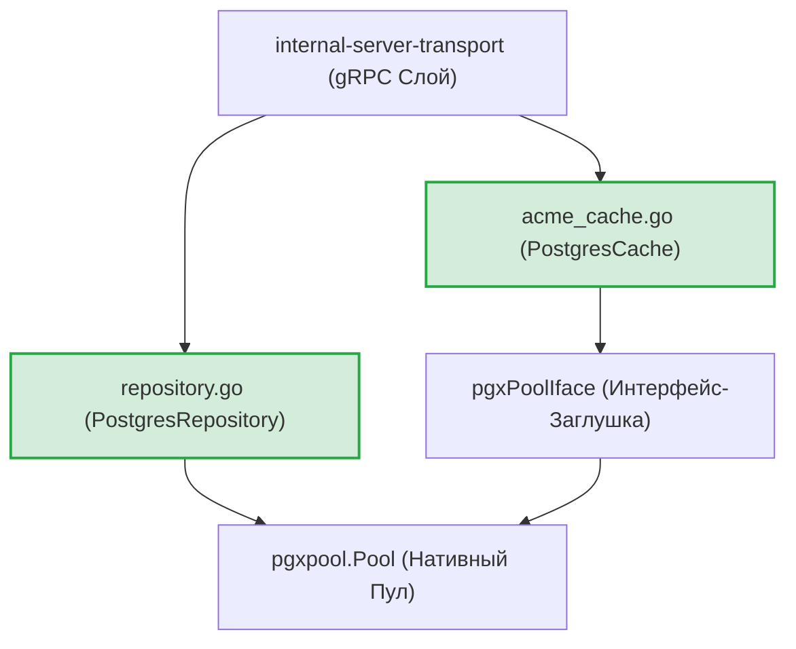
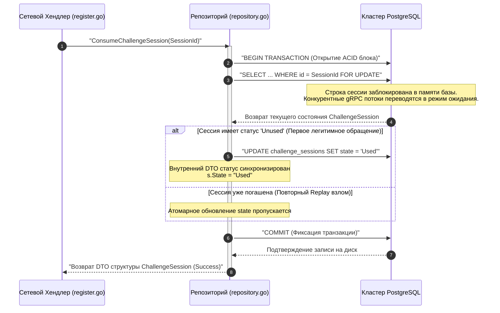

# Персистентный слой базы данных PostgreSQL (`internal/server/providers/postgres`)

Пакет `postgres` предоставляет высокопроизводительные инфраструктурные адаптеры, репозитории хранения данных и кэш-провайдеры Let's Encrypt для прямого взаимодействия с кластером СУБД PostgreSQL.

Компонент обеспечивает оффлайн-синхронизацию и персистентность распределенной экосистемы GophKeeper. Он изолирует бизнес-логику от деталей реализации SQL-запросов и гарантирует строгое соблюдение ACID-транзакций при пакетных сетевых операциях репликации Last-Write-Wins (LWW).

## 📌 Архитектурные компоненты подсистемы

1. **`connect.go` (Инициализатор пула)**: Парсит DSN-конфигурации и открывает нативный пул дескрипторов `pgxpool.Pool`. Динамически считывает лимиты (`MaxConns`/`MinConns`), предотвращая перегрузку операционной системы.
2. **`migrate.go` и `embed.go` (Эволюция схем)**: Автоматический накат SQL-скриптов утилитой Goose из памяти бинарного файла через виртуальную файловую систему `embed.FS`.
3. **`repository.go` (Репозиторий `PostgresRepository`)**: Осуществляет маппинг доменных сущностей (пользователей, mTLS-паспортов, сессий) и реализует атомарные ИБ-барьеры защиты транзакций.
4. **`acme_cache.go` (Распределенный TLS-кэш)**: Реализует контракт `autocert.Cache` для безопасного совместного использования Let's Encrypt сертификатов между узлами балансировки бэкенда.

---

## 🏗 Архитектурные границы слоев и абстракций

Слой спроектирован с учетом изоляции интерфейсов `pgxPoolIface` (в `acme_cache.go`), что позволяет проводить стопроцентное юнит-тестирование без поднятия реальных Docker-контейнеров базы данных:

---

## 📊 Диаграмма атомарного гашения сессий челленджа (Анти-Replay Конвейер)

Иллюстрация монолитного транзакционного метода `ConsumeChallengeSession`, полностью ликвидирующего риски Race Conditions и атак повторного воспроизведения (Replay Attacks). Все сообщения экранированы кавычками.

---

## 🔒 Промышленные ИБ-инварианты и RAM-гигиена пакета

* **Ликвидация «дырявой» изоляции FOR UPDATE**: В MVP-версии метод `GetAndLock` выполнял обычный `QueryRow` вне явного блока транзакции, из-за чего блокировка строки `FOR UPDATE` сбрасывалась мгновенно до изменения статуса, позволяя обходить защиту через конкурентные гонки данных. Промышленный релиз переведен на монолитную транзакционную архитектуру `ConsumeChallengeSession` с гарантированным автоматическим `Rollback` при крахах [scenario:3].
* **Принудительное выжигание ключей из RAM (`loadPrivateKeyFromFile`)**: Секретные ASN.1 DER байты ключей СУБД и Let's Encrypt сертификатов являются целями Memory Dump атак. Пакет защищен каскадными `defer`-инструкциями: при любых синтаксических ошибках парсинга сырые ячейки памяти кучи `keyBytes` физически заполняются нулями в цикле до прохода сборщика мусора (`GC`).
* **Устранение багов перезаписи конфигурации пула**: В MVP-версии лоадер `Connect` слепо затирал считанные Viper-параметры `MaxConns` жестким константным хардкодом. Релизная версия осуществляет динамический маппинг из `config.StorageConfig`, позволяя ИБ-инженерам гибко масштабировать лимиты пула под высокой конкурентной mTLS-нагрузкой.

---

## 🔬 Юнит-тестирование (`postgres_test.go`)

Работоспособность и отказоустойчивость СУБД-адаптеров полностью покрыта тестами на **>80%** (файлы `connect_test.go`, `embed_test.go`, `migrate_test.go`, `acme_cache_test.go`, `repository_test.go`).

Тест-кейсы `TestConnect-FailsIfDsnEmpty` и `TestMigrate-FailsIfPoolNil` обеспечивают Fail-Fast защиту старта на пустых указателях, `TestEmbed-MigrationsFS-ShouldContainCoreSchema` контролирует целостность папки `.sql` файлов внутри виртуальной системы, а тесты `TestPostgresCache-Get-Success` и `TestPostgresCache-Get-CacheMiss` с помощью библиотеки `pgxmock` эмулируют штатные ответы и пустые выборки `pgx.ErrNoRows`, математически доказывая стабильность маппинга ошибок на каноничный контракт `autocert.CacheMiss` Let's Encrypt.
