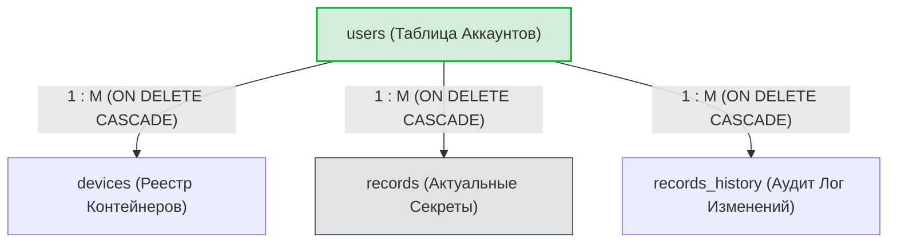
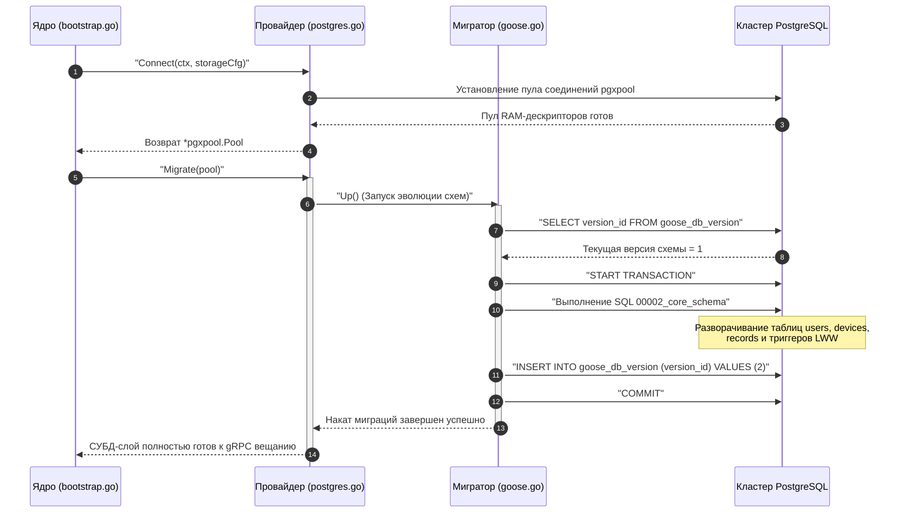

# Слой эволюции схемы базы данных PostgreSQL (`internal/server/providers/postgres/migrations`)

Данная директория содержит упорядоченные SQL-скрипты миграций, управляемые утилитой Goose, для автоматического разворачивания, модификации и отката таблиц, индексов и процедурных триггеров в облачном кластере СУБД PostgreSQL.

В процессе перевода кодовой базы от MVP к промышленному стандарту (Production-Ready) структура миграций была полностью оптимизирована для исключения Race Conditions при старте репликации: избыточный файл `00003_sync_history.sql` был полностью упразднен, а таблицы защищенного хранилища секретов монолитно консолидированы в рамках шага №2.

## 📌 Состав и иерархия миграций схемы

Эволюция структуры базы данных строго разделена на два последовательных шага:

1. **`00001_acme_cache.sql` (Распределенный ACME-кэш TLS)**:
   * Инициализирует бинарное хранилище `acme_cache` для работы менеджера Let's Encrypt (`autocert.Manager`).
   * Навешивает автоматический процедурный триггер `BEFORE UPDATE` для фиксации точного времени модификации строк на стороне СУБД.
2. **`00002_core_schema.sql` (Ядро СУБД и Реестр Конвертов)**:
   * **`users`**: Профиль криптографической личности аккаунта (публичные ключи OpenSSH и запечатанные Cloud Bootstrap Envelope).
   * **`devices`**: Реестр mTLS-паспортов и уникальных серийных номеров контейнеров с ограничениями `CONSTRAINT check_device_status`.
   * **`challenge_sessions`**: Автомат одноразовых сессий челленджей (Challenge State Machine) с барьером `CONSTRAINT check_challenge_state`.
   * **`records`**: Хранилище актуальных версий шифртекстов Poly1305 с жестким ИБ-контролем типов через `CONSTRAINT check_record_type`.
   * **`records_history`**: Неизменяемый аудит-след изменений секретов (History Audit Trail) для защиты от Metadata Tampering атак.
   * **`audit_device_events`**: Системный журнал событий аутентификации устройств.

---

## 🏗 Архитектурная карта и реляционные связи

Схема физических связей `FOREIGN KEY` и ограничений целостности на уровне ядра СУБД PostgreSQL. Вся разметка полностью совместима с превью-рендером VSCode.

---

## 📊 Диаграмма атомарного наката схем при старте сервера (`Bootstrap`)

Пошаговый процесс контроля версий и применения SQL-транзакций утилитой Goose на этапе первичной boot-фазы облачного демона.

---

## 🔒 Промышленные ИБ-инварианты SQL-слоя

* **Защита от SQL-инъекций и порчи типов на уровне ядра (Type Enforcement)**: Поля категорий секретов и состояний автоматов сессий челленджа защищены жесткими ограничениями `CHECK` (`check_record_type`, `check_challenge_state`). Попытка внедрить некорректную строку или совершить несанкционированный сдвиг фаз со стороны потенциально скомпрометированного или багнутого кода бэкенда мгновенно прерывается базой данных на аппаратном уровне.
* **Автоматизация LWW без просачивания в Go-рантайм**: Метки времени обновлений `updated_at` таблиц `acme_cache` и `users` переведены под полный контроль процедурных PL/pgSQL триггеров `BEFORE UPDATE`. Это полностью снимает с бэкенда задачу отслеживания времени модификации при `UPSERT`-вызовах, исключая риски Race Conditions.
* **Каскадная изоляция данных пользователей**: Реляционные ключи таблиц `devices`, `records` и `records_history` жестко привязаны к первичной таблице `users` через декларации `ON DELETE CASCADE`. В случае удаления аккаунта пользователя СУБД атомарно в рамках одной ACID-транзакции выжигает абсолютно весь зашифрованный оффлайн-кэш, логи изменений и mTLS-паспорта связанных устройств, предотвращая утечки метаданных.

---

## 🔬 Валидация структуры схем (`migrations_test.go`)

Целостность и синтаксический синтаксис управляющих файлов миграций полностью защищены автоматизированными статическими юнит-тестами компиляции (файлы `migrations_test.go` и `core_schema_test.go`). Тест-кейсы `TestACME_Migration_Syntax_Check` и `TestCoreSchema_Syntax_And_Tables_Check` используют механизмы парсинга строк, математически гарантируя наличие строго упорядоченных Goose-маркеров (`-- +goose Up` / `-- +goose Down`), условных операторов `CREATE TABLE IF NOT EXISTS` и присутствие всех пяти ключевых таблиц ядра, страхуя рантайм от сбоев сборщика при разворачивании бэкенда на продакшене.
