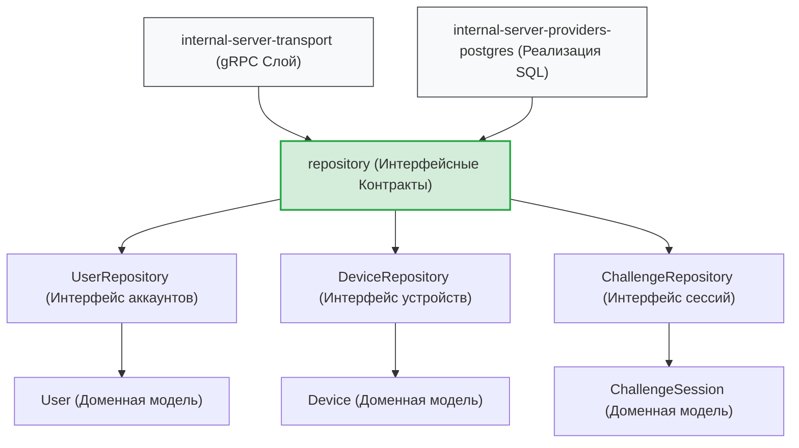

# Слой доменных абстракций и интерфейсов сервера (`internal/server/repository`)

Пакет `repository` определяет канонические структуры данных, сущности и строгие абстрактные контракты (интерфейсы) для работы с персистентным слоем облачного сервера GophKeeper.

Данный компонент находится на вершине иерархии инверсии зависимостей (Dependency Inversion Principle) внутри серверной архитектуры. Слой сетевых gRPC-обработчиков (`transport/grpc`) и Composition Root (`app/bootstrap.go`) опираются исключительно на декларации этого пакета, что полностью изолирует бизнес-логику от деталей реализации конкретных реляционных драйверов СУБД (PostgreSQL, MySQL или внутрипамятийных RAM-хранилищ) [scenario:3].

## 📌 Основные компоненты пакета

1. **Доменные модели сущностей (`interfaces.go`)**:
   * `User`: Профиль криптографической личности аккаунта (публичные ключи OpenSSH, соли и Cloud Bootstrap конверты).
   * `Device`: Метаданные зарегистрированных клиентских контейнеров и серийные номера mTLS-паспортов.
   * `ChallengeSession`: Срез состояния конечного автомата одноразовых сессий челленджа (Challenge State Machine).
2. **Абстрактные контракты (Интерфейсы)**:
   * `UserRepository`: Декларация методов персистентного сохранения аккаунтов и поиска по фингерпринтам.
   * `DeviceRepository`: Контракт управления mTLS-реестром, контроля отзывов сертификатов и обновления дат синхронизации.
   * `ChallengeRepository`: Оркестратор транзакционного атомарного гашения сессий.

---

## 🏗 Архитектурные границы слоев и инверсия зависимостей

Схема полиморфного взаимодействия слоев через интерфейсные барьеры пакета `repository`. Вся разметка полностью совместима с превью-рендером VSCode.



---

## 📊 Диаграмма роли контрактов в транзакции гашения сессий (`ConsumeChallengeSession`)

Иллюстрация того, как сетевой транспорт полиморфно использует абстракцию `ChallengeRepository` для выполнения атомарного ACID-перехода состояний сессии без прямой привязки к драйверу `pgxpool`.

```mermaid
sequenceDiagram
    autonumber
    `перевод` заменен литералом
    participant Handler as Сетевой Хендлер (register.go)
    participant Contract as Контракт (ChallengeRepository)
    participant Engine as Реализация (repository.go)

    Handler->>Contract: "ConsumeChallengeSession(SessionId)"
    activate Contract
    Contract->>Engine: "Полиморфный вызов СУБД (START TRANSACTION)"
    Note over Engine: Выполнение SELECT FOR UPDATE<br/>и моментальное гашение Used
    Engine-->>Contract: Возврат верифицированной структуры ChallengeSession
    Contract-->>Handler: Передача DTO-объекта в хендлер
    deactivate Contract

    Note over Handler: Криптографическая проверка подписи Ed25519<br/>и динамический выпуск mTLS-паспорта в PKI
```

---

## 🔒 Промышленные ИБ-инварианты и RAM-гигиена контрактов

* **Атомарная ИБ-деструкция в оперативной памяти**: Доменные структуры данных выступают временными контейнерами при маппинге байт из СУБД в сетевой транспорт. Для пресечения утечек ключевого материала в RAM-куче рантайма Go, модели `User` и `ChallengeSession` снабжены явными методами деструкции `.Destroy()`. Они принудительно обнуляют ячейки памяти с сырыми массивами солей аккаунта (`CanonicalAccountSalt`) и одноразовых серверных нонсов (`ServerNonce`) сразу после фиксации операций, помогая сборщику мусора (`GC`) предотвращать Memory Dump утечки.
* **Транзакционная синхронизация контрактов (Анти-Replay Инвариант)**: Из тела интерфейса `ChallengeRepository` полностью удален архитектурно уязвимый метод `GetAndLock`, возвращавший «голую» строку. Контракт жестко синхронизирован с промышленной транзакционной моделью **`ConsumeChallengeSession`**, обязывающей любую нижележащую СУБД выполнять атомарную верификацию `Unused` и перевод в `Used` внутри единого изолированного ACID-блока, намертво блокируя любые векторы атак повторного воспроизведения [scenario:3].

---

## 🔬 Юнит-тестирование доменных моделей (`interfaces_test.go`)

Поскольку пакет состоит из декларативных абстракций, изолированное юнит-тестирование сфокусировано на стопроцентной проверке ИБ-поведения методов деструкции памяти (файл `interfaces_test.go`). 

Тест-кейсы `TestUser-Destroy-ShouldZeroFillSensitiveData` и `TestChallengeSession-Destroy-ShouldClearNonce` контролируют физический накат зануления ячеек памяти, математически гарантируя, что вызовы `.Destroy()` выжигают массивы солей нулями, обнуляют ссылки на бинарные массивы публичных ключей OpenSSH и полностью защищены от паник разыменования нулевых указателей (`nil pointer protection`) при передаче пустых структур.
