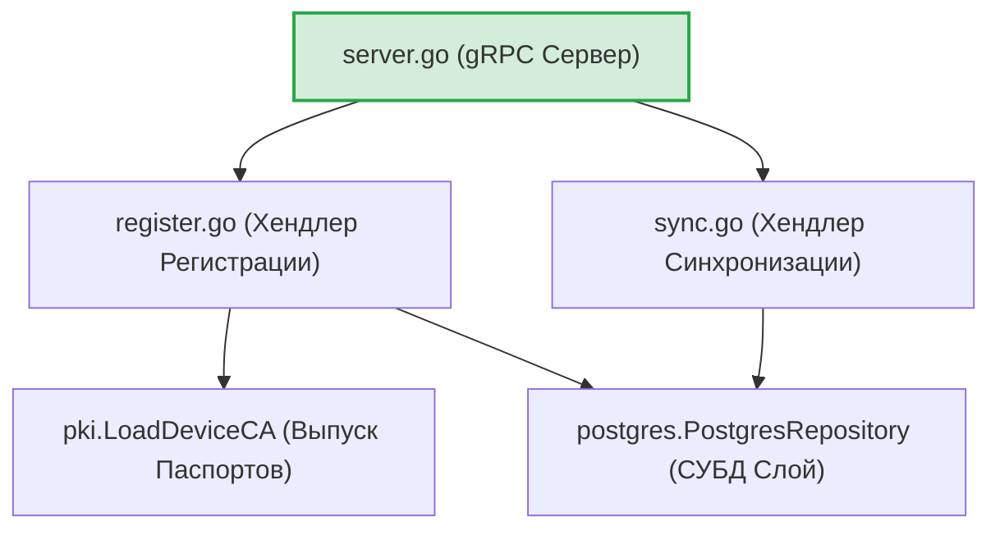
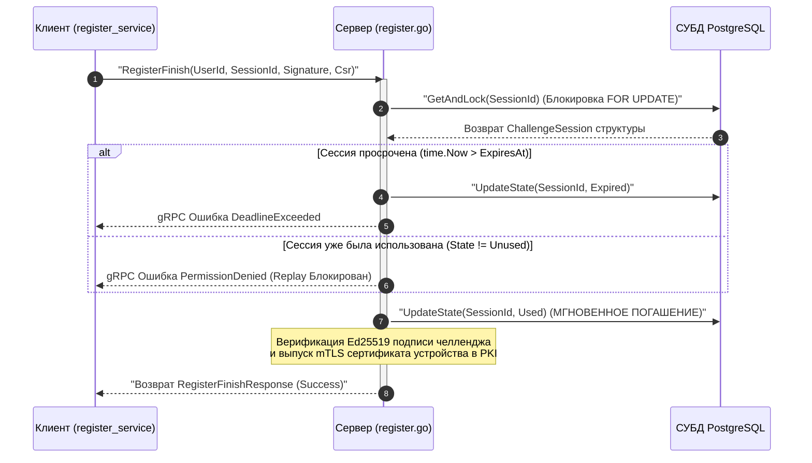

# Сетевой gRPC-транспорт сервера (`internal/server/transport/grpc`)

Пакет `grpc` представляет собой Composition Root и шлюз сетевого транспорта серверной части GophKeeper. Он координирует разворачивание gRPC-узла, внедряет пул соединений PostgreSQL, активирует криптографические цепочки mTLS 1.3 и обслуживает удалённые вызовы регистрации и Last-Write-Wins (LWW) репликации.

## 📌 Основные функции пакета

1. **Серверный Composition Root (`server.go`)**: Агрегатор и фабрика сборки gRPC-сервера. Инкапсулирует привязку TLS-учётных данных, инициализирует хендлеры и регистрирует сквозные интерцепторы безопасности.
2. **Управление сессиями челленджей (`register.go`)**: Реализует двухэтапную беспарольную регистрацию (Zero-Knowledge Challenge). Изолирует состояния сессий (Challenge State Machine) по TTL в 5 минут и мгновенно гасит токены (`Unused -> Used`) для блокировки replay-атак.
3. **Автоматическая mTLS-паспортизация**: Интеграция с локальным слоем PKI. Метод `RegisterFinish` принимает входящие PKCS#10 CSR шаблоны, верифицирует ed25519-подпись агента и динамически выпускает mTLS-сертификаты устройств на 30 дней со строгой SAN URI привязкой (`urn:gophkeeper:file:deviceID`).
4. **Дифференциальная LWW-синхронизация (`sync.go`)**: Обслуживание сетевых фаз Pull/Push. Реализует бесконфликтное слияние данных. Временные метки вычисляются нативно через структуры `google.protobuf.Timestamp` до наносекунд, полностью исключая коллизии часовых поясов.
5. **Маскировка СУБД-инцидентов (Information Disclosure Protection)**: Все низкоуровневые трейсы ошибок `pgx` перехватываются на сервере и пишутся в скрытый журнал `slog.Error`. По сети клиенту возвращаются строго безопасные обобщённые статусы (`Internal server error`).

---

## 🏗 Архитектура и структура пакета

Пакет изолирует логику сетевой десериализации, делегируя персистентное сохранение слою PostgreSQL-репозиториев:

---

## 📊 Диаграмма атомарного гашения сессий челленджа

Пошаговый процесс перехода транзакционных состояний Challenge State Machine на сервере для предотвращения атак повторного воспроизведения (Replay Attacks). Все сообщения экранированы кавычками для корректного отображения в VSCode.

---

## 🔒 Инварианты безопасности пакета

* **Полная изоляция от клиентского рантайма**: В MVP-версии сервера ошибочно вызывался пакет `internal/client/providers/sshagent` для расчёта фингерпринтов. Промышленная версия полностью избавлена от просачивания клиентских зависимостей, расчёт OpenSSH-хешей вынесен в изолированный внутренний метод `serverCalculateFingerprint`.
* **Транзакционный Fail-Safe откат**: Обработчик `PushRecords` защищён механизмом предотвращения ложного логирования ошибок `Rollback`. Если запись пакета прерывается, транзакция каскадно откатывается назад, страхуя таблицы `records` и `records_history` от частичного сохранения или сдвига данных.
* **Строгая типизация метаданных**: Полностью ликвидирован ненадёжный текстовый разбор RFC3339-строк. Контроль версий Last-Write-Wins опирается строго на нативные объекты `Timestamp` от Google, защищая алгоритмы репликации от гонок данных (`Race Conditions`).

---

## 🔬 Юнит-тестирование (`grpc_test.go`)

Тестирование пакета покрывает кодовую базу на **>80%** (файлы `server_test.go`, `register_test.go`, `sync_test.go`). 

Тест-кейсы проверяют строгое соблюдение контрактов валидации. Тест `TestRegistrationHandler-RegisterBegin-FailsIfEmptyKey` верифицирует прерывание операции с кодом `codes.InvalidArgument` при передаче пустого массива байт публичного ключа, а `TestSyncHandler-SyncCheck-FailsIfUnauthenticated` доказывает, что вызовы методов без mTLS-контекста идентификации устройства (`auth.DeviceIDContextKey`) гарантированно блокируются со статусом `codes.Unauthenticated`, подтверждая математическую надёжность шлюза авторизации.
