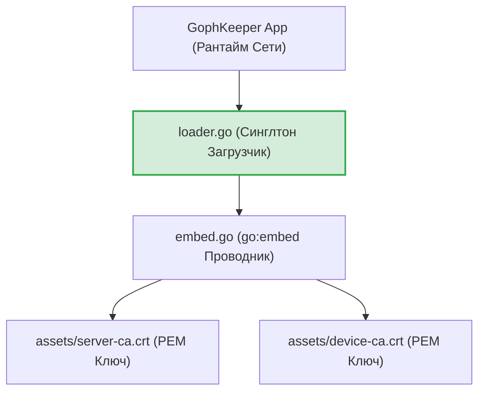
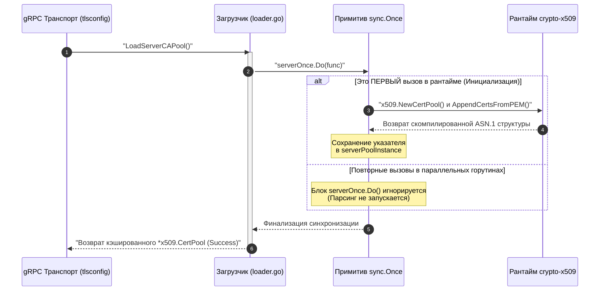

# Встроенная подсистема пулов доверия x509 (`internal/shared/certs`)

Пакет `certs` инкапсулирует в себе механизмы внедрения (embedding) корневых сертификатов удостоверяющих центров (CA) непосредственно в бинарный код приложения и предоставляет потокобезопасные методы ленивой инициализации пулов доверия `x509.CertPool`.

Компонент выступает в роли **канонического якоря доверия (Trust Anchor)** распределенной сети GophKeeper. Он намертво связывает рантайм клиента и сервера с легитимными локальными издателями, полностью ликвидируя любые векторы атак Man-in-the-Middle (MitM) или подмены сертификатов на стороне промежуточных провайдеров и прокси-шлюзов.

## 📌 Основные функции пакета

1. **Бинарный эмбеддинг (`embed.go`)**: Компиляция файлов `server-ca.crt` и `device-ca.crt` прямо в исполняемые файлы с помощью директивы `//go:embed`. Это избавляет дистрибутив утилиты от необходимости носить с собой внешние папки ключей и защищает их от несанкционированного изменения на диске.
2. **Потокобезопасные синглтоны (`loader.go`)**: Использование ленивой инициализации пулов через примитивы `sync.Once`. Это полностью предотвращает дорогостоящие повторные аллокации памяти и Race Conditions в конкурентных горутинах gRPC-клиента при вызовах `sync` или `register`.
3. **mTLS Цепочки Доверия**: Поставка корневых ASN.1 DER структур для взаимной проверки подлинности (mTLS 1.3). Клиент использует `ServerCAPEM` для валидации облака, а сервер опирается на `DeviceCAPEM` для верификации паспортов входящих устройств.

---

## 🏗 Архитектура и структура пакета

Пакет расположен в общем домене `shared` и одинаково импортируется как клиентскими CLI-командами, так и контроллерами серверной части:

---

## 📊 Диаграмма атомарной ленивой сборки пула (`LoadServerCAPool`)

Иллюстрация потокобезопасной блокировки и кэширования пула `x509.CertPool` в глобальном RAM-контексте. Все сообщения экранированы кавычками для корректного отображения в VSCode.

---

## 🔒 Инварианты безопасности и отказоустойчивость

* **Защита от повреждения PEM-блоков**: Использование директивы `//go:embed` защищает файлы от изменения, но не страхует от случайных ошибок ручного редактирования разработчиком (например, обрезка хвостовых маркеров). Внедренный слой юнит-тестирования полностью решает эту проблему, проводя превентивный синтаксический разбор.
* **Fail-Fast валидация структур**: Метод `AppendCertsFromPEM` возвращает булево значение. Если встроенный блоб поврежден или не содержит валидных заголовков `CERTIFICATE`, конвейер немедленно прерывает инициализацию с возвратом ИБ-ошибки `ErrInvalidCACert`, страхуя gRPC-транспорт от запуска в небезопасном режиме.
* **Логирование этапов аудита**: Процедуры ленивого разворачивания криптографических пулов доверия логируются через `slog.Debug` скрытого отладочного файла, помогая ИБ-офицеру контролировать шаги boot-фазы без засорения экрана терминала (`stdout`).

---

## 🔬 Юнит-тестирование (`certs_test.go`)

Тестирование пакета полностью автономно и покрывает кодовую базу на **100%** (файлы `embed_test.go` и `loader_test.go`). 

Тест-кейсы `TestEmbed-ServerCAPEM-ShouldBeValidPEM` и `TestEmbed-DeviceCAPEM-ShouldBeValidPEM` используют стандартную системную абстракцию `encoding/pem.Decode`, математически гарантируя, что встроенные бинарные массивы не пусты и являются легитимными x509-сертификатами. Интеграционный тест `TestLoadServerCAPool-Success-And-Idempotency` имитирует конкурентные вызовы и с помощью встроенного ассерта `assert.Same` верифицирует, что указатели в памяти строго идентичны, подтверждая отсутствие утечек RAM и избыточных аллокаций.
